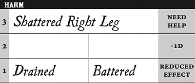
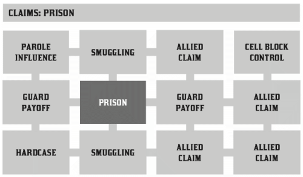

# Beacon Road

### Who Will You Be?

> Alpha Core Rules v2
>
> © 2018 Matthew O'Connor
>
> This work is based on Blades in the Dark (found at http://www.bladesinthedark.com/), product of One Seven Design, developed and authored by John Harper, and licensed for our use under the Creative Commons Attribution 3.0 Unported license ([http://creativecommons.org/licenses/by/3.0/](http://creativecommons.org/licenses/by/3.0/)).

# Table of Contents

- [Beacon Road](#beacon-road)
- [Table of Contents](#table-of-contents)
- [The Basics](#the-basics)
- [The Core System](#the-core-system)
    - [Actions & Attributes](#actions--attributes)
    - [Defenses & Hit Points](#defenses--hit-points)
    - [Stress & Trauma](#stress--trauma)
    - [Heroic Blessings](#heroic-blessings)
    - [Progress Clocks](#progress-clocks)
    - [Action Roll](#action-roll)
    - [Effect](#effect)
    - [Setting Position & Effect](#setting-position--effect)
    - [Consequences & Harm](#consequences--harm)
    - [Resistance & Armor](#resistance--armor)
    - [Fortune Roll](#fortune-roll)
    - [Gathering Information](#gathering-information)
    - [Coin & Stash](#coin--stash)
    - [The Faction Game](#the-faction-game)
    - [Advancement](#advancement)
- [The Characters](#the-characters)
    - [Character Creation](#character-creation)
    - [Character Archetypes](#character-archetypes)
    - [Character Bloodlines](#character-bloodlines)
- [The Crew](#the-crew)
    - [Crew Playbook](#crew-playbook)
- [The Score](#the-score)
    - [Planning & Engagement](#planning--engagement)
    - [Teamwork](#teamwork)
    - [Combat](#combat)
- [Downtime](#downtime)
    - [Payoff](#payoff)
    - [Heat](#heat)
    - [Entanglements](#entanglements)
    - [Downtime Activities](#downtime-activities)
    - [Vice](#vice)
    - [Virtue](#virtue)
    - [Downtime Activities in Play](#downtime-activities-in-play)
    - [Magnitude](#magnitude)
    - [Rituals](#rituals)
    - [Spells](#spells)
    - [Crafting](#crafting)
        - [Equipment](#equipment)
    - [Travel](#travel)
- [Bestiary and Other Sundry](#bestiary-and-other-sundry)
- [The World of Beacon](#the-world-of-beacon)
- [Appendix A: Powers](#appendix-a--powers)
- [Appendix B: Sandbox Tables](#appendix-b--sandbox-tables)
- [Appendix D: Definitions](#appendix-d--definitions)

# The Basics

## The Game

Welcome to *Beacon Road*, a game about a group of daring characters building an enterprising crew, set in the glorious and eponymous city of Beacon and its surroundings. We play to find out if the fledgling crew can thrive amidst the teeming threats that surround it.

## The Players

Each player creates a character and works with the other players to create the crew to which their characters belong. Each player strives to bring their character to life as an interesting, daring character who reaches boldly beyond their current safety and means. The characters are driven by fame, fortune, obligation, exile, power, love, or any of a hundred other motivations that push someone from the safety and comfort of their homes, lives, and jobs into the uncertain wilds and deeps. They may be a scoundrel, a hero, or something in between, but they are all daring beyond the norm. The players work together with the Game Master to establish the tone and style of the game by making judgment calls about the mechanics, dice, and consequences of actions. The players take responsibility as co-authors of the game with the GM.

## The Characters

The characters attempt to develop their crew by performing scores and contending with threats from their enemies.

## The Crew

In addition to creating characters, you'll also create the crew by choosing which type of criminal enterprise you're interested in exploring.

## The Game Master

The GM establishes the dynamic world around the characters. The GM plays all the non-player characters in the world by giving each one a concrete desire and preferred method of action.

The GM helps organize the conversation of the game so it's pointed toward the interesting elements of play. The GM isn't in charge of the story and doesn't have to plan events ahead of time. They present interesting opportunities to the players, then follow the chain of action and consequences wherever they lead.

## Playing A Session

A session of *Beacon Road* is like an episode of a TV show. There are one or two main events, plus maybe some side-story elements, which all fit into an ongoing series. A session of play can last anywhere from two to six hours, depending on the preferences of the group.

During a session, the crew of scoundrels works together to choose a score to accomplish, then they make a few dice rolls to jump into the action of the score in progress. The PCs take actions, suffer consequences, and finish the operation (succeed or fail). Then the crew has downtime, during which they recover, pursue side-projects, and indulge their vices. After downtime, the players once again look for a new opportunity or create their own goals and pursuits, and we play to find out what happens next.

# The Core System

## Judgment Calls

When you play, you'll make several key judgment calls. Everyone contributes, but either the players or the GM gets final say for each:

* Which actions are reasonable as a solution to a problem? *Can this person be swayed? Must we get out the tools and tinker with this old rusty lock, or could it also be quietly finessed?* The players have final say.

* How dangerous and how effective is a given action in this circumstance? *How risky is this? Can this person be swayed very little or a whole lot?* The GM has final say.

* Which consequences are inflicted to manifest the dangers in a given circumstance? *Does this fall from the roof break your leg? Do the constables merely become suspicious or do they already have you trapped?* The GM has final say.

* Does this situation call for a dice roll, and which one? *Is your character in position to make an action roll or **must they first make a resistance roll to gain initiative**?* The GM has final say.

* Which events in the story match the experience triggers for character and crew advancement? *Did you express your character's beliefs, drives, traits, background, virtue, or vice? You tell us.* The players have final say.

An adventure involves conflict, and a game uses rules to resolve those conflicts. To resolve an ambiguous situation, one or more players make dice rolls.

## Rolling the Dice

*Beacon Road* uses four-, six-, eight-, ten-, twelve-, and twenty-sided dice.

You roll several at once and **sum the single highest rolled die of each size**. If the highest rolled for a given size is the maximum that die size can roll, that die **explodes**: roll another die of that same size and add it to the sum. Continue this as long as a die rolls its maximum. Compare the sum with the **target number** (**TN**), if the total is equal or larger, the roll is a **success** (or a **hit**). If the sum is less than the **TN**, the roll is a **failure** (or a **miss**). A roll of 10 or more over the TN is a **critical** and confers additional benefits. Each increment of 10 over the TN increases the quality of that success. The number of increments of 10 is called the **critical multiplier**. If the check is a failure and the highest d20 is a 1, the check is a **botch**.

There are six types of rolls that you'll use most often in the game:

* **Action Roll.** When you attempt an action that's dangerous or troublesome, you make an action roll to find out how it goes. Action rolls and their effects and consequences drive most of the game.

* **Attack Roll.** When you attempt to attack an enemy, you make an attack roll (a type of action roll) against its defense. Attack rolls and their effects and consequences fill most of combat.

* **Downtime Roll.** When you are at their leisure after a job, you can perform downtime activities in relative safety. You make downtime rolls to see how much they get done.

* **Fortune Roll.** The GM can make a fortune roll to disclaim decision making and leave something up to chance. *How loyal is an NPC? How much does the plague spread? How much evidence is burned before the constables kick in the door?*

* **Travel Roll.** When traveling over a long distance, make a travel roll to see what you encounter and how that goes.

* **Resistance Roll.** You can make a resistance roll when you suffer a consequence they don't like. The roll tells us how much stress you suffer to reduce the severity of a consequence. *When you resist that "Broken Leg" harm, you take some stress and now it's only a "Sprained Ankle" instead.*

* **Tier Roll.** Roll a d20 with Advantage equal to your tier and keep the highest d20. When written as **[TIER]** the die do not explode, but when written as **TIER!** the die do explode.

Most dice systems in the game are expressions of this basic format. When you're first learning the game, you can always "collapse" back down to a simple roll to judge how things go. Look up the exact rule later when you have time.

A second kind of roll involves rolling several at once and **summing all rolled dice**. No dice explode in these rolls.

* **Damage Roll.** When an attack hits, make a damage roll and reduce their total hit points by the rolled amount.

* **Healing Roll.** When you successfully heal someone, make a healing roll and restore that many hit points.

When a die is written as **d4**, that represents the die itself. When written, in brackets, as **[d4]**, that represents a bounded die roll (a roll that does not explode). When written with a trailing exclamation point, as **d4!**, the represents an exploding die roll. When a rule says to **increase the die size**, roll the next larger die in the list: d4, d6, d8, d10, d12, and d20. When a rule says to **decrease the die size**, roll the next smaller die size. In general, this will not decrease a size below d4 or above d12, but the GM may rule differently.

A **roll** is written as **Action/ATTRIBUTE! vs TN**. This means making a **Tier Roll** and rolling a number of **attribute dice** equal to your **action rating**. If either the **action rating** or the **attribute dice** are zero, only roll make the **Tier Roll**. The TN can be a static number, a defense, or an action.

* *Tier depends on your crew and is explained on page XX.*

## Advantage and Disadvantage

Advantage and disadvantage are situational effects that alter the number of d20s rolled for a single roll. **Advantage** increases the number of d20s rolled by 1, and you still only sum the highest d20 rolled. **Disadvantage** increases the number of d20s rolled by 1, but you sum the lowest rolled d20. Advantage and disadvantage stack cumulatively with themselves and each other, canceling each other out one for one. Advantage or disadvantage beyond 1 is written as **advantage N** or **disadvantage N**, for example, advantage 2 represents rolling 2 additional d20s (3 total) and keeping the highest of the 3 rolled dice.

* *A character in a Tier 2 crew is making a roll in a precarious situation. The roll gains Advantage 2 from the Tier, and Disadvantage from the precarious situation. Make the final roll at Advantage 1 (2 - 1).*

## The Game Structure

*Beacon Road* has a structure to play, with four parts. By default, the game is in **free play**-characters talk to each other, they go places, they do things, they make rolls as needed.

When the group is ready, they choose a *target* for their next operation, then choose a type of *plan* to employ. This triggers the *engagement roll* (which establishes the situation as the operation starts) and then the game shifts into the **score** phase.

During the score, the PCs engage the target-they make rolls, overcome obstacles, call for flashbacks, and complete the operation (successfully or not). When the score is finished, the game shifts into the **downtime** phase.

During the downtime phase, the GM engages the systems for *payoff*, *heat*, and *entanglements*, to determine all the fallout from the score. Then the PCs each get their *downtime activities*, such as indulging their vice to remove stress or working on a long-term project. When all the downtime activities are complete, the game returns to **free play** and the cycle starts over again.

The phases are a conceptual model to help you organize the game. They're not meant to be rigid structures that restrict your options. Think of the phases as a menu of options to fit whatever it is you're trying to accomplish in play. Each phase suits a different goal.

# Actions & Attributes

## Action Ratings

There are 12 **actions** in the game that characters use to overcome obstacles.

* Command

* Consort

* Craft

* Finesse

* Hunt

* Prowl

* Skirmish

* Study

* Survey

* Sway

* Utter

* Wreck

Each action has a rating (from zero to 5) that tells you how many dice to roll when you perform that action. Action ratings don't just represent knowledge, skill, or training-you're free to describe *how* your character performs that action based on the type of person they are. Maybe your character is good at **Command** because they have a scary stillness to them, while another character barks orders and intimidates people with their military bearing.

You choose which action to perform to overcome an obstacle, by describing what your character does. Actions that are poorly suited to the situation may be less effective and may put the character in more danger, but they can still be attempted. Usually, when you perform an action, you'll make an **action roll** to see how it turns out.

## Action Roll

You make an **action roll** when your character does something potentially dangerous or troublesome. The possible results of the action roll depend on your character's **position**. There are three positions: **controlled**, **risky**, and **desperate**. If you're in a **controlled** position, the possible consequences are less serious. If you're in a **desperate** position, the consequences can be severe. If you're somewhere in between, it's **risky**-usually considered the "default" position for most actions. In combat, a **controlled** position decreases the target number by 5; while a **desperate** position increases it by 5.

If there's no danger or trouble at hand, you don't make an action roll. You might make a **fortune** roll or a **downtime** roll or the GM will simply say yes-and you accomplish your goal.

* *Whenever you make an action roll, gain Advantage equal to your Tier (page XX).*

## Attribute Ratings

There are three **attributes** in the game system that the player characters use to act: **BODY**, **MIND**, and **WILL**.

**BODY** measures physical prowess, health, strength, agility, and physical dexterity. **MIND** measures intelligence, learning, memory, speed of thought, perception, and awareness. **WILL** measures determination, drive, courage, force of personality, charisma, and presence. An attribute written in all capitals as **BODY**, **MIND**, or **WILL** refers to the attribute die. ATTR refers to a single attribute but may refer to any of them.

* *ATTR represents the die, ATTR! represents an exploding die, [ATTR] represents a bounded, non-exploding die.*

Each attribute has a rating (from zero to 5) that determines the **attribute dice** you use when making action rolls.

The rating for each attribute is equal to the number of dots in the **first column** under that attribute. The more well-rounded your character is with a particular set of actions, the better their attribute rating. The dice for each attribute is determined as follows: rating 0 rolls no additional dice, rating 1 rolls four-sided dice (a d4), rating 2 rolls six-sided dice (a d6), rating 3 rolls eight-sided dice (a d8), rating 4 rolls ten-sided dice (a d10), and rating 5 rolls twelve-sided dice (a d12).

#### Average Dice Rolls with Explosions

|     | 0 | 1 | 2 | 3 | 4 | 5 |
|-----|---|---|---|---|---|---|
| d4  | 2 | 3.3 | 4.6 | 5.6 | 6.2 | 6.8 |
| d6  | 2.6 | 4.2 | 5.8 | 6.8 | 7.6 | 8.3 |
| d8  | 3.2 | 5.1 | 7.1 | 8.3 | 9.1 | 9.9 |
| d10 | 3.9 | 6.1 | 8.2 | 9.7 | 10.7 | 11.5 |
| d12 | 4.6 | 7.1 | 9.6 | 11.2 | 12.3 | 13.1 |
| d20 | 7.2 | 11.1 | 14.9 | 17.1 | 18.6 | 19.7 |

## Actions

When you **Command**, you compel swift obedience.

* *You might intimidate or threaten to get what you want. You might lead a gang in a group action. You could try to order people around to persuade them (but Consorting might be better).*

When you **Consort**, you socialize with friends and contacts.

* *You might gain access to resources, information, people, or places. You might make a good impression or win someone over with your charm and style. You might make new friends or connect with your heritage or background. You could try to manipulate your friends with social pressure (but Sway might be better).*

When you **Craft**, you create devices, objects, and mechanisms.

* *You might create a new gadget or alter an existing item. You might pick a lock or crack a safe. You might disable an alarm or trap. You might turn the clockwork devices around the city to your advantage. You could try to use your technical expertise to control a vehicle (but Finessing might be better).*

When you **Finesse**, you employ dextrous manipulation or subtle misdirection.

* *You might pick someone's pocket. You might handle the controls of a vehicle or direct a mount. You might formally duel an opponent with graceful fighting arts. You could try to employ those arts in a chaotic melee (but Skirmishing might be better). You could try to pick a lock (but Crafting might be better).*

When you **Hunt**, you carefully track a target.

* *You might follow a target or discover their location. You might arrange an ambush. You might attack with precision shooting from a distance. You could try to bring your guns to bear in a melee (but Skirmishing might be better).*

When you **Prowl**, you traverse skillfully and quietly.

* *You might sneak past a guard or hide in the shadows. You might run and leap across the rooftops. You might attack someone from hiding with a back-stab or blackjack. You could try to waylay a victim in the midst of battle (but Skirmishing might be better).*

When you **Skirmish**, you entangle a target in close combat so they can't easily escape.

* *You might brawl or wrestle with them. You might hack and slash. You might seize or hold a position in battle. You could try to fight in a formal duel (but Finessing might be better).*

When you **Study**, you scrutinize details and interpret evidence.

* *You might gather information from documents, newspapers, and books. You might do research on an esoteric topic. You might closely analyze a person to detect lies or true feelings. You could try to examine events to understand a pressing situation (but Surveying might be better).*

When you **Survey**, you observe the situation and anticipate outcomes.

* *You might spot telltale signs of trouble before it happens. You might uncover opportunities or weaknesses. You might detect a person's motivations or intentions. You could try to spot a good ambush point (but Hunting might be better).*

When you **Sway**, you influence with guile, charm, or argument.

* *You might lie convincingly. You might persuade someone to do what you want. You might argue a compelling case that leaves no clear rebuttal. You could try to trick people into affection or obedience (but Consorting or Commanding might be better).*

When you **Utter**, you release arcane power.

* *You might communicate with a ghost. You might conjure flame from nothing. You could try to perceive beyond sight in order to better understand your situation (but Surveying might be better).*

When you **Wreck**, you unleash savage force.

* *You might smash down a door or wall with a sledgehammer, or use an explosive to do the same. You might employ chaos or sabotage to create a distraction or overcome an obstacle. You could try to overwhelm an enemy with sheer force in battle (but Skirmishing might be better).*

As you can see, many actions overlap with others. This is by design. As a player, you get to choose which action you roll, by saying what your character does. Can you try to **Wreck** someone during a fight? Sure! The GM tells you the position and effect level of your action in this circumstance. As it says, **Skirmish** *might* be better (less risky or more effective), depending on the situation at hand (sometimes it won't be better).

# Defenses & Hit Points

## Defense Ratings

There are three **defenses** in the game system that determine if attacks hit: **IRON**, **WARD**, and **GRIT**. **IRON** represents agility, ability to avoid damage, fortitude, and resistance to disease and poison. **WARD** represents mental guard, composure, and skill in social situations. **GRIT** represents willpower, determination, and persistence. Each defense has a rating that serves as the **target number** (**TN**) (written as **DEF 10**) which determines whether an attack hits or not. Each **defense rating** equals **8 plus the size of the associated attribute die plus the character's Tier.**

* *IRON = 8 + highest face of BODY + Tier*

* *WARD = 8 + highest face of MIND + Tier*

* *GRIT= 8 + highest face of WILL + Tier*

## Hit Points

A character has **hit points** (**HP**) representing their health, vitality, and will to fight. When an attack hits or at other triggers (e.g. disease, poison, wounds, etc.), a character might suffer **damage** to their hit points. This reduces their current HP by that amount. When a character is reduced to zero or fewer HP, they fall unconscious, becoming *incapacitated*. A character becomes *staggered* when their current hit points are half of or less than their maximum hit points.

* *Hit points = 6/11/16 + ⌈BODY⌉ + ⌈MIND⌉ + ⌈WILL⌉ + 4/5/6 per TIER*

    * *HP increases by 4 each Tier for Wizards, 5 each Tier for Rogues and Technicians, and 6 each Tier for Warriors.*

    * *Base depends upon archetype - 6 is Wizard, 11 is Rogue or Technician, 16 is Warrior.*

If a character's hit points are reduced to negative half your maximum hit points, you permanently die.

## Recovery Dice

A character has **recovery dice** determined by their archetype. Certain spells and abilities ask a character to make a recovery roll. Unless otherwise specified, take 1 stress and roll your recovery dice.

* *The wizard's recovery dice is **[d6] + TIER[d6]**.*

* *The rogue and the technician's recovery dice is **[d8] + TIER[d8]**.*

* *The warrior's recovery dice is **[d10] + TIER[d10]**.*

## Damage

There are 10 **damage types**: **chemical**, **electrical**, **entropic**, **glacial**, **kinetic**, **plasmic**, **psychic**, **radiant**, **temporal**, and **thermal**. While *damage type* doesn't have any intrinsic rules, other rules interact with the various types.

## Attack Roll

An **attack roll** is a specific type of action roll. An attack roll targets one or more defenses (**IRON**, **WARD**, and **GRIT**) and, if the roll meets or exceeds the defense rating, the attack is a **hit**, otherwise it is a **miss**.

* Determine how you are attacking.

* Determine the range of the attack.

* Select the targets of the attack.

* Make an attack roll for each target of the attack.

    * **TIER! + (Action Rating)/ATTRIBUTE!** vs **IRON**, **WARD**, or **GRIT**.

* If a target is hit, roll damage and resolve any other effects of the attack or weapon.

    * *Roll a number of Effect Die equal to half your attacking Action Rating (rounded up) and one attacking Attribute Die and sum them.*

        * *(half Action Rating)[EFFECT] + [ATTRIBUTE]*

    * *Roll additional Effect Die equal to the critical multiplier of the attack.*

    * *The target loses that many hit points.*

    * *Or zero if the target uses Armor or some other ability that would allow them to negate damage.*

* If a target is missed, resolve any effects that occur on a miss.

* If a target is reduced to zero or fewer hit points, they die or fall unconscious and begin dying.

    * If a character is at negative half your maximum hit points, you permanently die.

## Resistance Roll

Each attribute resists a different type of danger. If you get stabbed, for example, you resist physical harm with your Prowess rating. Resistance rolls always succeed-you diminish or deflect the bad result-but the better your roll, the less **stress** it costs to reduce or avoid the danger.

When the enemy has a big advantage, you'll need to make a resistance roll before you can take your own action. For example, when you duel the master sword-fighter, she disarms you before you can strike. You need to make a resistance roll to keep hold of your blade if you want to attack her. Or perhaps you face a powerful ghost and attempt to Utter with it to control its actions. But before you can make your own roll, you must resist possession from the spirit.

The GM judges the threat level of the enemies and uses these "preemptive" resistance rolls as needed to reflect the capabilities of especially dangerous foes.

# Stress & Trauma

## Stress

Characters in *Beacon Road* have a special reserve called **stress**. A character starts with 8 maximum stress and may not get more than 12 maximum stress

When they suffer a consequence that they don't want to accept, they can take stress instead. The result of the **resistance roll** determines how much stress it costs to avoid a bad outcome.

* *During a knife fight, Daniel's character, Cross, gets stabbed in the chest. Daniel rolls his Prowess rating to resist, and gets a 2. It costs 6 stress, minus 2 (the result of the resistance roll) to resist the consequences. Daniel marks off 4 stress and describes how Cross survives.*

* *The GM rules that the harm is reduced by the resistance roll, but not avoided entirely. Cross suffers level 2 harm ("Chest Wound") instead of level 3 harm ("Punctured Lung").*

## Pushing Yourself

You can use stress to **push yourself** for greater performance. For each bonus you choose below, take **1 stress** (each can be chosen once for a given action):

* Gain **advantage** on a roll. (This may be used for an action roll or downtime roll or any other kind of roll where extra effort would help you).

* Roll **+1 effect die**. (This may be used on a damage roll or healing roll.)

* Take action while *dazed* or *stunned*.

## Trauma

When you take damage that reduces your HP to zero or less, you fall unconscious, begin dying, and may not be resuscitated until the situation has calmed. If you are resuscitated, you suffer a level of trauma from the experience. When you take trauma, circle one of your **trauma conditions** like *Cold*, *Reckless*, *Unstable*, etc. They're all described below. After resuscitation and suffering trauma, **you have zero stress**.

**Trauma conditions are permanent**. Your character acquires the new personality quirk indicated by the condition, and can earn xp by using it to cause trouble. **When you mark your fourth trauma condition**, your character cannot continue as a daring scoundrel. You must retire them to a different life or sacrifice them to suffer for the crew's wanted level.

### Trauma Conditions

* **Cold**: You're not moved by emotional appeals or social bonds.

* **Haunted**: You're often lost in reverie, reliving past horrors, seeing things.

* **Obsessed**: You're enthralled by one thing: an activity, a person, an ideology.

* **Paranoid**: You imagine danger everywhere; you can't trust others.

* **Reckless**: You have little regard for your own safety or best interests.

* **Soft**: You lose your edge; you become sentimental, passive, gentle.

* **Unstable**: Your emotional state is volatile. You can instantly rage, or fall into despair, act impulsively, or freeze up.

* **Vicious**: You seek out opportunities to hurt people, even for no good reason.

## Sleeping and Whatnot

When you are able to sleep for a full night and get the rest you need, you restore 1 Stress and heal 1 Recovery.

# Heroic Blessings

The player characters are not normal and so can tap into heroic blessings that enable them to perform nigh-supernatural exploits. Heroic blessings are not related to archetypes, bloodlines, or crew. They are benefits that any player can use. Heroic blessings are represented with **Beacon Points** that a player can spend to activate a blessing. Beacon Points may be spent:

* To avoid death.

* To Act or React an additional time per round.

* To **push yourself**.

* To reroll with Advantage a failed roll.

* To trigger a flashback.

* Instead of taking some amount of Stress (not covered in the above).

# Progress Clocks

A **progress clock** is a circle divided into segments (see examples). Draw a progress clock when you need to track ongoing effort against an obstacle or the approach of impending trouble.

Sneaking into the constables watch tower? Make a clock to track the alert level of the patrolling guards. When the PCs suffer consequences from partial successes or missed rolls, fill in segments on the clock until the alarm is raised.

Generally, the more complex the problem, the more segments in the progress clock.

A complex obstacle is a 4-segment clock. A more complicated obstacle is a 6-clock. A daunting obstacle is an 8-segment clock.

When you create a clock, make it about the **obstacle,** not the method. The clocks for an infiltration should be "Interior Patrols" and "The Tower," not "Sneak Past the Guards" or "Climb the Tower." The patrols and the tower are the obstacles-the PCs can attempt to overcome them in a variety of ways.

Complex enemy threats can be broken into several "layers," each with its own progress clock. For example, the dockside gangs' HQ might have a "Perimeter Security" clock, an "Interior Guards" clock, and an "Office Security" clock. The crew would have to make their way through all three layers to reach the gang boss' personal safe and valuables within.

Remember that a clock tracks progress. It reflects the fictional situation, so the group can gauge how they're doing. A clock is like a speedometer in a car. It *shows* the speed of the vehicle-it doesn't determine the speed.

## Simple Obstacles

Not every situation and obstacle requires a clock. Use clocks when a situation is complex or layered and you need to track something over time-otherwise, resolve the result of an action with a single roll.

Examples of progress clocks follow.

### Danger Clocks

The GM can use a clock to represent a progressive danger, like suspicion growing during a seduction, the proximity of pursuers in a chase, or the alert level of guards on patrol. In this case, when a complication occurs, the GM ticks one, two, or three segments on the clock, depending on the consequence level. When the clock is full, the danger comes to fruition-the guards hunt down the intruders, activate an alarm, release the hounds, etc.

### Racing Clocks

Create two opposed clocks to represent a race. The PCs might have a progress clock called "Escape" while the constables have a clock called "Cornered." If the PCs finish their clock before the constables fill theirs, they get away. Otherwise, they're cornered and can't flee. If both complete at the same time, the PCs escape to their lair, but the hunting officers are outside!

You can also use racing clocks for an environmental hazard. Maybe the PCs are trying to complete the "Search" clock to find the lockbox on the sinking ship before the GM fills the "Sunk" clock and the vessel goes down.

### Linked Clocks

You can make a clock that unlocks another clock once it's filled. For example, the GM might make a linked clock called "Trapped" after an "Alert" clock fills up. When you fight a veteran warrior, she might have a clock for her "Defense" and then a linked clock for "Vulnerable." Once you overcome the "Defense" clock, then you can attempt to overcome the "Vulnerable" clock and defeat her. You might affect the "Defense" clock with violence in a knife-fight, or you lower her defense with deception if you have the opportunity. As always, the method of action is up to the players and the details of the fiction at hand.

### Mission Clocks

The GM can make a clock for a time-sensitive mission, to represent the window of opportunity you have to complete it. If the countdown runs out, the mission is scrubbed or changes-the target escapes, the household wakes up for the day, etc.

### Tug-of-war Clocks

You can make a clock that can be filled *and* emptied by events, to represent a back-and-forth situation. You might make a "Revolution!" clock that indicates when the refugees start to riot over poor treatment. Some events will tick the clock up and some will tick it down. Once it fills, the revolution begins. A tug-of-war clock is also perfect for an ongoing turf war between two crews or factions.

### Long-term Project

Some projects will take a long time. A basic long-term project (like tinkering up a new feature for a device) is eight segments. Truly long-term projects (like creating a new designer drug) can be two, three, or even four clocks, representing all the phases of development, testing, and final completion. Add or subtract clocks depending on the details of the situation and complexity of the project.

A long-term project is a good catch-all for dealing with any unusual player goal, including things that circumvent or change elements of the mechanics or the setting.

### Faction Clocks

Each faction has a long-term goal. When the PCs have **downtime**, the GM ticks forward the faction clocks that they're interested in. In this way, the world around the PCs is dynamic and things happen that they're not directly connected to, changing the overall situation in the city and creating new opportunities and challenges.

The PCs may also directly affect NPC faction clocks, based on the missions and scores they pull off. Discuss known faction projects that they might aid or interfere with, and also consider how a PC operation might affect the NPC clocks, whether the players intended it or not.

# Action Roll

When a player character does something challenging, we make an **action roll** to see how it turns out. An action is challenging if there's an obstacle to the PC's goal that's dangerous or troublesome in some way. We don't make an action roll unless the PC is put to the test. If their action is something that we'd expect them to simply accomplish, then we don't make an action roll.

Each game group will have their own ideas about what "challenging" means. This is good! It's something that establishes the tone and style of game.

To make an action roll, we go through six steps. In play, they flow together somewhat, but let's break each one down here for clarity.

1. The player states their **goal** for the action.

2. The player chooses the **action rating**.

3. The GM sets the **target number** for the roll based on **position** and **effect level**.

4. Add **bonus dice** from **advantage** or other sources.

5. The player rolls the dice, and we judge the result.

6. For an attack roll that hits, make a **damage roll**.

## 1. The Player States Their Goal

Your goal is the concrete outcome your character will achieve when they overcome the obstacle at hand. Usually the character's goal is pretty obvious in context, but it's the GM's job to ask and clarify the goal when necessary.

"You're punching him in the face, right? Okay... what do want to get out of this? Do you want to take him out, or just rough him up so he'll do what you want?"

## 2. The Player Chooses the Action Rating

The player chooses which **action rating** to roll, following from what their character is doing on-screen. If you want to roll your Skirmish action, then get in a fight. If you want to roll your Command action, then order someone around. You can't roll a given action rating unless your character is presently performing that action in the fiction.

## 3. The GM Sets the Target Number for the Roll Based on Position and Effect Level.

Once the player chooses their action, the GM sets the **target number** for the roll. In combat, this is the target's **defense** modified by any present situations - banes, boon, conditions, or wounds - currently affecting the target. Out of combat, the base **target number** is based on your position in the situation: **controlled**, **risky**, and **desperate**. The position represents how dangerous or troublesome the action might be and how composed or disciplined the target is. To choose a position, the GM looks at the profiles for the positions below and picks one that most closely matches the situation at hand. **By default, an action roll is risky.** You wouldn't be rolling if there was no risk involved. If the situation seems more dangerous, make it desperate. If it seems less dangerous, make it controlled.

* *The base controlled target number is 6 + the target's Tier.*

* *The base risky target number is 11 + the target's Tier.*

* *The base desperate target number is 16 + the target's Tier.*

The GM assesses the likely **effect level** of this action, given the factors of the situation. Essentially, the effect level tells us "how much" this action can accomplish: will it have **limited**, **standard**, or **great** effect?

The GM's choices for effect level and position can be strongly influenced by the player's choice of action rating. If a player wants to try to make a new friend by Wrecking something-well... maybe that's possible, but the GM wouldn't be crazy to say it's a desperate roll and probably limited effect. Seems like Consorting would be a lot better for that. The players are always free to choose the action they perform, but that doesn't mean all actions should be equally risky or potent.

## 4. Add Bonus Dice

You can normally gain up to **advantage** 2 for your action roll (some special abilities or conditions might give you additional advantage). For one, you can gain **advantage** from a teammate. They take 1 stress, say how they help you, give you **advantage**, and if you fail the roll, you may reroll it. For another, you can either **push yourself** (take 1 stress) or you can accept a **Fiend's Bargain** (you can't get dice for both, it's one or the other).

### The Fiend's Bargain

Characters in *Beacon Road* are scoundrels-they don't always act in their own best interests. To reflect this, the GM or any other player can offer you a bonus die if you accept a Fiend's Bargain. Common Fiend's Bargains include:

* Collateral damage, unintended harm.

* Sacrifice coin or an item.

* Betray a friend or loved one.

* Offend or anger a faction.

* Start and/or tick a troublesome clock.

* Add heat to the crew from evidence or witnesses.

* Suffer harm.

The Fiend's Bargain occurs regardless of the outcome of the roll. You make the deal, pay the price, and gain **advantage**.

The Fiend's Bargain is always a free choice. If you don't like one, just reject it (or suggest how to alter it so you might consider taking it). You can always just push yourself for **advantage** instead.

If it's ever needed, the GM has final say over which Fiend's Bargains are valid.

## 5. Roll the Dice and Judge the Result

Once the goal, action rating, position, and effect have been established, grab all the dice and roll. (See the sets of possible outcomes, by position, in the table.)

The action roll tells you how well the character performs and, in non-combat situations, how serious the consequences are for them. They might succeed at their action without any consequences (on a critical), or they might succeed but suffer consequences (on a success), or it might just all go wrong (on a failure).

On a failure, it's up to the GM to decide if the character's action has any effect or not, or if it even happens at all. Usually, the action just fails completely, but in some circumstances, it might make sense or be more interesting for the action to have some effect even on a failure.

Each success and failure outcome lists suggested **consequences** for the character. The worse your position, the worse the consequences are. The GM can inflict one or more of these consequences, depending on the circumstances of the action roll. Characters have the ability to avoid or reduce the severity of consequences that they suffer by **resisting** them.

When you narrate the action after the roll, the GM and player collaborate together to say what happens on-screen. *Tell us how you vault across to the other rooftop. Tell us what you say to the Inspector to convince her. The GM will tell us how she reacts. When you face the Red Sash duelist, what's your fighting style like? Etc.*

## Action Roll Summary

* A player or GM calls for a roll. Make an **action roll** when the character performs a dangerous or troublesome action.

* The player chooses the **action rating** and associated **ATTRIBUTE** to roll. Choose the action that matches what the character is doing in the fiction.

* The GM establishes the **position** and **effect level** of the action. The choice of position and effect is influenced strongly by the player's choice of action.

* Add up to two bonus dice. 1) **Assistance** from a teammate. 2) **Push yourself** (take 1 stress) or accept a **Fiend's Bargain**.

* Roll the dice and judge the outcome. The players and GM narrate the action together. The GM has final say over what happens and inflicts consequences as called for by the position and the result of the roll.

### Action Roll

* Roll d20! and **ATTRIBUTE!** dice equal to your **Action Rating**.

* Gain **Advantage** equal to your **Tier**.

* Gain **Advantage** if you have **Assistance**.

* Gain **Advantage** if you **Push Yourself** -or- you accept a **Fiend's Bargain**.

* **Controlled** (base TN = 6 + target's Tier)-You act on your terms. You exploit a dominant advantage.

    * **Critical:** You do it with **increased effect** proportional to the critical multiplier.

    * **Success:** You hesitate. Withdraw and try a different approach, or else do it with a minor consequence: a minor **complication** occurs, you have **reduced effect**, you suffer **lesser harm**, you end up in a **risky** position.

    * **Failure:** You falter. Press on by seizing a **risky** opportunity, or withdraw and try a different approach.

* **Risky** (base TN = 11 + target's Tier)-You go head to head. You act under fire. You take a chance.

    * **Critical:** You do it with **increased effect** proportional to the critical multiplier.

    * **Success:** You do it, but there's a consequence: you suffer **harm**, a **complication** occurs, you have **reduced effect**, you end up in a **desperate** position.

    * **Failure:** Things go badly. You suffer **harm**, a **complication** occurs, you end up in a **desperate** position, you **lose this opportunity**.

* **Desperate** (base TN = 16 + target's Tier)-You overreach your capabilities. You're in serious trouble.

* **Critical:** You do it with **increased effect** proportional to the critical multiplier.

* **Success:** You do it, but there's a consequence: you suffer **severe harm**, a **serious complication** occurs, you have **reduced effect**.

* **Failure:** It's the worst outcome. You suffer **severe harm**, a **serious complication** occurs, you **lose this opportunity** for action.

### Double-duty Rolls

In situations where having an NPC roll adds nothing useful, an action roll does double-duty: **it resolves the action of the PC as well as any NPCs that are involved**. The single roll tells us how those actions interact and which consequences result. On a critical, the PC wins and has their effect. On a success, it's a mix-both the PC and the NPC have their effect. On a failure, the NPC wins and has their effect as a consequence on the PC.

# Effect

In *Beacon Road*, you achieve goals by taking actions and facing consequences. But how many actions does it take to achieve a particular goal? That depends on the **effect level** of your actions. The GM judges the effect level using the profiles below. Which one best matches the action at hand-**great**, **standard**, or **limited**? Each effect level indicates the questions that should be answered for that effect, as well as how many segments to tick if you're using a **progress clock**.

| Effects | | Ticks |
|-|-|-|
| Great | You achieve more than usual. How does the extra effort manifest? What additional benefit do you enjoy? | 3 |
| Standard | You achieve what we'd expect as "normal" with this action. Is that enough, or is there more left to do? | 2 |
| Limited | You achieve a partial or weak effect. How is your impact diminished? What effort remains to achieve your goal? | 1 |

## Assessing Factors

To assess effect level, first start with your gut feeling, given this situation. Then, if needed, assess three factors that may modify the effect level: **potency**, **scale**, and **quality**. If the PC has an advantage in a given factor, consider a higher effect level. If they have a disadvantage, consider a reduced effect level.

### Potency

The potency factor considers particular weaknesses, taking extra time or a bigger risk, or the influence of arcane powers. An infiltrator is more potent if all the lights are extinguished and they move about in the dark.

### Quality/Tier

Quality represents the effectiveness of tools, weapons, or other resources, usually summarized by Tier. **Fine items** count as +1 bonus in quality, stacking with Tier.

Thorn is picking the lock to a safehouse run of a gang renowned for Occult dealings. Her crew is Tier I and she has fine lockpicks-so she's effectively Tier II. The Occult gang is Tier III. Thorn is outclassed in quality, so her effect will be limited on the lock.

### Scale

Scale represents the number of opponents, size of an area covered, scope of influence, etc. Larger scale can be an advantage or disadvantage depending on the situation. In battle, more people are better. When infiltrating, more people are a hindrance.

When considering factors, effect level might be reduced below limited, resulting in **zero effect**-or increased beyond great, resulting in an **extreme effect**.

If a PC special ability gives "+1 effect," it comes into play *after* the GM has assessed the effect level. For example, if you ended up with zero effect, the +1 effect bonus from your Cutter's Bodyguard ability would bump them up to limited effect.

Also, remember that a PC can **push themselves** (take 1 stress) to get +1 effect on their action.

Every factor won't always apply to every situation. You don't have to do an exact accounting every time, either. Use the factors to help you make a stronger judgment call-don't feel beholden to them.

## Trading Position for Effect

After factors are considered and the GM has announced the effect level, a player might want to trade position for effect, or vice versa. For instance, if they're going to make a risky roll with standard effect (the most common scenario, generally), they might instead want to push their luck and make a desperate roll but with great effect.

This kind of trade-off isn't included in the effect factors because it's not an element the GM should assess when setting the effect level. Once the level is set, though, you can always offer the trade-off to the player if it makes sense in the situation.

* *"I Prowl across the courtyard and vault over the wall, hiding in the shadows by the canal dock and gondola."*

* *"I don't think you can make it across in one quick dash. The scale of the courtyard is a factor here, so your effect will be limited. Let's say you can get halfway across with this action, then you'll have to Prowl through the other half of the space (and the rest of the guards there) to reach the other side."*

* *"I didn't realize it was that far. Hmmm. Okay, what if I just go as fast as I can. Can I get all the way across if I make a desperate roll?"*

* *"Yep, sounds good to me!"*

## Consequences

When a PC suffers an effect from an enemy or a dangerous situation, it's called a **consequence**. Consequences are the companion to effects. PCs have effect on the world around them and they suffer consequences in return from the risks they face.

# Setting Position & Effect

The GM sets position and effect for an action roll at the same time, after the player says what they're doing and chooses their action. Usually, **Risky / Standard** is the default combination, modified by the action being used, the strength of the opposition, and the effect factors.

The ability to set position and effect as independent variables gives you nine combinations to choose from, to help you convey a wide array of fictional circumstances.

*For example, if a character is facing off alone against a small enemy gang, the situation might be:*

* *She fights the gang straight up, rushing into their midst, hacking away in a wild **Skirmish**. In this case, being threatened by the larger force lowers her position to indicate greater risk, and the scale of the gang reduces her effect (Desperate / Limited).*

* *She fights the gang from a choke-point, like a narrow alleyway where their numbers can't overwhelm her at once. She's not threatened by several at once, so her risk is similar to a one-on-one fight, but there's still a lot of enemies to deal with, so her effect is reduced (Risky / Limited).*

* *She doesn't fight the gang, instead trying to maneuver her way past them and escape. She's still under threat from many enemy attacks, so her position is worse, but if the ground is open and the gang can't easily corral her, then her effect for escaping isn't reduced (Desperate / Standard). If she had some immediate means of escape (like leaping onto a speeding carriage), then her effect might even be increased (Desperate / Great).*

* *The gang isn't aware of her yet-she's set up in a sniper position on a nearby roof. She takes a shot against one of them. Their greater numbers aren't a factor, so her effect isn't reduced, and she's not immediately in any danger (Controlled / Great). Maybe instead she wants to fire off a salvo of suppressing fire against the whole gang, in which case their scale applies (Controlled / Limited). If the gang is on guard for potential trouble, her position is more dangerous (Risky / Great). If the gang is alerted to a sniper, then the effect may be reduced further, as they scatter and take cover (Risky / Limited). If the gang is able to muster covering fire while they fall back to a safe position, then things are even worse for our scoundrel (Desperate / Limited).*

# Consequences & Harm

Enemy actions, bad circumstances, or the outcome of a roll can inflict **consequences** on a PC. There are five types (at right).

A given circumstance might result in one or more consequences, depending on the situation. The GM determines the consequences, following from the fiction and the style and tone established by the game group.

## Reduced Effect

This consequence represents impaired performance. The PC's action isn't as effective as they'd anticipated. You hit him, but it's only a flesh wound. She accepts the forged invitation, but she'll keep her eye on you throughout the night. You're able to scale the wall, but it's slow going-you're only halfway up. This consequence essentially reduces the effect level of the PC's action by one after all other factors are accounted for.

## Complication

This consequence represents trouble, mounting danger, or a new threat. The GM might introduce an immediate problem that results from the action right now: the room catches fire, you're disarmed, the crew takes +1 heat from evidence or witnesses, you lose status with a faction, the target evades you and now it's a chase, reinforcements arrive, etc.

Or the GM might tick a clock for the complication, instead. Maybe there's a clock for the alert level of the guards at the manor. Or maybe the GM creates a new clock for the suspicion of the noble guests at the masquerade party and ticks it. Fill one tick on a clock for a minor complication or two ticks for a standard complication.

A **serious complication** is more severe: reinforcements surround and trap you, the room catches fire and falling ceiling beams block the door, your weapon is broken, the crew suffers +2 heat, your target escapes out of sight, etc. Fill three ticks on a clock for a serious complication.

**Don't inflict a complication that negates a successful roll.** If a PC tries to corner an enemy and gets a 4/5, don't say that the enemy escapes. The player's roll succeeded, so the enemy is cornered... maybe the PC has to wrestle them into position and during the scuffle the enemy grabs their gun.

## Lost Opportunity

This consequence represents shifting circumstance. You had an opportunity to achieve your goal with this action, but it slips away. To try again, you need a new approach-usually a new form of action or a change in circumstances. Maybe you tried to Skirmish with the noble to trap her on the balcony, but she evades your maneuver and leaps out of reach. If you want to trap her now you'll have to try another way-maybe by Swaying her with your roguish charm.

## Worse Position

This consequence represents losing control of the situation-the action carries you into a more dangerous position. Perhaps you make the leap across to the next rooftop, only to end up dangling by your fingertips. You haven't failed, but you haven't succeeded yet, either. You can try again, re-rolling at the new, worse position. This is a good consequence to choose to show escalating action. A situation might go from controlled, to risky, to desperate as the action plays out and the PC gets deeper and deeper in trouble.

## Harm

This consequence represents a long-lasting debility (or death). When you suffer harm, record the specific injury on your character sheet equal to the level of harm you suffer. If you suffer **lesser harm**, record it in the bottom row. If you suffer **moderate harm**, write it in the middle row. If you suffer **severe harm**, record it in the top row. See examples of harm and the harm tracker, below.

Your character suffers the penalty indicated at the end of the row if any or all harm recorded in that row applies to the situation at hand. So, if you have "Drained" and "Battered" harm in the bottom row, you'll suffer reduced effect when you try to run away from the constables. When you're impaired by harm in the top row (severe harm, level 3), your character is incapacitated and can't do anything unless you have help from someone else or **push yourself** to perform the action.

If you need to mark a harm level, but the row is already filled, the harm moves up to the next row above. So, if you suffered standard harm (level 2) but had no empty spaces in the second row, you'd have to record severe harm (level 3), instead. If you run out of spaces on the top row and need to mark harm there, your character suffers a **catastrophic, permanent consequence** (loss of a limb, sudden death, etc., depending on the circumstances).

*This character has three harm: a "Shattered Right Leg" (level 3) plus "Drained" and "Battered" (level 1). If they suffer another level 1 harm, it will move up to level 2. If they suffer another level 3 harm, it will move up to level 4: Fatal.*

### Harm examples

**Fatal (4):** *Electrocuted, Drowned, Stabbed in the Heart.*

**Severe (3):** *Impaled, Broken Leg, Shot in Chest, Badly Burned, Terrified.*

**Moderate (2):** *Exhausted, Deep Cut to Arm, Concussion, Panicked, Seduced.*

**Lesser (1):** *Battered, Drained, Distracted, Scared, Confused.*

Harm like "Drained" or "Exhausted" can be a good fallback consequence if there's nothing else threatening a PC (like when they spend all night Studying those old books, looking for any clues to their enemy's weaknesses before he strikes).

# Resistance & Armor

When your PC suffers a consequence that you don't like, you can choose to resist it. Just tell the GM, "No, I don't think so. I'm resisting that." Resistance is always automatically effective-the GM will tell you if the consequence is reduced in severity or if you avoid it entirely. Then, you'll make a **resistance roll** to see how much stress your character suffers as a result of their resistance.

You make the roll using one of your character's **attributes** (BODY, MIND, or WILL). The GM chooses the attribute, based on the nature of consequences or the targeted defense:

* **BODY**: Consequences from physical strain or injury; or attacks targeting **IRON**.

* **MIND**: Consequences from deception or understanding; or attacks targeting **WARD**.

* **WILL**: Consequences from mental strain or willpower; or attacks targeting **GRIT**.

Your character suffers **6 stress** when they resist, **minus the highest die result from the resistance roll**. So, if you rolled a 4, you'd suffer 2 stress. If you rolled a 6, you'd suffer zero stress. If you get a critical result, you also **clear 1 stress**.

* *Ian's character, Silas, is in a desperate Skirmish with several duelists and one of them lands a blow with their sword. Since the position was desperate, the GM inflicts severe harm (modified by any other factors). They tell Ian to record level 3 harm, "Gut Stabbed" on Silas's sheet. Ian decides to resist the harm, instead. The GM says he can reduce the harm by one level if he resists it. Ian rolls 3d for Silas's Prowess attribute and gets a 5. Silas takes 1 stress and the harm is reduced to level 2, "Cut to the Ribs."*

Usually, a resistance roll **reduces the severity** of a consequence. If you're going to suffer fatal harm, for example, a resistance roll would reduce the harm to severe, instead. Or if you got a complication when you were sneaking into the manor house, and the GM was going to mark three ticks on the "Alert" clock, she'd only mark two (or maybe one) if you resisted the complication. You may also make a resistance roll during combat with an Action to reduce the severity of a Wound.

**You may only roll against a given consequence once.**

The GM also has the option to rule that your character **completely avoids** the consequence. For instance, maybe you're in a sword fight and the consequence is getting disarmed. When you resist, the GM says that you avoid that consequence completely: you keep hold of your weapon.

**By adjusting which consequences are reduced vs. which are avoided, the GM establishes the overall tone of your game**. For a more daring game, most consequences will be avoided. For a grittier game, most consequences will only be reduced with resistance.

The GM may also threaten several consequences at once, then the player may choose which ones to resist (and make rolls for each).

* *"She stabs you and then leaps off the balcony. Level 2 harm and you lose the opportunity to catch her with fighting."*

* *"I'll resist losing the opportunity by grappling her as she attacks. She can stab me, but I don't want to let her escape."*

Once you decide to resist a consequence and roll, you suffer the stress indicated. You can't roll first and see how much stress you'll take, then decide whether or not to resist.

## Resistance Roll

* In combat, spend a Reaction to make a resistance roll.
    * TIER! + ATTR! vs attack roll; or controlled, risky, or desperate target number.
* You **reduce** or **avoid** the effects of the consequence (GM chooses).
    * **Critical:** Clear 1 stress.
    * **Success:** Take 2 stress.
    * **Failure:** Take 4 stress.
    * **Botch:** Take 6 stress.

## Armor

If you have a type of **armor** that applies to the situation, you can mark an armor box to reduce or avoid a consequence, instead of rolling to resist. If the armor is relevant to the situation, you may mark an armor box to gain *resistance* to one of the damage types dealt by an attack.

* *Jonadab would suffer a crushing blow that would deal 30 points of damage and stun him - effectively taking him out of the fight. Instead, marking one armor box grants **kinetic resistance** against that attack (halving the damage taken to 15) and marking a second armor box negates the stun.*

When an armor box is marked, it can't be used again until it's restored. All of your armor is restored when you choose your **load** for the next score.

## Death

There are a couple ways for a PC to die:

* If a character's hit points are reduced to negative half your maximum hit points, you permanently die.

* If they suffer level 4 fatal harm and they don't resist it, they die. *Sometimes this is a choice a player wants to make, because they feel like it wouldn't make sense for the character to survive or it seems right for their character to die here.*

* If they need to record harm at level 3 and it's already filled, they suffer a catastrophic consequence, which might mean sudden death (depending on the circumstances).

When your character dies, you have options:

* You can create a new scoundrel to play. Maybe you "promote" one of the NPC gang members to a PC, or create a brand new character who joins the crew.

# Fortune Roll

The fortune roll is a tool the GM can use to disclaim decision making. You use a fortune roll in two different ways:

**When you need to make a determination about a situation the PCs aren't directly involved in** and don't want to simply decide the outcome.

Two rival gangs are fighting. How does that turn out? The GM makes a fortune roll for each of them. One gets a good result but the other gets limited effect. The GM decides that the first gang takes over some of their rivals' turf but suffer some injuries during the skirmish.

**When an outcome is uncertain**, but no other roll applies to the situation at hand.

While pilfering the workshop of an alchemist, Cross is possessed by a vengeful ghost. As control of his body slips away, Cross grabs a random potion bottle and drinks it down. Will the arcane concoction have an effect on the spirit? Will it poison Nock to death? Who knows? The GM makes a fortune roll to see how it turns out.

When you make a fortune roll you may assess **any trait rating** to determine the dice pool of the roll.

* When a faction takes an action with uncertain outcome, you might use their **Tier** rating to make a fortune roll.

* When a gang operates independently, use their **quality** rating for a fortune roll.

* When a supernatural power manifests with uncertain results, you might use its **magnitude** for a fortune roll.

* When a PC **gathers information**, you might make a fortune roll using their **action rating** to determine the amount of the info they get.

If no trait applies, roll a **d20!** for sheer luck or grant advantage (from one to four) based on the situation at hand. If two parties are directly opposed, make a fortune roll for each side to see how they do, then assess the outcome of the situation by comparing their performance levels.

The fortune roll is also a good tool to help the GM manage all the various moving parts of the world. Sometimes a quick roll is enough to answer a question or inspire an idea for what might happen next.

Other examples of fortune rolls:

* The PCs instigate a war between two factions, then sit back and watch the fireworks. How does it turn out? Does either side dominate? Are they both made vulnerable by the conflict? Make a few fortune rolls to find out.

* A strange sickness is sweeping the city. How badly is a crime ridden district hit by the outbreak? The GM assigns a magnitude to the arcane plague, and makes a fortune roll to judge the extent of its contamination.

* The Hound stakes out a good spot and makes a sniper shot against a gang leader when he enters his office. The controlled Hunt roll is a success, but is great effect enough to instantly kill a grizzled gang leader? Instead of making a progress clock for his mortality, the GM decides to use a simple fortune roll with his "toughness" as a trait to see if he can possibly survive the attack. The roll is a 4/5: the bullet misses his heart, but hits him in the lung-it's a mortal wound. He's on death's door, with only hours to live, unless his gang can get an expert physicker to him in time.

* Inspectors are putting a case together against the PC crew. How quickly will their evidence result in arrests? The crew's wanted level counts as a major advantage for the inspectors.

* The PCs face off in a skirmish with a veteran demon hunter captain and her crew. The tide of battle goes in the PCs' favor, and many crew members are killed. One of the players asks if the captain will surrender to spare the rest of her crew's lives. The GM isn't sure. How cold-hearted is this veteran hunter? She's stared giant demons in the eye without flinching... is there anything human left inside her? The GM makes a 2d fortune roll for "human feelings" to see if a spark of compassion remains in heart. If so, maybe one of the PCs can roll to Consort, Sway, or Command her to stand down.

### Fortune Roll

* **Roll d20!** with **Advantage** equal to the **trait rating** versus a **controlled** (6), **risky** (11), or **desperate** (16) target number.

* **Advantage** for each Major Advantage.

* **Disadvantage** for each Major Disadvantage.

* **Critical:** Exceptional result / Great, extreme effect.

* **Success:** Good result / Standard, full effect.

* **Failure:** Mixed result / Limited, partial  effect.

* **Botch:** Bad result / Poor, little effect.

# Gathering Information

The flow of information from the GM to the players about the fictional world is very important in a roleplaying game. By default, the GM tells the players what their characters perceive, suspect, and intuit. But there's just too much going on to say *everything*-it would take forever and be boring, too. The players have a tool at their disposal to more fully investigate the fictional world.

When you want to know something specific about the fictional world, your character can **gather information**. The GM will ask you **how** your character gathers the info (or how they learned it in the past).

If it's common knowledge, the GM will simply answer your questions. If there's an obstacle to the discovery of the answer, an action roll is called for. If it's not common knowledge but there's no obstacle, a simple fortune roll determines the quality of the information you gather.

Each attempt to gather information takes time. If the situation allows, you can try again if you don't initially get all the info that you want. But often, the opportunity is fleeting, and you'll only get one chance to roll for that particular question.

Some example questions are on the bottom of the character sheet. The GM always answers honestly, but with a level of detail according to the level of effect.

The most common gather information actions are Surveying the situation to reveal or anticipate what's going on and Studying a person to understand what they intend to do or what they're really thinking.

Sometimes, you'll have to maneuver yourself into position before you can gather information. For example, you might have to Prowl to a good hiding place first and then Study the cultists when they perform their dark ritual.

## Investigation

Some questions are too complex to answer immediately with a single gather information roll. For instance, you might want to discover the network of contraband smuggling routes in the city. In these cases, the GM will tell you to start a **long-term project** that you work on during **downtime**.

You track the investigation project using a progress clock. Once the clock is filled, you have the evidence you need to ask several questions about the subject of your investigation as if you had great effect.

## Examples & Questions

* You might **Utter** to spirits to manifest echoes of recent spirit activity. *Have any new ghosts been here? How can I find the spirit well that's calling to them? What should I be worried about?*

* You might **Command** a local barkeep to tell you what he knows about the secret meetings held in his back room. *What's really going on here? What's he really feeling about this? Is he part of this secret group?*

* You might **Consort** with a well-connected friend to learn secrets about an enemy, rival, or potential ally. *What do they intend to do? What might I suspect about their motives? How can I discover leverage to manipulate them?*

* You might **Hunt** a courier across the city, to discover who's receiving satchels of coin from a master duelist. *Where does the package end up? How can I find out who signed for the package at City Hall?*

* You might **Study** ancient and obscure books to discover an arcane secret. *How can I disable the runes of warding? Will anyone sense if they're disabled?*

* Or you might **Study** a person to read their intentions and feelings. *What are they really feeling? How could I get them to trust me?*

* You might **Survey** a manor house to case it for a heist. *What's a good point of infiltration? What's the danger here?*

* Or you might Survey a charged situation when you meet another gang. *What's really going on here? Are they about to attack us?*

* You might **Sway** a powerful lord at a party so he divulges his future plans. *What does he intend to do? How can I get him to think I might be a good partner in this venture?*

* Or you might **Sway** his bodyguard to confide in you about recent events. *Where has he been lately? Who's he been meeting with?*

### Gather Information

*Ask a question and make an action roll or a fortune roll. The GM answers you honestly, with a level of detail depending on the effect level.*

**Great**: You get exceptional details. The information is complete and follow-up questions may expand into related areas or reveal more than you hoped for.

**Standard**: You get good details. Clarifying and follow-up questions are possible.

**Limited**: You get incomplete or partial information. More information gathering will be needed to get all the answers.

# Coin & Stash

## Coin

Coin is an abstract measure of cash and liquid assets.

The few bits PCs use in their daily lives are not tracked. If a character wants to spend to achieve a small goal (bribe a doorman), use the PC's **lifestyle quality** for a fortune roll.

### Monetary values

* 1 coin: A full purse of silver pieces. A week's wages.

* 2 coin: A fine weapon. A weekly income for a small business. A fine piece of art. A set of luxury clothes.

* 4 coin: A satchel full of silver. A month's wages.

* 6 coin: An exquisite jewel. A heavy burden of silver pieces.

* 8 coin: A good monthly take for a small business. A small safe full of coins and valuables. A very rare luxury commodity.

* 10 coin: Liquidating a significant asset-a carriage and goats, a horse, a deed to a small property.

More than 5 coin is an impractical amount to keep lying around. You must spend the excess or put it in your **stash** (see below). A crew can also store 5 coin in their lair, by default. If they upgrade to a **vault**, they can expand their stores to 10 and then 20 coin. Any coin beyond their limit must be spent as soon as possible (typically before the next score) or distributed among the crew members.

One unit of coin in silver pieces or other bulk currency takes up one item slot for your **load** when carried.

### Coin Use

* Spend 1 coin to get an additional **activity** during **downtime**.

* Spend 1 coin to increase the result level of a **downtime activity** roll.

* Spend coin to avoid certain crew **entanglements**.

* Put coin in your character's **stash** to improve their lifestyle and circumstances when they retire. See the next page.

* Spend coin when you advance your crew's **Tier**.

## Stash & Retirement

When you mark your character's final trauma and they retire, the amount of coin they've managed to stash away determines their fate. Your stash tracker is on your character sheet.

* **Stash 0-10: Poor Soul.** You end up in the gutter, awash in vice and misery.

* **Stash 11-20: Meager.** A tiny hovel that you can call your own.

* **Stash 21-39: Modest.** A simple home or apartment, with some small comforts. You might operate a tavern or small business.

* **Stash 40-49: Fine.** A well-appointed home or apartment, claiming a few luxuries. You might operate a medium business.

* **Stash 50: Wealthy.** A large home or mansion, with any luxuries you desire. You might operate a large business.

In addition, each full row of stash (10 **coins**) indicates the **quality level of the character's lifestyle**, from zero (street life) to five (luxury).

* *Cross wants some alone-time with a prospective new friend, but he can't take them back to the hidden lair where he lives, so what to do? Ryan, Cross's player, says he wants to rent a nice room for the evening, so the GM asks for a fortune roll using Cross's lifestyle rating to see what quality of room Cross can manage.*

### Removing coin from your stash

If you want to pull coin out of your stash, you may do so, at a cost. Your character sells off some of their assets and investments in order to get some quick cash. **For every 2 stash removed, you get 1 coin in cash.**

# The Faction Game

## Tier

Each notable faction is ranked by **Tier**-a measure of wealth, influence, and scale. At the highest level are the Tier V and VI factions, the true powers of the city. Your crew begins at Tier 0.

You'll use your Tier rating to roll dice when you acquire an asset, as well as for any fortune roll for which your crew's overall power level and influence is the primary trait. Most importantly, your Tier determines the **quality level** of your items as well as the quality and **scale** of the gangs your crew employs-and thereby what size of enemy you can expect to handle.

* *Remember that you gain Advantage equal to your Tier on rolls.*

### Gang scale by tier

* **Tier V.** Massive gangs. (80 people)

* **Tier IV.** Huge gangs. (40 people)

* **Tier III.** Large gangs. (20 people)

* **Tier II.** Medium gangs. (12 people)

* **Tier I.** Small gangs. (3-6 people)

* **Tier 0.** 1 or 2 people

## Hold

On the faction ladder next to the Tier numbers is a letter indicating the strength of each faction's **hold**. Hold represents how well a faction can maintain their current position on the ladder. W indicates **weak** hold. S indicates **strong** hold. Your crew begins with **strong** hold at **Tier 0**.

## Development

To move up the ladder and develop your crew, you need **rep**. **Rep** is a measure of clout and renown. When you accrue enough **rep**, the other factions take you more seriously and you attract the support needed to develop and grow.

When you complete a score, your crew earns **2** rep. If the target of the score is higher Tier than your crew, you get **+1 rep per Tier higher**. If the target of the score is lower Tier, you get **-1 rep** per Tier lower (minimum zero).

You need **12 rep** to fill the **rep** tracker on your crew sheet. When you fill the tracker, do one of the following:

* If your hold is weak, it becomes strong. **Reset your rep to zero**.

* If your hold is strong, you can pay to increase your crew Tier by one. This costs **coin** equal to your **new Tier x 8**. As long as your rep tracker is full, you don't earn new **rep** (12 is the max). Once you pay and increase your Tier, **reset your rep to zero** and **reduce your hold to weak**.

## Turf

Another way to contribute to the crew's development is by acquiring **turf**. When you seize and hold territory, you establish a more stable basis for your **rep**. Each piece of turf that you claim represents abstracted support for the crew (often a result of the fear you instill in the citizens on that turf).

Turf is marked on your **rep** tracker (see the example below). Each piece of turf you hold reduces the **rep** cost to develop by one. So, if you have 2 turf, you need 10 **rep** to develop. If you have 4 turf, you need 8 **rep** to develop. **You can hold a maximum of 6 turf.** When you develop and reset your **rep**, **you keep the marks from all the turf you hold.**

* *If you hold 3 pieces of turf, you need only 9 **rep** to develop, instead of 12. *

* *When you develop, you'll clear the 9 **rep** marks, but keep the 3 turf marks. Mark turf on the right side, to show the "cap" on how much **rep** is needed.*

Also, when you acquire turf, you expand the scope of your crew's **hunting grounds**.

### Reducing Hold

You may perform an operation specifically to reduce the hold of another faction, if you know how they're vulnerable. If the operation succeeds, the target faction loses 1 level of hold. If their hold is weak and it drops, the faction loses 1 Tier and stays weak.

When a faction is at war, it temporarily loses 1 hold.

Your crew can lose hold, too, following the same rules above. If your crew is Tier 0, with weak hold, and you lose hold for any reason, your lair comes under threat by your enemies or by a faction seeking to profit from your misfortune.

## Faction Status

Your crew's **status** with each faction indicates how well you are liked or hated. Status is rated from -3 to +3, with zero (neutral) being the default starting status. You track your status with each faction on the faction sheet.

When you create your crew, you assign some positive and negative status ratings to reflect recent history. The ratings will then change over time based on your actions in play.

### Faction status changes

When you execute an operation, you gain -1 or -2 status with factions that are hurt by your actions. You may also gain +1 status with a faction that your operation helps. (If you keep your operation completely quiet then your status doesn't change.) Your status may also change if you do a favor for a faction or if you refuse one of their demands.

### Faction Status Levels

* **+3: Allies.** This faction will help you even if it's not in their best interest to do so. They expect you to do the same for them.

* **+2: Friendly.** This faction will help you if it doesn't create serious problems for them. They expect you to do the same.

* **+1: Helpful.** This faction will help you if it causes no problems or significant cost for them. They expect the same from you.

* **0: Neutral.**

* **-1: Interfering.** This faction will look for opportunities to cause trouble for you (or profit from your misfortune) as long as it causes no problems or significant cost for them. They expect the same from you.

* **-2: Hostile.** This faction will look for opportunities to hurt you as long as it doesn't create serious problems for them. They expect you to do the same, and take precautions against you.

* **-3: War.** This faction will go out of its way to hurt you even if it's not in their best interest to do so. They expect you to do the same, and take precautions against you. When you're at war with any number of factions, your crew suffers +1 **heat** from scores, temporarily loses 1 hold, and PCs get only one downtime action rather than two. You can end a war by eliminating your enemy or by negotiating a mutual agreement to establish a new status rating.

* *If your crew has weak hold when you go to war, the temporary loss of hold causes you to lose one Tier. When the war is over, restore your crew's Tier back to its pre-war level.*

## Claims

Each crew sheet has a map of claims available to be seized. The claim map displays a default roadmap for your crew type. Claims should usually be seized in an orderly sequence, by following the paths from the central square, the crew's lair.

*However, you may attempt to seize any claim on your map*, ignoring the paths (or even seek out a special claim not on your map) but these operations will always be especially difficult and require exceptional efforts to discover and achieve.

### Seizing a claim

Every claim is already controlled by a faction. To acquire one for yourself, you have to take it from someone else. To seize a claim, tell the GM which claim on your map your crew intends to capture. The GM will detail the claim with a location and a description and will tell you which faction currently controls that claim. Or the GM might offer you a choice of a few options if they're available.

If you choose to ignore the roadmap paths when seizing a claim, the GM might tell you that you'll need to investigate and gather information in order to discover a claim of that type before you can attempt to seize it.

Execute the operation like any other **score**, and if you succeed, you seize the claim and the targeted faction loses the claim.

Seizing a claim is a serious attack on a faction, usually resulting in -2 faction status with the target, and potentially +1 status with its enemies.

As soon as you seize a claim, you enjoy the listed benefit for as long as you hold the claim. Some claims count as **turf**. Others provide special benefits to the crew, such as advantage in certain circumstances, extra coin generated for the crew's treasury, or new opportunities for action.

### Losing a claim

An enemy faction may try to seize a claim that your crew holds. You can fight to defend it, or negotiate a deal with the faction, depending on the situation. If you lose a claim, you lose all the benefits of that claim. If your lair is lost, you lose the benefits of all of your claims until you can restore your lair or establish a new one. To restore or establish a new lair, accomplish a score to do so.

# Advancement

## PC Advancement

Each player keeps track of the experience points (**xp**) that their character earns.

During the game session, mark xp:

* When you **push yourself** and fail an **action roll**. Mark 1 xp in the attribute for the action you rolled. For example, if you roll a **Skirmish**action, **push yourself**, and fail, you mark xp in **Prowess***.* When you roll in a **group action** that's desperate, you also mark xp.

At the end of the session, review the **xp triggers** on your character sheet. For each one, mark 1 xp if it happened at all, or mark 2 xp if it happened a lot during the session. The xp triggers are:

* **Your playbook-specific xp trigger**. For example, the Warrior's is *"Address a challenge with violence or coercion."* To "address a challenge," your character should attempt to overcome a tough obstacle or threat. It doesn't matter if the action is successful or not. You get xp either way.

* **You expressed your beliefs, drives, traits, or background.** Your character's beliefs and drives are yours to define, session to session. Feel free to tell the group about them when you mark xp.

* **You struggled with issues from your virtue, vice, or trauma**. Mark xp for this if your virtue complicated a **score**, if your vice tempted you to some bad action, or if trauma caused you trouble. Simply indulging your vice doesn't count as struggling with it (unless you **overindulge**).

You may mark end-of-session xp on any xp tracks you want (any attribute, your archetype, or your bloodline xp track).

When you fill an xp track, clear all the marks and take an **advance**. When you take an advance from your archetype or bloodline track, you may choose an additional **special ability** from the advancing archetype or bloodline. When you take an advance from an attribute, you may add an **additional action dot** to one of the actions under that attribute.

* *Nadja is playing a Hound. At the end of the session, she reviews her xp triggers and tells the group how much xp she's getting. She rolled two desperate **Hunt** actions during the session, so she marked 2 xp on her **THOUGHT** xp track. She addressed several challenges with tracking or violence, so she marks 2 xp for that. She expressed her heritage many times when dealing with the gang from her homeland, so she takes 2 xp for that. She also showcased her character's beliefs, but 2 xp is the maximum for that category, so she doesn't get any more. She didn't struggle with her vice or traumas, so no xp there. That's 4 xp at the end of the session. She decides to put it all in her **THOUGHT** xp track. This fills the track, so she adds a new action dot in **Hunt**.*

You can also earn xp by **training** during downtime. When you train, mark xp in one of your attributes or in your playbook. A given xp track can be trained only once per downtime phase.

## Crew Advancement

At the end of the session, review the crew xp triggers and mark 1 crew xp for each item that occurred during the session. If an item occurred multiple times or in a major way, mark 2 crew xp for it. The crew xp triggers are:

* **Your crew-specific xp trigger.** For example, the Sin-eaters' is *"When you play this crew, you earn xp when you protect civilization or absorb evil."* If the crew successfully completed an operation from this trigger, mark xp.

* **Contend with challenges above your current station.** If you tangled with higher Tiers or more dangerous opposition, mark xp for this.

* **Bolster your crew's reputation or develop a new one.** Review your crew's reputation. Did you do anything to promote it? Also mark xp if you developed a new reputation for the crew.

* **Express the goals, drives, inner conflict, or essential nature of the crew.** This one is very broad! Essentially, did anything happen that highlighted the specific elements that make your crew unique?

**When you fill your crew advancement tracker**, clear the marks and take a new **special ability** or mark **two crew upgrade boxes**.

* *For example, when a crew of Sin-eaters earns a crew advance, they could take a new special ability, like **Forged in the Fire**. Or they could mark two upgrades, like **Composed** and **Knowledge of Evil**.*

Say how you've obtained this new ability or upgrades for the crew. *Where did it come from? How does it become a new part of the crew?*

### Profits

Every time the crew advances, **each PC gets stash** equal to the crew Tier+2, to represent profits generated by the crew as they've been operating.

# The Characters

## Characters

Every character is familiar with all of the various feats represented by the **actions** of the game. They're all able to **Skirmish** in a knife-fight, **Prowl** in the shadows, **Utter** to strange energy, **Consort** with contacts for information, and so on.

Of course, you'll also have your specializations and skills, the qualities that make your character uniquely effective. You might want the ability to compel obedience from ghosts and channel arcane energy through your body, or maybe you want to manipulate the network of the underworld to your advantage and see danger before it strikes, or maybe you just want to be the deadliest fighter with a blade. In this chapter, you'll learn how to create your own unique scoundrel and choose the abilities that suit the style of play you prefer.

# Character Creation

## Choose an archetype

An archetype is what we call the sheet with all the specific rules to play a certain character type in *Beacon Road*.

When you choose an archetype, you're choosing a set of **special abilities** (which give your character ways to break the rules in various ways) and a set of **xp triggers** (which determine how you earn experience for character advancement). But every archetype represents a scoundrel at heart. The Warrior has special abilities related to combat, but that doesn't mean they're "the fighter" of the game. Any character type can fight well. Think of your archetype as an area of focus and preference, but not a unique skill set.

You're selecting the set of initial action ratings and special abilities that your character has access to-but you're not defining their immutable essence or true nature. Your character will grow and change over time; who they become is part of the fun of playing the game.

Once you've chosen your archetype, follow the steps below to complete your character.

## Choose a bloodline

A bloodline represents your ancestry and species; and specifies your virtue and your vice.

### Detail your virtue

Your virtue is defined by your bloodline. Detail it on the appropriate line.

* **Cheer:** Your unassailable mood lifts the spirits of others in the darkest of times.

* **Harmony:** "To every thing there is a season, and a time to every purpose under the heaven."

* **Justice:** The afflicted, downtrodden, and oppressed look to you to represent them.

* **Industry:** Nothing is impossible with hardwork, elbow grease, and unflagging endurance.

* **Remembrance:** The past led us to today; allow it to coach us into tomorrow.

* **Resilience:** Whether master or slave, you persist toward your goals.

* **Resonance:** Beauty and splendor in the world reverberate within you and grow around you.

* **Service:** Beyond what others cannot or will not, you empower those around your with your assistance.

### Detail your vice

Your vice is defined by your bloodline. Every character is in thrall to some vice or another, which they indulge to deal with stress. Describe your vice on the line above with the specific details and the name and location of your **vice purveyor**.

* **Anger:** Everything is wrong; and you're going to fix it.

* **Gluttony:** Gratification from lovers, food, drink, drugs, art, theater, etc.

* **Greed:** Unnecessary accumulation; and expensive or ostentatious displays of opulence.

* **Pride:** You are better and more important; everything is about you.

* **Sorrow:** The weight of past pain weighs heavily on you; do not pass it on to others.

* **Toil:** You know nothing but constant work, perpetual striving, and consistent servitude.

## Choose 3 traits

Your character's **traits** describe unique personality aspects, flaws, perks, strengths, or weaknesses that aren't easily codified in the game mechanics and that separate you from others and provide motivations, beliefs, or drives. Select 3 of the following traits - or choose your own - and write them on your character sheet. The GM is encouraged to award you a Beacon Point when you play these traits - especially to your detriment.

* *Actor, addicted, aloof, alluring, arrogant, audacious, bitter, bold, bloodlust, brash, cautious, charming, clumsy, cold, courageous, crazed, cunning, deranged, dimwitted, dishonest, distractible, dominating, fair, foolish, gullible, honest, humble, impatient, inspiring, intimidating, mysterious, neurotic, patient, rash, respectable, sagacious, socially inept, stubborn, strange, thoughtful, vengeful, visionary, vivacious, zealous.*

## Choose a background

Your character's **background** describes what they did before they joined the crew. Choose a background and then write a detail about it that's specific to your character.

* Academic, Commoner, Criminal, Labor, Military, Noble, Outlaw, Religious, Slave.

## Assign four action dots

Your playbook begins with three action dots already placed. You get to add four more dots (so you'll have seven total). At the start of the game, no action rating may have more than two dots (unless a special ability tells you otherwise). Assign your four dots like this:

* Put one dot in any action that you feel reflects your character's **traits**.

* Put one dot in any action that you feel reflects your character's **background**.

* Assign two more dots anywhere you please (max rating is 2, remember).

## Choose a special ability

Take a look at the special abilities for your playbook and choose one. If you can't decide which one to pick, go with the first one on the list-it's placed there as a good default choice.

### Special Armor

Some special abilities refer to your **special armor**. Each character sheet has three sets of boxes to track usage of armor (armor, shield, and special). If you have any abilities that use your special armor, tick one of its box when you activate one of them. If you don't have any special abilities that use special armor, then you can't use those armor boxes. You start with 2 special armor boxes and gain additional boxes equal to your Tier.

## Calculate derived stats

Derive your hit points, IRON, WARD, and GRIT and write them down.

* **Hit Points.** Archetype base + highest face of BODY + highest face of MIND + highest face of WILL + 4/5/6 per Tier.

    * Wizard archetype base is 6.

    * Rogue and technician archetype base is 11.

    * Warrior archetype base is 16.

* **IRON.** 8 + highest face of BODY + Tier.

* **WARD.** 8 + highest face of MIND + Tier.

* **GRIT.** 8 + highest face of WILL + Tier.

## Choose one close friend and one rival

Each playbook has a list of NPCs that your character knows. Choose one from the list who is a close relationship (a good friend, a lover, a family relation, etc.). Mark the upward-pointing triangle next to their name. Then choose another NPC on the list who's your rival or enemy. Mark the downward-pointing triangle next to their name.

## Record your name, alias, & look

Choose a name for your character from the sample list (page XX), or create your own. If your character uses an alias, make a note of it. Record a few evocative words that describe your character's look (samples provided below).

* *Age: Youthful, adolescent, mature, middle-aged, aging, graying, wizened.*

* *Build: Lanky, compact, gaunt, corpulent.*

* *Hair: Shaved or bald, close-cropped, mohawk, long hair, braids, ponytail, tousled, short, bun, cornrows, conk, dreadlocks, fallera, afro, pixie, flat-top, pompadour, updo, turban, coif, hat, cloak, cowl, mask, bandana, helm, helmet, hairless.*

* *Eyes: Piercing, glasses, spectacles, monocle, brown, hazel, blue, green, gray, purple, cat-eyes, golden, hawk-eyes, shark-eyes, glowing, goggles, veil, glassy, white, haunted, dim, sparkling, sharp, crystalline, aglow.*

* *Face: Mustache, beard, mutton chops, sideburns, clean-shaven or hair-free, strong-jaw, soft-face, high-cheekboned, angular-lined.*

* *Attire: Vest, sleeveless, shirt, blouse, suit coat, dress, rags, gown, tuxedo, pants, kilt, skirt, shorts, rags, armored, battered, unkempt, robes, vestments, uniform, duster.*

* *Feet: Boots, bare feet, sandals, slippers, shoes, clogs, clawed, hooves, cloven, paws.*

## Review your details

Take a look at the details on your character sheet, especially the **experience triggers** for your playbook (like "Earn xp when you address a challenge with knowledge or arcane power," for example) and the **special items** available to a character of your type (like the Whisper's spirit mask, for example). You begin with access to all of the items on your sheet, so don't worry about picking specific things-you'll decide what your character is carrying later on, when you're on the job.

That's it! Your character is ready for play. When you start the first session, the GM will ask you some questions about who you are, your outlook, or some past events. If you don't know the answers, make some up. Or ask the other players for ideas.

## Character creation summary

1. **Choose an archetype.** Your archetype represents your reputation, your special abilities, and how you advance.

2. **Choose a bloodline.** Your bloodline provides access to unique special abilities related to your ancestry and defines your virtue and your vice.

3. **Choose 3 traits.** Traits represent flaws, perks, strengths, and weaknesses. *For example, bitter, deranged, and rash.*

4. **Choose a background.** Detail your choice with your specific history. *For example, Labor: Hunter, mutineer.*

5. **Assign four action dots.** No action may begin with a rating higher than 2 during character creation. *(After creation, action ratings may advance up to 4. When you unlock the Mastery advance for your crew, you can advance actions up to rating 5.)*

6. **Choose a special ability.** They're in the gray column in the middle of the character sheet. If you can't decide, choose the first ability on the list. It's placed there as a good first option.

7. **Calculate derived stats.** Evaluate your hit points and defenses.

8. **Choose a close friend and a rival.** Mark the one who is a close friend, long-time ally, family relation, or lover (the upward-pointing triangle). Mark one who is a rival, enemy, scorned lover, betrayed partner, etc. (the downward-pointing triangle).

9. **Record your name, alias, and look.** Choose a name, an alias (if you use one), and jot down a few words to describe your look. Examples are provided on the preceding page.

## Loadout

You have access to all of the **items** on your character sheet. For each operation, decide what your character's **load** will be. During the operation, you may say that your character has an item on hand by checking the box for the item you want to use-up to a number of items equal to your chosen load. Your load also determines your movement speed and conspicuousness:

* 1-3 load: **Light.** *You're faster (increasing your stride by 5'), less conspicuous; you more easily blend in.*

* 4/5 load: **Normal**. *You look like a scoundrel, ready for trouble.*

* 6 load: **Heavy.** *You're slower (decreasing your stride by 5'). You look like an operative on a mission.*

* 7-9 load: **Encumbered.** *You're overburdened and can't do anything except move very slowly.*

Some special abilities increase the load limits.

Some items count as multiple items for load (they have connected boxes). *Items in italics don't count toward your load.*

You don't need to select specific items now. Review your personal items and the standard item descriptions.

# Character Archetypes

## Special Abilities

**Exemplar.** Increase one of your attribute ratings by 1.

**Seasoned.** You may take a special ability from a different archetype.

## Rogue

* Medium length description of the character here. Include what kind of activities they normally partake in.

* XP Triggers

    * At the end of a session, mark XP if you addressed a challenge with audacity or stealth.

* Starting Actions

    * 2 dots: Finesse

    * 1 dot: Prowl

* Starting Builds

    * *If you want some guidance when you assign your four starting action dots and special ability, use one of these templates.*

    * **Blackguard.**

    * **Hunter.** Hunt +2, Study +1, Consort +1. **Sharpshooter.**

    * **Keeper.** Hunt +1, Survey +1, Utter +2.

* Friends and Rivals

    * A beggar

    * A gang leader

    * A locksmith

    * A spy

    * A tavern owner

* Special Abilities

    * **Ambush.**

        * When you attack from hiding or spring a trap, you gain **advantage** on your roll.

            * *This ability benefits from preparation- so don't forget you can do that in a flashback.*

    * **Expertise.**

        * Choose one of your action ratings. When you lead a group action using that action, you can suffer only 1 stress at most, regardless of the number of failed rolls.

            * *This special ability is good for covering for your team. If they're all terrible at your favored action, you don't have to worry about suffering a lot of stress when you lead their group action.*

    * **Like Looking Into The Mirror.**

        * You can always tell when someone is lying to you.

            * *This ability works in all situations without restriction. It is very powerful, but also a bit of a curse. You see though every lie, even the kind ones.*

    * **Little Something On The Side.**

        * At the end of each downtime phase, you earn **+2 stash**.

            * *Since this money comes at the end of downtime, after all downtime actions are resolved, you can't remove it from your stash and spend it on extra activities until your next downtime phase.*

    * **Reflexes.**

        * When there's a question about who acts first, the answer is you.

            * *You may choose to act cautiously in combat, but if an enemy would attempt to act against you, you may take your turn before they do.*

            * *This ability gives you the initiative in most situations. Some specially trained NPCs might also have reflexes, but otherwise, you're always the first to act, and can interrupt anyone else who tries to beat you to the punch. This ability usually doesn't negate the need to make an action roll that you would otherwise have to make, but it may improve your position or effect.*

    * **Shadow.**

        * You may expend one box of your **special armor** to resist a consequence from detection or security measures, or to **push yourself** for a feat of athletics or stealth.

            * *When you use this ability, tick one box of your special armor box on your playbook sheet. If you "resist a consequence" of the appropriate type, you avoid it completely. If you use this ability to push yourself, you get one of the benefits (advantage, +1 effect, act despite dazed or stunned) but you don't take 1 stress. Your special armor is restored at the beginning of downtime.*

    * **Sharpshooter.**

        * You do not suffer Disadvantage when making ranged weapon attacks at distances beyond their first range increment. You can **push yourself** to do one of the following: *make a ranged attack at extreme distance beyond what's normal for the weapon-unleash a barrage of rapid fire to suppress the enemy.*

            * *When you push yourself to activate this ability, you still get one of the normal benefits of pushing yourself (advantage, +1 effect, etc.) in addition to the special ability.*

* *The first use of this ability allows you to attempt long-range sniper shots that would otherwise be impossible with typical rudimentary firearms. The second use allows you to keep up a steady rate of fire in a battle (enough to "suppress" a small gang up to six people), rather than stopping for a slow reload or discarding a gun after each shot. When an enemy is suppressed, they're reluctant to maneuver or attack (usually calling for a fortune roll to see if they can manage it).*

    * **Vital Strike.**

        * When you **flank** the single target of an attack you make, when you are **hidden** from it, or when it is **incapacitated**; increase the effect damage die of that attack by d4.

* Items

    * [ ] Fine thievery tools

    * [ ] Light leather armor

    * [ ] Light 2H ranged weapon

    * [ ] *Smoke bombs*

    * [ ] *A vial of poison*

## Technician

* Medium length description of the character here. Include what kind of activities they normally partake in.

* XP Triggers

    * At the end of a session, mark XP if you addressed a challenge with calculation or technical skill.

* Starting Actions

    * 2 dots: Craft

    * 1 dot: Hunt

* Starting Builds

    * *If you want some guidance when you assign your four starting action dots and special ability, use one of these templates.*

    * **Apothecary.** +1 Wreck, +1 Hunt, +1 Survey, +1 Sway. **Alchemist.**

    * **Engineer.** +1 Finesse, +1 Study, +2 Survey. **Artificer.**

    * **Felsmith.** +1 Wreck, +2 Utter, +1 Command. **Strange Methods.**

    * **Physician.** +2 Finesse, +2 Study. **Sawbones.**

* Friends and Rivals

    * A frequent client

    * A law officer

    * A merchant

    * A peer

    * A supplier

* Special Abilities

    * **Alchemist.**

        * When you **invent** or **craft** a creation with *alchemical* features, get **+1 quality level** to your roll. You begin with one special formula already known.

            * *Follow the Inventing procedure with the GM to define your first special alchemical formula.*

    * **Analyst.**

        * During downtime, you get **two ticks** to distribute among any long term project clocks that involve investigation or learning a new formula or design plan.

    * **Artificer.**

        * When you **invent** or **craft** a creation with *spark-craft* features, get **+1 quality level** to your roll. You begin with one special design already known.

            * *Follow the Inventing procedure with the GM to define your first spark-craft design.*

    * **Calculating.**

        * Due to your careful planning, during downtime, you may give yourself or another crew member **+1 downtime activity**.

            * *If you forget to use this ability during downtime, you can still activate it during the score and flashback to the previous downtime when the extra activity happened.*

    * **Fortitude.**

        * You may expend your **special armor** to resist a consequence of fatigue; weakness; *chemical*, *entropic*, or *thermal* effects, or to **push yourself** when working with technical skill or handling alchemicals.

            * *When you use this ability, tick one special armor box on your character sheet. If you resist a consequence, you avoid it completely. If you use this ability to push yourself, you get one of the benefits (advantage or additional effect die), but you don't take stress. Your special armor is restored at the beginning of downtime.*

    * **Sawbones.**

        * Gain **advantage** on action rolls to administer treatment, bind wounds, or help someone heal from trauma.

            * *Training - or far too much practice - is essential to properly administer treatment.*

    * **Strange Methods.**

        * When you **invent** or **craft** a creation with *arcane* features, get **+1 quality level** to your roll. You begin with one arcane design already known.

            * *Follow the Inventing procedure with the GM to define your first arcane design.*

* Items

* [ ] Bandolier

* [ ] Clockwork Design

* [ ] Craft Tools

* [ ] Wrecking Tools

* [ ] Mechanism

* [ ]-[ ] Brewer's Pack

* [ ]-[ ] Healer's Pack

* [ ]-[ ] Complex and Large Mechanism

## Warrior

* Warriors fight and defend. They attack relentlessly and impose themselves on others through their sheer physicality. They use their bodies to stand in the way of harm and protect those unable to do so.

* Who will you be?

* XP Triggers

    * At the end of a session, mark XP if you addressed a challenge with coercion or violence.

* Starting Actions

    * 2 dots: Skirmish

    * 1 dot: Command

* Starting Builds

    * *If you want some guidance when you assign your four starting action dots and special ability, use one of these templates.*

    * **Berserker.** +2 Wreck, +2 Hunt. **Deadly.**

    * **Pugilist.** +2 Prowl, +2 Consort. **Arcane Potency.**

    * **Templar.** +1 Finesse, +1 Command, +2 Study. **Bodyguard.**

    * **Warden.** +2 Prowl, +2 Utter. **Battleborn.**

* Friends and Rival

    * A mercenary

    * A pugilist

    * A sawbones

    * A smith

    * A soldier

* Special Abilities

    * **Arcane Potency.**

        * You may imbue your hands, melee weapons, or tools with energy - allowing them to deal an additional damage type in addition to *kinetic* damage.

            * *Your fists are now a light, melee weapon that rolls a [d6] effect die and threatens to your reach.*

            * *When you imbue yourself with arcane energy, how do you do it? What does it look like when the energy manifests?*

    * **Battleborn.**

        * You may expend your **special armor** to negate a consequence from an attack in combat or to **push yourself** during a fight.

            * *When you use this ability, tick one special armor box on your character sheet. If you "negate a consequence", you completely avoid damage, a wound, or another consequence. If you use this ability to push yourself, you get one of the benefits (advantage, additional effect die, act when dazed or stunned), but you don't take stress. Your special armor is restored at the beginning of downtime.*

    * **Bodyguard.**

        * When you **protect** a teammate, gain **Advantage** on your resistance roll. When you gather info to anticipate possible threats in the current situation, you get **+1 effect**.

            * *The protect teamwork maneuver lets you face a consequence for a teammate. If you choose to resist that consequence, this ability gives you Advantage on your resistance roll. Also, when you read a situation to gather information about hidden dangers or potential attackers, you get +1 effect-which means more detailed information.*

    * **Deadly.**

        * You may expend your **special armor** to **push yourself** when making melee attacks. When you do, you gain all benefits of **pushing yourself**.

            * *When you use this ability, tick one special armor box on your character sheet. If you use this ability to push yourself, you get all of the benefits (advantage, additional effect die, act when dazed or stunned), but you don't take stress. Your special armor is restored at the beginning of downtime.*

    * **Mule.**

        * Your load limits are higher. Light: 5. Normal: 7. Heavy: 8.

            * *This ability is great if you want to wear heavy armor and pack a heavy weapon without attracting lots of attention. Since your exact gear is determined on-the-fly during an operation, having more load also gives you more options to get creative with when dealing with problems during a score.*

    * **Stalwart.**

        * You cannot be *pushed* or *slammed*. You gain +2 **Iron**.

    * **Vigorous.**

        * You recover from harm faster. Permanently fill in one of your healing clock segments. Gain **Advantage** on healing treatment rolls.

            * *Your healing clock becomes a 3-clock, and you gain Advantage when you recover.*

* Items

    * [ ] + Medium Armor

    * [ ]-[ ] 1H Weapon and Heavy Shield

    * [ ]-[ ] Fine 2H Weapon

## Wizard

* Medium length description of the character here. Include what kind of activities they normally partake in.

* XP Triggers

    * At the end of a session, mark XP if you addressed a challenge with arcane powers or knowledge.

* Starting Actions

    * 2 dots: Utter

    * 1 dot: Study

* Starting Builds

    * *If you want some guidance when you assign your four starting action dots and special ability, use one of these templates.*

    * **Adept.** +1 Prowl, +1 Survey, +2 Command. **Meditation.**

    * **Inquisitor.** +2 Skirmish, +1 Hunt, +1 Command. **Warded.**

    * **Librarian.** +1 Study, +2 Survey, +1 Consort. **Spellcraft.**

    * **Pactmage.** +1 Command, +1 Consort, +2 Sway. **Bargain.**

* Friends and Rivals

    * An archivist

    * A cold killer

    * An inspector

    * A servant

    * A supernatural entity

* Special Abilities

    * **Arcane Mind.**

        * You're always aware of supernatural entities in your presence. Gain **advantage** when you **gather information** about the supernatural by any means.

    * **Bargain.**

        * You have made a pact with some powerful entity to channel its power - in exchange.

            * *You suffer other consequences instead of taking stress to use rituals or cast spells. Is this health, coin, luck, relationships, mishaps?*

            * *Work with the GM to define your pact and your first spell.*

    * **Inhuman Resolve.**

        * You are immune to the terror that some supernatural entities inflict. You gain +2 **Grit**.

            * *With this ability, you do not freeze up or flee when confronted by any kind of supernatural entity or strange arcane event.*

    * **Meditation.**

        * Take **1 stress** to roll **Utter** while performing a different action. Say how you channel your magic to this use.

            * *This is the "jack-of-all-trades" ability. If you want to attempt lots of different sorts of actions and still have a good dice pool to roll, this is the special ability for you.*

    * **Ritual.**

        * You know the arcane methods to perform ritual sorcery. You can **Study** an arcane ritual (or create a new one) to summon a supernatural effect or being. You begin with one ritual already learned.

            * *Without this special ability, the study and practice of rituals leaves you utterly vulnerable to the powers you supplicate. Such endeavors are not recommended.*

            * *Follow the Ritual creation procedure with the GM to define your first ritual.*

    * **Spellcraft.**

        * You know the arcane methods to conjure supernatural effects from written spells. You can **Study** a spell (or create a new one) to summon a supernatural effect. You begin with one spell already learned.

            * *Without this special ability, written spells are only words on a page.*

            * *Follow the Spell Creation procedure with the GM to define your first spell.*

            * *The stress cost of any spells you cast is lowered by the action rating of the casting action - a 6 stress power would cost a character with Utter 2 only 4 stress.*

    * **Warded.**

        * You may expend your **special armor** to resist a supernatural consequence, or to **push yourself** when you contend with or employ arcane forces.

            * *When you use this ability, tick one special armor box on your character sheet. If you resist a consequence, this ability negates or reduces its severity. If you use this ability to push yourself, you get one of the benefits (advantage or additional effect die), but you don't take stress. Your special armor is restored at the beginning of downtime.*

* Items

    * [ ] Vestments
    * [ ]-[ ] Books and Tomes

## Character items

Add a list of five distinctive items that are either Fine (+1 quality), light (reduced load), rare, or otherwise specific to this character.

Some examples include: Weapons, clothes, arcane implements, specialized tools, custom gear, capable pets, or supernatural objects.

# Character Bloodlines

## Draconic

* *A humanoid descendent of a dragon.*

* Senses:

    * Normal.

* Size:

    * Medium (5' × 5'), averaging from 6' to 7' tall.

* Stride:

    * 25'.

* Virtue:

    * **Resonance:**

        * Beauty and splendor in the world reverberate within you and grow around you.

* Vice:

    * **Greed:**

        * *While dragons sleep on mountains, their descendents love gold and jewel.*

* Special Abilities

    * **Arcane Fighter.**

        * You may imbue your hands, melee weapons, or tools with energy. Your melee attacks then deal an additional **damage type**.

            * What damage type do you imbue yourself with? When you imbue yourself with arcane energy, how do you do it? What does it look like when the energy manifests?

    * **Elemental Affinity.**

        * You may expend one box of your **special armor** to negate one consequence from an attack of a single **damage type**, or to **push yourself** to breathe destructive energy.

            * *What element do you breathe? What elements do you have an affinity for? What elements are you vulnerable to?*

            * *When you use this ability, tick one special armor box on your character sheet. If you negate a consequence, you ignore it completely. If you use this ability to push yourself, you get one of the benefits (advantage or additional effect die), but you don't take stress. Your special armor is restored at the beginning of downtime.*

## Dwarf

* *Built from stone.*

* Senses:

    * Dimsight.

* Size:

    * Medium (5' × 5'), averaging from 4' to 5' tall.

* Stride:

    * 20'.

* Virtue:

    * **Industry.**

        * Nothing is impossible with hardwork, elbow grease, and unflagging endurance.

* Vice:

    * **Greed.**

        * Unnecessary accumulation; and expensive or ostentatious displays of opulence.

* Special Abilities

    * **Lettered in Stone.**

        * You know the dwarven secrets of lettering metal, stone, wood, leather, and cloth to imbue it earthen power. You can **Study** the runic lettering (or create a new one) to strengthen or alter an item or allow it to produce a supernatural effect. You begin with one runic lettering already learned.

            * *Follow the Runic Lettering Creation procedure with the GM to define your runic lettering*

    * **Strapping.** Your load limits are higher, and you are not slowed by your load. Light: 5. Normal: 7. Heavy: 8.

        * *Dwarves make Mules look like weaklings.*

        * *This ability is great if you want to wear heavy armor and pack a heavy weapon without attracting lots of attention. Since your exact gear is determined on-the-fly during an operation, having more load also gives you more options to get creative with when dealing with problems during a score.*

## Elf

* *An ancient people, elves live beyond and remember before any other metahumans. The length of their lives and their exquisite memories feed their sorrow, their arrogance, their self-absorption. They rarely procreate for fear of passing the pain of the past onto their children.*

* Senses:
    * Keen Ears and Starsight.

* Size:
    * Medium (5' × 5'), slender and averaging from 6' to 7' tall.

* Stride:
    * 30'.

* Virtue:

    * **Remembrance:**

        * The past led us to today; allow it to coach us into tomorrow.

* Vice:

    * **Sorrow:**

        * The weight of past pain weighs heavily on you; do not pass it on to others.

* Special Abilities

    * **Reflexes.**

        * When there's a question about who acts first, the answer is you.

* *You may choose to act *cautiously* in combat, but if an enemy would attempt to act against you, you may take your turn before they do.*

* *This ability gives you the initiative in most situations. Some specially trained NPCs might also have reflexes, but otherwise, you're always the first to act, and can interrupt anyone else who tries to beat you to the punch. This ability usually doesn't negate the need to make an action roll that you would otherwise have to make, but it may improve your position or effect.*

    * **The Eldersong.**

        * You know how to sing to perform ritual sorcery. You can **Study** a song (or create a new one) to summon a supernatural effect or being. You may sing without spending a **downtime action** (as is normal for rituals) but permanently mark one **stress** for each song you know. You begin with one song already learned.

            * *Follow the Ritual creation procedure with the GM to define your first song.*

            * *All elven songs are believed to be a manifestation of the eldersong.*

## Forgeborn

* *Created full-size by the forges for labor and war and imbued with sentience, the forgeborn seek purpose.*

* Senses:

    * Infravision.

* Size:

    * Medium (5' × 5'), from 5' to 8' tall.

* Stride:

    * 25'.

* Virtue:

    * **Resilience:**

        * Whether master or slave, you persist toward your goals.

* Vice:

    * **Toil:**

        * You know nothing but constant work, perpetual striving, and consistent servitude.

* Special Abilities

    * **Foresight.**

        * Two times per score you can **assist** a teammate without paying stress. Describe how you prepared for this.

            * *You can narrate an event in the past that helps your teammate now, or you might explain how you expected this situation and planned a helpful contingency that you reveal now.*

    * **Mode.**

        * When you **train** during a **downtime action**, you may switch two of your **attribute ratings**.

## Halfblood

* *Not fully in one world or another.*

* Senses, Size, Stride:

    * *How do your two bloodlines manifest in your senses, size, and stride?*

* *What weaknesses or vulnerabilities do you have because of your different bloodlines?*

* Virtue and Vice:

    * *Select your virtue and vice from your two bloodlines.*

* Special Abilities

    * **Born of Two Worlds.**

        * You may select one special ability from one of your bloodlines.

            * *This special ability may be taken twice - once for each of your bloodlines.*

## Halfing

* *A little person given to cheer.*

* Senses:

    * Normal.

* Size:

    * Small (2.5' × 2.5'), averaging between 2' and 3' tall.

* Stride:

    * 20'.

* Virtue:

    * **Cheer:**

        * Your unassailable mood lifts the spirits of others in the darkest of times.

* Vice:

    * **Gluttony:**

        * Gratification from lovers, food, drink, drugs, art, theater, etc.

* Special Abilities

    * **Infiltrator.**

        * You are not affected by **quality** or **Tier** when you bypass security measures.

            * *This ability lets you contend with higher-Tier enemies on equal footing. When you're cracking a safe, picking a lock, or sneaking past elite guards, your effect level is never reduced due to superior Tier or quality level of your opposition.*

            * *Are you a renowned safe cracker? Do people tell stories of how you slipped under the noses of two Chief Inspectors, or are your exceptional talents yet to be discovered?*

    * **Subterfuge.**

        * You may expend **special armor** to resist a consequence from suspicion or persuasion, or to **push yourself** for subterfuge.

            * *When you use this ability, tick one of your special armor boxes on your playbook sheet. If you "resist a consequence" of the appropriate type, you avoid it completely. If you use this ability to push yourself, you get one of the benefits (advantage, +1 effect, etc.) but you don't take 1 stress. Your special armor is restored at the beginning of downtime.*

## Human

* *You and I*.

* Senses:

    * Normal.

* Size:

    * Medium (5' × 5'), averaging from 5' to 6' tall.

* Stride:

    * 25'.

* Virtue:

    * **Service:**

        * Beyond what others cannot or will not, you empower those around your with your assistance.

* Vice:

    * **Pride:**

        * You are better and more important; everything is about you.

* Special Abilities

    * **Connected.**

        * During downtime, you get **+1 result level** when you **acquire an asset** or **reduce heat**.

            * *Your array of connections can be leveraged to loan assets, pressure a vendor to give you a better deal, intimidate witnesses, etc.*

    * **Mastermind.**

        * You may expend **special armor** to **protect** a teammate, or to **push yourself** when you gather information or work on a long-term project.

            * *When you use this ability, tick one special armor box on your playbook sheet. If you protect a teammate, this ability negates or reduces the severity of a consequence or harm that your teammate is facing. You don't have to be present to use this ability-say how you prepared for this situation in the past. If you use this ability to push yourself, you get one of the benefits (advantage, +1 effect), but you don't take 1 stress. Your special armor is restored at the beginning of downtime.*

## Orc

* *Nature involuntarily twisted into hatred.*

* Senses:

    * Darksight.

* Size:

    * Medium (5' × 5'), from 4' to 7' tall.

* Stride:

    * 25'.

* Virtue:

    * **Justice:**

        * The afflicted, downtrodden, and oppressed look to you to represent them.

* Vice:

    * **Anger:**

        * Everything is wrong; and you're going to fix it.

* Special Abilities

    * **Savage.**

        * When you unleash physical violence, it's especially frightening. When you **Command** a frightened target, gain **advantage**.

            * *You instill fear in those around you when you get violent. How they react depends on the person. Some people will flee from you, some will be impressed, some will get violent in return. The GM judges the response of a given NPC.*

            * *In addition, when you **Command** someone who's affected by fear (from this ability or otherwise), gain advantage on your roll.*

    * **Vengeful.**

        * You gain an additional **xp trigger**: *You got payback against someone who harmed you or someone you care about.* If your crew helped you get payback, also mark crew xp.

## Troll

* *A mountain brought to life.*

* Senses:

    * Darksight.

* Size:

    * Large (10' × 10'), averaging between 9' and 12' tall.

* Stride:

    * 30'.

* Virtue:

    * **Harmony:**

        * "To every thing there is a season, and a time to every purpose under the heaven."

* Vice:

    * **Gluttony:**

        * Gratification from lovers, food, drink, drugs, art, theater, etc.

* Special Abilities

    * **Not To Be Trifled With.**

        * You can **push yourself** to do one of the following: *perform a feat of physical force that verges on the superhuman-engage a small gang on equal footing in close combat.*

            * *When you push yourself to activate this ability, you still get one of the normal benefits of pushing yourself (advantage, +1 effect, etc.) in addition to the special ability.*

            * *If you perform a feat that verges on the superhuman, you might break a metal weapon with your bare hands, tackle a galloping horse, lift a huge weight, etc. If you engage a small gang on equal footing, you don't suffer reduced effect due to scale against a small gang (up to six people)*.

    * **Regeneration.**

        * You may expend one box of your **special armor** to **recover** from **a wound** or **hit point damage.**

            * *What prevents you from regenerating? What does it look like when you regenerate? Is it painful?*

            * *When you use this ability, tick one special armor box on your character sheet. Your special armor is restored at the beginning of downtime.*

# The Crew

## Crew creation

## Choose a crew type

Each Blades-powered game should have crew types that suit its setting and premise. These might be organizations, gangs, ships, strongholds, etc. Three to six options are good.

Your crew type determines the scores that you'll focus on, as well as a selection of special abilities that support that kind of action. The crew type isn't meant to be restrictive-a crew of smugglers might sometimes engage in extortion or sell contraband -but the core activity of the crew type is the most frequent way they earn coin and xp for advancement.

Like a character playbook, your crew type is also how you're known in the underworld. The criminal factions and institutions think of you as "assassins" or "a cult" etc., and will treat you accordingly.

Your crew begins with 2 coin in its coffers (the remains of the PCs' savings). You are **Tier 0**, with **strong hold** and **0** rep.

## Choose an initial reputation & lair

Your crew has just formed and acquired a lair. Given this group of characters and their previous escapades, what initial **reputation** would you have among the factions of the underworld? Choose one from the list below (or create your own).

* Ambitious

* Brutal

* Daring

* Honorable

* Professional

* Savvy

* Subtle

* Strange

You earn xp when you bolster your crew's reputation, so think of this as another cue to indicate what sorts of action you want in the game. Will you be recklessly ambitious, targeting higher-Tier targets? Will you take on daring scores that others deem too risky? Are you interested in the strange and the weird?

Also, talk about where the crew makes its **lair**. You begin at Tier 0, so it's probably a very modest or abandoned sort of place.

## Establish your hunting grounds

Your crew is brand-new, but you have chosen some small part of a district as your **hunting grounds**. This is the area that you usually target for your scores, and you know it well. Your hunting grounds don't have to be in the same district as your lair. The area is small, only three or four city blocks-but it's still an intrusion on someone. The entire city is divided among larger, stronger factions. The GM will tell you which faction claims the area, then you decide how to deal with them:

* Pay them off. Give them 1 coin in exchange for giving you room to work.

* Pay the faction 2 coin as a show of respect and gain **+1 status** with them.

* Keep your money and take **-1 status** with that faction.

Your hunting grounds are useful for a particular type of criminal operation. Each crew type has a list of different operation types for their hunting grounds. For instance, Assassins have *Accident*, *Disappearance*, *Murder*, or *Ransom* as options. Choose one of these operation types as your preference.

When you prepare to execute an operation of your preferred type on your hunting grounds, you gain Advantage on any **gather information** rolls and a free additional **downtime activity** to contribute to that operation. This can help you discover an opportunity, acquire an asset you might need for the job, find an appropriate client, etc.

When you acquire **turf** you also expand the size and/or type of your hunting grounds. Detail the new area and/or methods with help from the GM.

## Choose a special ability

Take a look at the special abilities for your crew and choose one. If you can't decide which one to pick, go with the first one on the list-it's placed there as a good default choice. It's important to pick a special ability that everyone is excited about. You can get more special abilities in the future by earning xp.

Just like picking the crew type, reputation, lair, and hunting grounds, choosing a special ability is another chance to focus the game down to a more specific range of possibilities. That's a lot to work with, and it helps get the game going in a strong direction from the very beginning.

## Assign crew upgrades

An upgrade is a valuable asset that helps the crew in some way, like a boat or a gang (see the complete descriptions further down). Each crew type has two pre-selected **upgrades** that suit that crew (like **Prowess** **Training** and a **gang** of Thugs for the Bravos crew).

You get to add **two additional upgrades** to your new crew (so you'll have a total of four upgrades when you start). You can choose from the specific upgrades available to your crew type or the general upgrades on the crew sheet.

When you assign your two upgrades, the GM will tell you about two factions that are impacted by your choices:

* One faction helped you get an upgrade. They like you, and you get **+1 status** with them. At your option, spend 1 coin to repay their kindness, and take **+2 status** with them instead.

* One faction was screwed over when you got an upgrade. They don't like you, and you get **-2 status** with them. At your option, spend 1 coin to mollify them, and take **-1 status** with them instead.

You'll be able get more upgrades in the future by earning xp.

## Choose a favorite contact

Take a look at your list of potential contacts on the crew sheet. Choose one contact who is a close friend, long-time ally, or partner in crime. The GM will tell you about two factions that are impacted by your choice:

* One faction is also friendly with this contact, and you get **+1 status** with them.

* One faction is unfriendly with this contact, and you get **-1 status** with them.

At your option, these factions are even more concerned with this contact and so you take **+2** and **-2 status** instead.

## Crew Upgrades

* **Boat House:** You have a boat, a dock on a waterway, and a small shack to store boating supplies. A second upgrade improves the boat with armor and more cargo capacity.

* **Carriage House:** You have a carriage, and draft animals to pull it, and a stable. A second upgrade improves the carriage with armor and larger, swifter steeds.

* **Cohort:** A cohort is a gang or a single expert NPC who works for your crew. For all the details on cohorts, see below.

* **Hidden Lair:** Your lair has a secret location and is disguised to hide it from view. If your lair is discovered, use two downtime activities and pay coin equal to your Tier to relocate it and hide it once again.

* **Mastery:** Your crew has access to master level training. You may advance your PCs' action ratings to 5 (until you unlock this upgrade, PC action ratings are capped at 4). This costs four upgrade boxes to unlock.

* **Quality:** Each upgrade improves the **quality rating** of all the PCs' items of that type, beyond the quality established by the crew's Tier and fine items. You can improve the quality of **Documents, Gear** (covers Burglary Gear and Climbing Gear), **Arcane Implements**, **Subterfuge Supplies, Tools** (covers Demolitions Tools and Crafting Tools), and **Weapons**. *So, if you are Tier 0, with fine lockpicks (+1) and the Quality upgrade for gear (+1), you could contend equally with a Tier II quality lock.*

* **Quarters:** Your lair includes living quarters for the crew. Without this upgrade, each PC sleeps elsewhere, and is vulnerable when they do so.

* **Secure Lair:** Your lair has locks, alarms, and traps to thwart intruders. A second upgrade improves the defenses to include arcane measures that work against spirits. *You might roll your crew's Tier if these measures are ever put to the test, to see how well they thwart an intruder.*

* **Training:** If you have a Training upgrade, you earn 2 xp (instead of 1) when you train a given xp track during downtime (Deed, Thought, Word, Archetype, or Bloodline xp). This upgrade essentially helps you advance more quickly. *If you have Thought Training, when you train Thought during downtime, you mark 2 xp on the Thought track (instead of just 1). If you have Archetype Training, you mark 2 xp on your Archetype xp track when you train.*

* **Vault:** Your lair has a secure vault, increasing your storage capacity for coin to 8. A second upgrade increases your capacity to 16. A separate part of your vault can be used as a holding cell.

* **Workshop:** Your lair has a workshop appointed with tools for tinkering and alchemy, as well as a small library of books, documents, and maps. You may accomplish long-term projects with these assets without leaving your lair.

## Cohorts

A **cohort** is a **gang** or an **expert** who works for your crew. To recruit a new cohort, spend **two upgrades** and create them using the process below.

### Creating a gang

Choose a **gang type** from the list below:

* **Adepts:** Scholars, tinkerers, occultists, and chemists.

* **Rooks:** Con artists, spies, and socialites.

* **Rovers:** Sailors, carriage drivers, and deathlands scavengers.

* **Skulks:** Scouts, infiltrators, and thieves.

* **Thugs:** Killers, brawlers, and roustabouts.

A gang has **scale** and **quality** equal to your current crew Tier. It increases in scale and quality when your crew moves up in Tier.

If your crew is Tier 0, your gang is quality 0 and scale 0 (1 or 2 people). When your crew is Tier II, your gang is quality 2 and scale 2 (12 people).

Some crew upgrades will add the "Elite" feature to a gang, which gives them advantage when they roll for a given Type. *So, if you're Tier I and have a gang of Elite Thugs (advantage), they would roll 3/d20! when they try to kill a target.*

### Creating an expert

Record the expert's **type** (their specific area of expertise). They might be a *Doctor*, an *Investigator*, an *Occultist*, an *Assassin*, a *Spy*, etc.

An expert has **quality** equal to your current crew Tier +1. Their scale is always zero (1 person). Your experts increase in quality when your crew moves up in Tier.

### Edges & flaws

When you create a cohort, give them one or two **edges** and an equal number of **flaws**.

#### Edges

* **Fearsome:** The cohort is terrifying in aspect and reputation.

* **Independent:** The cohort can be trusted to make good decisions and act on their own initiative in the absence of direct orders.

* **Loyal:** The cohort can't be bribed or turned against you.

* **Tenacious:** The cohort won't be deterred from a task.

#### Flaws

* **Principled:** The cohort has an ethic or values that it won't betray.

* **Savage:** The cohort is excessively violent and cruel.

* **Unreliable:** The cohort isn't always available, due to other obligations, stupefaction from their vices, etc.

* **Wild:** The cohort is drunken, debauched, and loud-mouthed.

### Modifying a cohort

You can add an **additional type** to a gang or expert by spending two crew upgrades. When a cohort performs actions for which its types apply, it uses its full quality rating. Otherwise, its quality is zero. A given cohort can have up to two types.

### Using a cohort

When you send a cohort to achieve a goal, roll their **quality** to see how it goes. Or, a PC can oversee the maneuver by leading a **group action**. If you direct the cohort with orders, roll Command. If you participate in the action alongside the cohort, roll the appropriate action. The quality of any opposition relative to the cohort's quality affects the position and effect of the action.

The PCs crew of Hawkers want to run a rival gang out of the alley where they're selling drugs. They send their gang of Thugs to go kick the interlopers out. The GM rolls 2d for the Thugs' quality, and gets a 3. An hour later, the Thugs come back, beaten and bloody. One of them looks sheepish, "Those guys are tough, boss." (The GM inflicts harm on the cohort, and they failed their goal.)

The next day, the crew boss goes back and leads a group action, rolling her 3d in Skirmish alongside the Thugs' 2d. The boss gets a 6 this time-they beat the tar out of the other gang and send them packing (at least for now).

## Cohort Harm & Healing

Cohorts suffer harm similarly to PCs. A cohort can suffer four levels of harm:

1. **Weakened.** The cohort has a reduced effect.

2. **Impaired.** The cohort operates with reduced quality (disadvantage on all rolls).

3. **Broken.** The cohort can't do anything until they recover.

4. **Dead.** The cohort is destroyed.

All of your cohorts heal during downtime. If circumstances are amenable for recovery, each cohort removes one level of harm (or two levels of harm instead, if a PC spends a downtime activity helping them recuperate).

If a cohort is destroyed, it may be replaced. Spend coin equal to your Tier +2 to restore it, plus two downtime activities to recruit new gang members, or hire a new expert.

## Crew creation summary

1. **Choose a crew type.** The crew type determines the group's purpose, their special abilities, and how they advance. You begin at **Tier 0**, with **strong hold** and 0 rep. You start with 2 coin.

2. **Choose an initial reputation and lair.** Choose how other underworld factions see you:

* *Ambitious-Brutal-Daring-Honorable-Professional-Savvy-Subtle-Strange.*

* Look at the map and pick a district in which to place your lair. Describe the lair.

3. **Establish your hunting grounds.** Look at the map and pick a district in which to place your hunting grounds. Decide how to deal with the faction that claims that area.

* Pay them 1 coin.

* Pay them 2 coin. Get **+1 status**.

* Pay nothing. Get **-1 status**.

4. **Choose a special ability.** They're in the gray column in the middle of the crew sheet. If you can't decide, choose the first ability on the list. It's placed there as a good first option.

5. **Assign crew upgrades.** Your crew has two upgrades pre-selected. Choose two more. If your crew has a cohort, follow the procedure to create it. Record the faction status changes due to your upgrades:

* One faction helped you get an upgrade. Take **+1 status** with them. Or spend 1 coin for **+2 status** instead.

* One faction was harmed when you got an upgrade. Take **-2 status** with them. Or spend 1 coin for **-1 status** instead.

6. **Choose a favorite contact.** Mark the one who is a close friend, long-time ally, or partner in crime. Record the faction status changes related to your contact:

* One faction is friendly with your contact. Take **+1 status** with them.

* One faction is unfriendly with your contact. Take **-1 status** with them.

* At your option, increase the intensity of the factions' relationship with your contact and take **+2** and **-2 status**, instead.

# Crew Playbook

## Guild

* Like A thieves guild that does thieving things; or a merchant guild that does merchanting things

* What do you represent?

    * Thievery

    * Assassins

    * Commerce

    * Travel

    * Adventure

## Nomads

* A group constantly on the move

* Not Lair but Vehicle (Boat/Ship/Airship/Train)

## Order

* An order of "knights" that do knightly things

* Instead of Hunting Grounds or Flavors of Evil, how about Vows or Oaths or Principles?

    * Oath of Generosity?

    * Or should this be more like Oath of the Destruction of Unjust Social Structures?

    * Censures?

## Sin-eaters

* Sin-eaters exist to take the world's evil into themselves and prevent metahumanity from consuming itself. Each sin-eater voluntarily takes a sacred oath that binds them to their cause for their remaining days and banishes them from civilization. You are a necessary evil - hated and used by all.

* **When you play this crew, you earn xp when you protect civilization or absorb evil.**

* *How voluntary were your oaths? Where did your banishment take you - the wilds, the city's underbelly, across the known world? How do you avoid death and imprisonment from those who hate you? What flavors of evil do you devour?*

* How does payoff work for a sin-eater? Some entity hires a sin-eater to remove some evil they know about.

* How do sin-eaters gain rep? Sin-eaters gain rep by quickly, quietly, and carefully dealing with evil. Without exposing anyone else.

* What organizations or businesses would sin-eaters control or have access to? Sin-eaters cannot have *legal* control of any organizations or businesses (because of their oaths), but evil is everywhere so they would have access to any organizations.

* What separates sin-eaters as a group from others?

    * Sin-eaters take a sacred, binding oath.

    * Sin-eaters are banished from civilization.

    * Sin-eaters are a necessary evil.

    * They are smaller in number because of the weight of what they take on.

* How are sin-eaters similar to other groups?

    * They're a group.

    * They are better, more efficient, safer, etc. when together than when apart.

* How different are sin-eater oaths?

* Mechanics should come from the following:

* What does a sin-eater's oath look like? And how is it binding?

    * What kind of evil will you eat?

    * How do you eat evil?

        * Kill the perpetrators.

        * Train the oppressed.

        * Make yourself the target of the evil.

        * Corrupt and debilitate their organizations.

        * Steal what has been stolen.

        * Redistribute what has been ceased.

    * Does how you eat evil vary depending upon the kind of evil?

    * Where are they banished from?

        * Relationships, connection, intimacy, being recognized as heroes,

        * City

        * Town

        * Village

        * District

        * Can you be banished from "civilization" and forced to live in its underbelly?

        * Can you be banished from a rural, farming community to go eat the sins of the aristocracy?

    * Where are they banished to?

        * Loneliness, mistreatment, scapegoating, to represent the worst of metahumanity

        * Wilds?

        * Underbelly?

        * Dungeons?

        * High society?

* What does a sin-eater's banishment look like?

    * The vow never to return.

* **Oaths**

    * Oath of Veracity.

        * To lie you must take 1 **stress**. If you break your word, take 1 **stress**. When you **gather information**, gain **advantage** when attempting to discern the truth or to detect lies.

            * *You vow to always tell the truth and to follow through on whatever you say. You become supernaturally aware of other's lies.*

    * Oath of Poverty.

        * Gain 1 XP for each coin you give away without benefit to yourself or your crew.

            * *No helping allies or buying weapons for another crew member or bribing a guard, etc.*

            * *Your crew may also gain XP in this manner.*

* **Banishments**

* Starting Upgrades

* Word Training

* Quarters

* Flavors of Evil

    * **Corruption**

    * **Domination**

    * **Greed**

    * **Injustice**

    * **Violence**

* Contacts

    * A noble

    * A priest

    * A crime boss

    * A soldier

    * A tavern owner

* Crew Upgrades

    * **Implement  & Weapon Rigging.**

        * You get 2 free load that may be used for implements and weapons.

    * **Composed.**

        * Each PC gets **+2 stress boxes**. This costs three upgrades to unlock, not just one.

    * **Hardened.**

        * Each PC gets **+1 trauma box**. This costs three upgrades to unlock, not just one. *This may bring a PC with 4 **trauma** back into play if you wish.*

    * **Elite Emissary.**

        * All of your expert emissaries gain **advantage** on rolls for related actions.

    * **Knowledge of Evil.**

        * Each PC gets **+1 WARD** and **GRIT**. *Your focus in removing evil from the world helps you resist its lure.*

* Claims

* **Lair**.

    * You start here.

* **2 Turf.**

    * You require one less **rep** to advance in tier (max 6).

* **Cover Identities.**

    * You gain **advantage** on the **engagement roll** for **deception** and **social** plans.

        * *False identities help confuse the opposition.*

* **Ancient Altar.**

    * You gain **advantage** on the **engagement roll** for **arcane** plans.

        * *Its blessing is with you.*

* **Secret Pathways.**

    * You gain **advantage** on the **engagement roll** for **stealth** plans.

        * *You might have access to long-forgotten underground canals, rooftop walkways, wilderness trails, forest paths, or some other route of your choosing.*

* **Frontier Allies.**

    * You gain **advantage** on the **engagement roll** for plans that take place in the wilds.

        * *Denizens of the wilds are willing to help those who would remove evil; nature is enough to contend with.*

* **Infirmary.**

    * You gain **advantage** on healing treatment rolls.

        * *The infirmary also has beds for long-term convalescence.*

* **Confessional.**

    * You gain **advantage** when **gathering information** for a score.

        * *People talk freely when it won't be repeated.*

* **Recognized.**

    * You gain **advantage** on **Command** and **Sway** on your turf.

        * *Locals want nothing to do with you so will attempt to finish their business with you as quickly as possible.*

* **Necessary Evil.**

    * You get **-2** **heat** per score.

        * *The locals recognize some need to look the other way.*

* **Depository.**

    * Any time during downtime, roll **[d6]** equal to your Tier. You earn **coin** equal to the highest result, minus your **heat**.

        * *People leave items, offerings, coin, trinkets, or memorabilia to rid themselves of evil.*

* **Fly On The Wall.**

    * You get **+2** **coin** in payoff for scores that involve a single flavor of evil.

        * *Your connections notify you of the tastiest meals around.*

* **Local Protector.**

    * You get **+2** **coin** in your payoff for scores that involve battle or show of force.

        * *Locals are more than willing to pool their resources to resolve a problem they can't deal with themselves.*

* **Quiet Efficacy.**

    * You get **+1 rep** per score.

        * *You are known and appreciated for quickly and quietly resolving the problem of evil.*

### Special Abilities

#### Deadly

Each PC may add +1 action rating to **Hunt**, **Prowl**, or **Skirmish** (up to a max rating of 4).

* *Each player may choose the action they prefer (you don't all have to choose the same one). If you take this ability during initial character and crew creation, it supersedes the normal starting limit of 2 for action ratings.*

#### Death Veil

Due to hard-won experience or arcane ritual, you don't take extra **heat** when killing is involved on a score.

#### Fiends

Fear is as good as respect. You may count each **wanted level** as if it were **turf**.

* *The maximum wanted level is 4. Regardless of how much turf you hold (from this ability or otherwise) the minimum rep cost to advance your Tier is always 6.*

#### Forged in the Fire

Each PC has been toughened by cruel experience. You get **+1 IRON**, **WARD**, and **GRIT**.

* *This ability applies to PCs in the crew. It doesn't confer any special toughness to your cohorts.*

#### Just Passing Through

During **downtime**, take **-1** heat. When your heat is 4 or less, you gain **advantage** to deceive people when you pass yourselves off as ordinary citizens.

#### No Traces

When you keep an operation quiet or make it look like an accident, you get half the **rep** value of the target (round up) instead of zero. When you end downtime with zero heat, take **+1** **rep**.

* *No one wants to be associated with a sin-eater. This ability rewards you for honoring that abhorrence.*

#### Patron

When you advance your **Tier**, it costs half the coin it normally would.

* *Who is your patron? Why do they help you?*

## Short description of Crew

You're professional murderers-death is your business.

**Add xp trigger. When you play this crew, you earn xp when you execute a successful operation of a few specific types.** Some examples include: murder, ransom, battle extortion, sabotage, product supply or sale, espionage, theft, acquiring new contraband or sources.

*Add questions to personalize the crew. How is the crew distinguished from other similar crews?*

## Starting upgrades

* First upgrade

* Second upgrade

## Favored Operations

A list of operation types that the crew may perform. Some possibilities include: murder, ransom, extortion, sabotage, acquisition, consecration, sacrifice, sale, supply, show of force, socialize, burglary, espionage, robbery, smuggling arms, smuggling contraband, or smuggling passengers.

## Contacts

A list of five possible contacts for the crew, along with descriptions of each. Some possibilities include: a gang boss, a deal broker, a noble, a bounty hunter, a merchant, a blacksmith, a physicker, a ward boss, a tavern owner, an academic, an occultist, a magistrate, a dilettant, an explorer, a collector, an arms dealer, a drug dealer, an anarchist, or a dock worker.

Questions can include how you know the friend, what they've done for you, what you do for them, and what kind of relationship you have.

## Crew upgrades

A list of five upgrades specific to the crew. Some examples:

* **Rigging:** You get 2 free load in two of the equipment categories (weapons, implements, supplies, gear, documents, and tools).

* **Prison Contacts:** Your Tier is effectively +1 higher in prison. *This counts for any Tier-related element in prison, including the incarceration roll.*

* **Elite Cohorts (specify type):** All of your cohorts with the specified type gain to quality rolls for related actions.

* **Hardened:** Each PC gets **+1 trauma box**. This costs three upgrades to unlock, not just one. *This may bring a PC with 4 *trauma* back into play if you wish.*

* **Composed:** Each PC gets **+1 stress box**. This costs three upgrades to unlock, not just one.

* **Underground Maps and Passkeys:** You have easy passage through the underground canals, tunnels, and basements of the city.

* **Camouflage:** Your vehicles are perfectly concealed when at rest. They blend in as part of the environment, or as an uninteresting civilian vehicle (your choice).

### Make a Claim Map for the Crew. Sample claims include:

**Turf:** You require one less Rep to advance in tier (max 6).

**City Records**: You gain Advantage on the **engagement roll** for **stealth** plans. *You can use blueprints and other documents to determine a good approach for infiltrations.*

**Cover Identities:** You gain Advantage on the **engagement roll** for **deception** and **social** plans. *False identities help confuse the opposition.*

**Cover Operation:** You get **-2** heat per score. *The cover of a legitimate operation helps deflect some of the heat from law enforcement.*

**Envoy:** You get **+2** coin in **payoff** for scores that involve high-class clients. *This well-connected liaison will help arrange for a better payoff from rich clients.*

**Fixer**: You get **+2** coin in **payoff** for scores that involve lower-class clients. *This well-respected agent will help arrange for a better payoff from poorer clients.*

**Infirmary:** You gain Advantage on healing treatment rolls. *The infirmary also has beds for long-term convalescence.*

**Informants:** You gain Advantage on gather information for a score. *Your eyes and ears on the streets are always on the lookout for new targets.*

**Protection Racket:** Any time during downtime, roll dice equal to your Tier. You earn coin equal to the highest result, minus your heat. *Some of the locals are terrified of you and will gladly pay for "protection."*

**Training Rooms:** Your cohorts of a specific type get **+1 scale**. *Extra training enables them to fight like a larger gang.*

**Vice Den:** Any time during downtime, roll dice equal to your Tier. You earn coin equal to the highest result, minus your heat.

**Victim Trophies:** You get **+1 rep** per score. *Word of your grisly "collection" gets around, and your boldness boosts your rep in the underworld.*

**Fighting Pits:** During downtime, roll dice equal to your Tier. You earn coin equal to the highest result, minus your heat. *The locals love to gamble away their hard-won coin on the blood-sports you host.*

**Street Fence:** You get **+2** coin in your payoff for scores that involve lower-class targets. *An expert can find the treasure amid the trash you loot from your poorer victims.*

**Terrorized Citizens:** You get **+2** coin in your payoff for scores that involve battle or extortion. *The frightened locals offer you tribute whenever you lash out. They don't want to be next.*

**Warehouses:** You gain Advantage on **acquire asset** rolls. *You have space to hold all the various spoils you end up with after your battles. It can be useful on its own or for barter when you need it.*

**Ancient Altar:** You gain Advantage on the **engagement roll** for **occult** plans. *Its blessing is with you.*

**Ancient Tower:** You gain Advantage on Consort with arcane entities on-site.

**Offertory:** You get **+2** coin in your payoff for scores that involve occult operations. *The frightened locals offer you tribute when you perform your dark practices. They don't want to be next.*

**Local Graft:** You get **+2** coin in **payoff** for scores that involve a show of force or socializing. *A few city officials share bribe money with those who show that they're players on the scene.*

**Lookouts:** You gain Advantage on Hunt or Survey on your turf.

**Luxury Venue:** Roll **Advantage** to Consort and Sway rolls on-site. *Silks, paintings, and crystal impress the clientele.*

**Surplus Cache:** You get **+2** coin in **payoff** for scores that involve product sale or supply. *You have an abundance of product, which pads your pockets every now and then.*

**Covert Drop:** You get **+2** coin in **payoff** for scores that involve espionage or sabotage. *The perfect hidden exchange point is worth the extra coin to discerning clientele.*

**Interrogation Chamber:** You gain Advantage on Command and Sway on-site. *Grisly business, but effective.*

**Loyal Fence:** You get **+2** coin in **payoff** for scores that involve burglary or robbery. *It requires a skilled eye and good contacts to move stolen goods.*

**Secret Pathways:** You gain Advantage on the **engagement roll** for **stealth** plans. *You might have access to long-forgotten underground canals, rooftop walkways, or some other route of your choosing.*

**Tavern:** You gain Advantage on Consort and Sway rolls on-site. *Some booze and friendly conversation can go a long way.*

**Side Business:** Any time during downtime, roll dice equal to your Tier. You earn coin equal to the highest result, minus your heat. *What kind of legitimate business is this? How do you get paid in secret?*

## Crew special abilities

Create seven special abilities for your crew. Here are several examples.

### Deadly

Each PC may add +1 action rating to Hunt, Prowl, or Skirmish (up to a max rating of 3).

* *Each player may choose the action they prefer (you don't all have to choose the same one). If you take this ability during initial character and crew creation, it supersedes the normal starting limit for action ratings.*

### Death veil

Due to hard-won experience or occult ritual, you don't take extra heat when killing is involved on a score.

### No traces

When you keep an operation quiet or make it look like an accident, you get half the rep value of the target (round up) instead of zero. When you end downtime with zero heat, take **+1** rep.

* *There are many clients who value quiet operations. This ability rewards you for keeping a low-profile.*

### Patron

When you advance your **Tier**, it costs half the coin it normally would.

* *Who is your patron? Why do they help you?*

### Predators

When you use a stealth or deception plan to commit murder, gain Advantage to the **engagement roll**.

* *This ability applies when the goal is murder. It doesn't apply to other stealth or deception operations you attempt that happen to involve killing.*

### Fiends

Fear is as good as respect. You may count each wanted level as if it were **turf**.

* *The maximum wanted level is 4. Regardless of how much turf you hold (from this ability or otherwise) the minimum rep cost to advance your Tier is always 6.*

### Forged in the fire

Each PC has been toughened by cruel experience. You gain Advantage on **resistance** rolls.

* *This ability applies to PCs in the crew. It doesn't confer any special toughness to your cohorts.*

### War dogs

When you're at war (-3 faction status), your crew does not suffer -1 hold and PCs still get two downtime activities, instead of just one.

### Anointed

You gain **advantage** to **resistance** rolls against supernatural threats. You gain Advantage on healing rolls when you have supernatural harm.

### Accord

Sometimes friends are as good as territory. You may treat up to three **+3 faction statuses** you hold as if they are **turf**.

* *If your status changes, you lose the turf until it becomes +3 again. Regardless of how much turf you hold (from this ability or otherwise) the minimum rep cost to advance your Tier is always 6.*

### High society

It's all about who you know. Take **-1 heat** during downtime and roll **Advantage** to **gather information** about the city's elite.

### Pack rats

Your lair is a jumble of stolen items. When you roll to **acquire an asset**, gain Advantage.

* *This ability might mean that you actually have the item you need in your pile of stuff, or it could mean you have extra odds and ends to barter with.*

### Second story

When you execute a clandestine infiltration, you gain advantage on the **engagement roll**.

### Synchronized

When you perform a **group action**, you may count multiple 6s from different rolls as a critical success.

* *For example, Lyric leads a group action to Utter to the ghost field to overcome a magical ward on the Dimmer Sisters' door. Emily, Lyric's player, rolls and gets a 6, and so does Matt! Because the crew has Synchronized, their two separate 6s count as a critical success on the roll.*

### All hands

During **downtime**, one of your **cohorts** may perform a downtime activity for the crew to **acquire an asset**, **reduce** heat, or work on a **long-term project**.

### Just passing through

During **downtime**, take **-1** heat. When your heat is 4 or less, you gain Advantage on deceive people when you pass yourselves off as ordinary citizens.

# The Score

*Murder for hire, brutal extortion, dark rituals, illicit deals, smuggling runs, thievery in the shadows-the only chances left for those pushed to the margins and denied the privileges of the corrupt and predatory elite.*

In *Blades in the Dark*, we play to find out if a fledgling crew of characters can prosper in the underworld-and that prosperity depends upon their criminal endeavors, which we call **scores**.

A score is a single operation with a particular goal: *burgle a Lord's manor, assassinate the diplomat, smuggle a strange artifact into the city*, etc. Usually, a score will fall into one of three categories:

* A **criminal activity**, determined by your crew type. An assassination, burglary, illicit vice deal, etc.

* Seizing a **claim** that you choose from your crew's **claim map**.[ Claims help your crew grow and develop](https://bladesinthedark.com/node/19).

* A **special mission** or goal determined by the players (like getting a rare artifact to empower one of the Whisper's rituals).

A score can be long and involved or short and sweet. There might be lots of rolls and trouble, or just a few actions to resolve it. *Play to find out what happens!* A score doesn't need to fill one session of play every time. Let it be however long it is.

The PCs can set up a new score by choosing a target (from their claims or the faction list, for example), by approaching a potential client and asking for work, or by being contacted by an NPC who needs to hire a crew for a job.

A score consists of a few key elements, detailed in this chapter: **planning & engagement**, **flashbacks**, and **teamwork**.

# Planning & Engagement

Your crew spends time planning each score. They huddle around a flickering lantern in their lair, looking at scrawled maps, whispering plots and schemes, bickering about the best approach, lamenting the dangers ahead, and lusting after stacks of coin.

But you, the players, don't have to do the nitty-gritty planning. The characters take care of that, off-screen. All you have to do is choose what **type of plan** the characters *have already made*. There's no need to sweat all the little details and try to cover every eventuality ahead of time, because the **engagement roll** (detailed below) ultimately determines how much trouble you're in when the plan is put in motion. *No plan is ever perfect.* You can't account for everything. This system assumes that there's always some unknown factors and trouble-major or minor-in every operation; you just have to make the best of it.

There are six different plans, each with a missing **detail** you need to provide (see the list below). To "plan an operation," simply choose the plan and supply the detail. Then the GM will **cut to the action** as the first moments of the operation unfold.

* **Arcane**- Engage a supernatural power. *Detail: The arcane method.*

* **Assault**- Do violence to a target. *Detail: The point of attack*.

* **Deception**- Lure, trick, or manipulate. *Detail: The method of deception.*

* **Stealth**- Trespass unseen. *Detail: The point of infiltration.*

* **Social**- Negotiate, bargain, or persuade. *Detail: The social*

* **Transport**- Carry cargo or people through danger. *Detail: The route*

## The Detail

When you choose a plan, you provide a missing **detail**, like the point of attack, social connection, etc. If you don't know the detail, you can **gather information** in some way to discover it.

## Item Loadouts

After the plan and detail are in place, each player chooses their character's **load**. This indicates how much stuff they're carrying on the operation. They don't have to select individual items-just the maximum amount they'll have access to during the action.

## Engagement Roll

Once the players choose a plan and provide its detail, the GM cuts to the action-describing the scene as the crew starts the operation and encounters their first obstacle. But how is this established? The way the GM describes the starting situation can have a huge impact on how simple or troublesome the operation turns out to be. Rather than expecting the GM to simply "get it right" each time, we use a dice roll instead. This is the **engagement roll**.

The engagement roll is a **fortune roll**, starting with **d20! for sheer luck**. Modify the dice pool for any major advantages or disadvantages that apply.

### Major Advantages / Disadvantages

* Is this operation particularly bold or daring? Gain Advantage. Is this operation overly complex or contingent on many factors? Roll Disadvantage.

* Does the **plan's detail** expose a vulnerability of the target or hit them where they're weakest? Gain Advantage. Is the target strongest against this approach, or do they have particular defenses or special preparations? Roll Disadvantage.

* Can any of your **friends or contacts** provide aid or insight for this operation? Gain Advantage. Are any **enemies or rivals** interfering in the operation? Roll Disadvantage.

* Are there any **other elements** that you want to consider? Maybe a lower-Tier target will give you Advantage. Maybe a higher-Tier target will give you Disadvantage. Maybe there's a situation that makes the operation more or less tricky.

The engagement roll assumes that the PCs are approaching the target as intelligently as they can, given the plan and detail they provided, so we don't need to play out tentative probing maneuvers, special precautions, or other ponderous non-action. The engagement roll covers all of that. The PCs are already in action, facing the first obstacle-up on the rooftop, picking the lock on the window; kicking down the door of the rival gang's lair; maneuvering to speak with a Lord at the masquerade party; etc.

Don't make the engagement roll and then describe the PCs *approaching* the target. It's the approach that the engagement roll resolves. Cut to the action that results *because of* that initial approach-to the first serious obstacle in their path.

**Engagement Roll**

* **d20!** for sheer luck versus **controlled**, **risky**, or **desperate** target number.

* **Advantage** for each **Major** **Advantage.**

* **Disadvantage** for each **Major** **Disadvantage.**

* **Critical:** Exceptional result. *You've already overcome the first obstacle and you're in a controlled position for what's next.*

* **Success:** Good result. *You're in a controlled position when the action starts.*

* **Failure:** Mixed result. *You're in a risky position when the action starts.*

* **Botch:** Bad result. *You're in a desperate position when the action starts.*

* *The first obstacles at the witches' house are their cunning locks and magical traps. The engagement roll puts us on the roof outside a window, as the PCs attempt to silently and carefully break into the attic.*

* *The PCs have kicked down the door and swarmed into the front room of the gang's lair, weapons flashing, into the swirl of the melee with the first guards.*

* *The PCs have socialized politely at the party, maneuvering into position to have a private word with a powerful Lord. As a group of young nobles leave his side, the PCs step up and engage him in conversation.*

If the players want to include a special preparation or clever setup, they can do so with **flashbacks** during the score. This takes some getting used to. Players may balk at first, worried that you're skipping over important things that they want to do. But jumping straight into the action of the score is much more effective once you get used to it. When they see the situation they're in, their "planning" in flashbacks will be focused and useful, rather than merely speculations on circumstances and events that might not even happen.

### Outcomes

The outcome of the engagement roll determines the **position** for the PCs' initial actions when we cut to the score in progress. A **botch** means a desperate position. A **failure** is a risky position. A **success** yields a controlled position. And a **critical** carries the action beyond the initial obstacle, deeper into the action of the score.

No matter how low-Tier or outmatched you are, a desperate position is the worst thing that can result from the plan + detail + engagement process. It's designed this way so the planning process matters, but it doesn't call for lots of optimization or nitpicking. Even if you're reckless and just dive in and take your chances, you can't get too badly burned. Plus, you might even want those desperate rolls to generate more xp for the PCs, which helps to bootstrap starting characters into advancement.

When you describe the situation after the roll, use the details of the target to paint a picture of the PCs' position. How might the strange, occult gang present a desperate position for burglars? How might the violent and ruthless butchers present a risky threat to assaulting thugs? How might the vain and pompous Lord present a controlled opportunity for a manipulative scoundrel? Use this opportunity to show how the PCs' enemies are dangerous and capable-don't characterize a bad engagement roll as a failure by the PCs, or they won't trust the technique in the future. Sure, things are starting out desperate here against the creepy occultists, but you're just the type of characters who are daring enough to take them on. Let's get to it.

### How long does it last?

The engagement roll determines the starting position for the PCs' actions. How long does that hold? Does the situation stay desperate? No. Once the initial actions have been resolved, you follow the normal process for establishing position for the rest of the rolls during the score. The engagement roll is a quick short-hand to kick things off and get the action started-it doesn't have any impact after that.

## Linked Plans

Sometimes an operation seems to call for a couple of plans linked together. A common scenario is a team that wants a two-pronged approach. "You create a diversion at the tavern, and when they send thugs over there, we'll break into their lair." There are two ways to handle this.

1. The diversion is a **setup maneuver** that a team member performs as part of the plan. A successful setup maneuver can improve **position** for teammates (possibly offsetting a bad engagement roll) or give increased effect. An unsuccessful setup maneuver might cause trouble for the second part of the plan-an easy consequence is to give the engagement roll Disadvantage. *If it makes sense, the team member who performed the setup can drift back into the main operation and join the team later so they don't have to sit out and wait.*

2. The diversion is its own plan, engagement, and operation, whose outcome creates the opportunity for a future plan. Use this option when the first part of the plan is required for the next part to happen at all. For example, you might execute a stealth plan to steal an artifact from the Museum of the Ancients, then later use that artifact in an occult plan to consecrate a temple for your forgotten god. In this case, you go into downtime (and payoff, heat, etc.) after the first part of the plan, as normal.

Either approach is fine. It's usually a question of interest. Is the linked plan idea interesting enough on its own to play out moment by moment? Is it required for the second plan to make sense? If so, make it a separate operation. If not, just use a setup maneuver.

## Flashbacks

The rules don't distinguish between actions performed in the present moment and those performed in the past. When an operation is underway, you can invoke a **flashback** to roll for an action in the past that impacts your current situation. Maybe you convinced the district Watch sergeant to cancel the patrol tonight, so you make a Sway roll to see how that went.

The GM sets a **stress cost** when you activate a flashback action.

* 0 Stress: An ordinary action for which you had easy opportunity. *The Cutter *Consorted* with her friend to agree to arrive at the dice game ahead of time, to suddenly spring out as a surprise ally.*

* 1 Stress: A complex action or unlikely opportunity. *The Hound *Finessed* his pistols into a hiding spot near the card table so he could retrieve them after the pat-down at the front door.*

* 2 (or more) Stress: An elaborate action that involved special opportunities or contingencies. *The Whisper has already Studied the history of the property and learned of a ghost that is known to haunt its ancient canal dock-a ghost that can be compelled to reveal the location of the hidden vault.*

After the stress cost is paid, a flashback action is handled just like any other action. Sometimes it will entail an action roll, because there's some danger or trouble involved. Sometimes a flashback will entail a fortune roll, because we just need to find out how well (or how much, or how long, etc.). Sometimes a flashback won't call for a roll at all because you can just pay the stress and it's accomplished.

If a flashback involves a **downtime** activity, pay 1 coin or 1 rep for it, instead of stress.

One of the best uses for a flashback is when the **engagement roll** goes badly. After the GM describes the trouble you're in, you can call for a flashback to a special preparation you made, "just in case" something like this happened. This way, your "flashback planning" will be focused on the problems that *do* happen, not the problems that *might* happen.

### Limits of flashbacks

A flashback isn't time travel. It can't "undo" something that just occurred in the present moment. For instance, if an Inspector confronts you about recent thefts of occult artifacts when you're at the Lady's party, you can't call for a flashback to assassinate the Inspector the night before. She's here now, questioning you-that's established in the fiction. You *can* call for a flashback to show that you intentionally tipped off the inspector so she would confront you at the party-so you could use that opportunity to impress the Lady with your aplomb and daring.

#### Flashback examples

* *"I want to have a flashback to earlier that night, where I sneak into the stables and feed fireweed to all their goats so they'll go berserk and create a distraction for our infiltration."*

* *"Ha! Nice. Okay, that's seems a bit tricky, dealing with ornery goats and all... 1 stress."*

* *"Should I roll Prowl to sneak in and plant it?"*

* *"Nah. Their goat stable security amounts to a stable boy who is usually asleep anyway. You can easily avoid their notice."*

* *"So it just works?"*

* *"Eh... not so fast. When you want the distraction to hit, let's make a fortune roll to see how crazy the Fireweed Goat Maneuver gets. 3d20!"*

* *"The engagement roll is... a 2. Looks like a desperate situation for you! Hmmm. Okay, so you're inside the gang's compound at the docks, slipping up through the shadows next to some huge metal storage tanks. But then all the electric lights come on. The big metal warehouse door rolls open, and you hear a heavy wagon coming in through the gate. Looks like they're getting a delivery right now, and a bunch of gang members are out to receive it. They're about to be on top of you. What do you do?"*

* *"Hang on, I want to have a flashback."*

* *"Okay, for what?"*

* *"Uh. Something... helpful? Damn, I don't know what that would be. Anyone have ideas?"*

* *"Oh, what if you Consorted with your docker friends yesterday and they blabbed about this delivery, so we rigged it with a bomb."*

* *"Oh man, that's hilarious. But kind of nuts. I guess 2 stress for that?"*

* *"Sounds good. But let's make that Consort roll and see if your docker friends made any demands or complicated anything for you. Then we need to find out how well this bomb works. Who was in charge of that?"*

* *"I did it. I'll roll Craft to set the fuse just right. Hopefully."*

## Giving up on a score

When you give up on a score, you go into **downtime**. Follow the phases for downtime presented in the next chapter. You'll usually have zero **payoff**, since you didn't accomplish anything. You'll still face **heat** and **entanglements** as usual.

# Teamwork

## Teamwork

When the team of PCs works together, the characters have access to four special **teamwork maneuvers**. They're listed at the bottom of the character playbook sheets to help remind the players of them. The four maneuvers are:

* **Assist** another PC who's rolling an action.

* Lead a **group action**.

* **Protect** a teammate.

* **Set up** a character who will follow through on your action.

### Assist

When you assist another player who's rolling, describe what your character does to help. Take 1 stress and give them **advantage** on their roll. If they fail, they may reroll, taking the second roll. In combat, you must take an **action** or **reaction**. You might also suffer any consequences that occur because of the roll, depending on the circumstances. Only one character may assist a given roll. *If you really want to help and someone else is already assisting, consider performing a **setup** maneuver instead.*

A character may assist a group action, but only if they aren't taking part in it directly. You decide which character in the group action rolls with **advantage**.

### Lead a group action

When you lead a group action, you coordinate multiple members of the team to tackle a problem together. Describe how your character leads the team in a coordinated effort. Do you bark orders, give subtle hand signals, or provide charismatic inspiration?

Each PC who's involved makes an **action roll** (using the same action) and **the team counts the single best result** as the overall effort for everyone who rolled. However, the character leading the group action takes **1 stress** for each PC that rolled 1-3 as their best result.

This is how you do the "we all sneak into the building" scene. Everyone who wants to sneak in rolls their Prowl action, and the best result counts for the whole team. The leader suffers stress for everyone who does poorly. It's tough covering for the stragglers.

**The group action result covers everyone who rolled.** If you don't roll, your character doesn't get the effects of the action.

Your character doesn't have to be especially skilled at the action at hand in order to lead a group action. This maneuver is about leadership, not necessarily about ability. You can also lead your crew's **cohorts** with a group action. Roll Command if you direct their efforts, or roll the appropriate action rating if you participate alongside them. The cohort rolls its **quality** level.

### Protect

You step in to face a consequence that one of your teammates would otherwise face. **You suffer it instead of them. You may roll to resist it as normal.** In combat, you must take an **action** or **reaction**. Describe how you intervene.

This is how you do the "I'll dive in front of the bullet" You cover for a teammate, suffering any harm or consequences that still linger after you've rolled to resist. It hurts, cost stress, and may leave you in a bad spot. But hey, you're a hero.

### Set up

When you perform a setup action, you have an indirect effect on an obstacle. If your action has its intended result, any member of the team who follows through on your maneuver gets **+1 effect level** or **improved position** for their roll. You choose the benefit, based on the nature of your setup action.

This is how you do the "I'll create a distraction" scene. You roll Sway to distract a constable with your charms, then any teammate who follows through with a Prowl action to sneak past him can get improved position. It's less risky since you're drawing the guard's attention.

This is a good way to contribute to an operation when you don't have a good rating in the action at hand. A clever setup action lets you help the team indirectly. Multiple follow-up actions may take advantage of your setup (including someone **leading** a group action) as long as it makes sense in the fiction.

Since a setup action can increase the effect of follow-up actions, it's also useful when the team is facing tough opposition that has advantages in quality, scale, and/or potency. Even if the PCs are reduced to zero effect due to disadvantages in a situation, the setup action provides a bonus that allows for limited effect.

The PCs are facing a heavily armored carriage that's immune to their weapons. Aldo uses Wreck as a setup action to pry some of the armor loose with his crowbar, giving follow up actions +1 effect-going from zero to limited effect.

## Do We Have to Use Teamwork?

Teamwork maneuvers are options, not requirements. Each character can still perform solo actions as normal during an operation. If your character can't communicate or somehow coordinate with the rest of the team, you can't use or benefit from any teamwork maneuvers.

# Combat

There are three main kinds of encounters: combat, skill, and social. An encounter can move between the different kinds depending on the character choices or can encompass 2 or 3 different kinds at once. A simple, less important, or less interesting encounter can be resolved with a single roll and appropriate narration. More interesting or more important encounters should be resolved using the full encounter rules below.

## Skill Encounters

A **skill encounter** involves the characters using their skills to overcome obstacles and challenges in the world. This can involve things like sneaking past guards into a castle, navigating treacherous mountains and jungles, chasing a criminal through a city, or constructing a fortification. A *skill encounter* involves characters making skill checks and moving closer to their goal until either they complete the challenge, their time runs out, or they fail in a way that gives them another path to follow.

A character can undertake two different kinds of actions during a skill encounter: a solo action or **leading a group action**. A solo action would be something like a character picking a lock, remembering a crucial bit of information, or interrogating a bystander. The success or failure of this action is entirely determined by the success or failure of that character's check.

## Social Encounters

A **social encounter** revolves around characters talking, posturing, commiserating, and otherwise interacting socially. At the beginning of a social encounter, each side of the disagreement states their desired result to the GM. If the players and the GM agree to the possible consequences, the encounter proceeds. The GM then assigns each side of the disagreement a clock that when filled represents that side winning. Each side takes turns making appropriate skill checks (usually **Command**, **Consort**, and **Sway**) to convince the other side of the usefulness of their goal. Each success advances the clock that side. A failure gives the other side advantage on their next argument. A botch ticks clock segments for the other side. A critical ticks additional clock segments based on the critical multiplier.

When one side of an argument completes their goal, they have won the argument and achieve their stated goals. Any other sides with ticked clocks achieve some of their goals, requiring concessions from the winning side.

## Entering Combat

When it is determined that a combat encounter needs to begin, the first step is to determine if any creatures are surprised. Surprise is generally determined by the winner of opposed **Survey** vs **Prowl** rolls. In situations where one side of the combat has no awareness of the other, simply assign *surprised*. If a creature might be aware (or you want to let the dice decide) but isn't actively watching, those creatures suffer *disadvantage* on the **Survey** check. *Surprised* creatures may not act during the first round of combat. Other creatures act normally, but **ambushing** characters act first, taking a full turn. If no creatures are *surprised*, all creatures may act normally the first round of combat.

A **round of combat** involves the following stages:

1. Each player decides if their character acts **rashly** or **cautiously** and indicates their choice.

2. All **ambushing** characters act.

3. All player characters acting **rashly** take their turns in an order decided by the players.

4. All non-player characters act in an order determined by the GM. This is called the **monster** turn.

5. All player characters acting **cautiously** take their turns in an order decided by the players.

Continue taking rounds until the combat has been decided one way or another whether that is death, defeat, surrender, ceasefire, or retreat. If the player character's decisions to act *rashly* or *cautiously* is dragging on without resolution have a non-player character take its turn.

## Actions in Combat

Each round a creature may **Act** twice and **React** twice. You Act during your turn, and React during other's turns.

Players must decide if their characters are going to act *rashly* or *cautiously* in each round. A character acting *rashly* may Act one fewer times and React one fewer times per round (by default, letting them Act once and React once when acting *rashly*). A character acting *cautiously* maintains their full complement of actions.

An **Act** represents the primary focus of your turn and generally involves inflicting your will onto an enemy, aiding an ally, preparing for a future turn, or moving.

* Make a basic attack.
* Charge - choose a target, advance toward that target up to your stride; if you end your movement closer to your target than you started your turn and if you moved at least twice your size (ex., 10' for medium or 20' for large), you make a melee charge attack. Gain advantage on the attack check.
* Advance up to your stride.
* Maneuver 5'.
* Pick up an item.
* Draw or Stow one or two Readied items.
* Aim to gain *advantage* on your next ranged attack this turn.
* Make a *resistance roll* to reduce the severity of a Wound.
* Use an Action Power.

You **React** in response to the actions of another - whether this is hitting an enemy running wildly past you or interposing yourself between danger and an ally.

* Make a reaction attack against an enemy advancing out of your melee threat.
* Make a reaction attack against an enemy advancing into your melee threat, if you have a longer melee threat than they do.
* Make a *resistance roll* to avoid consequences or reduce damage.
* Respond to help an ally.
* Use a Reaction Power.

## Movement

An **advance** is a voluntary, normal movement. Each creature has a **stride** represented as the number of feet they can advance during an Action in combat. If you spend your Action on an advance, you may move a number of feet up or equal to your stride. A **maneuver** is a voluntary, careful movement that allows you to move without risking reaction attacks. If you spend your Action on a maneuver, you may move 5'. An advance or a maneuver are voluntary movement.

A movement **toward** a target requires that each square of movement ends closer to the target than it started. A movement **away from** a target requires that each 1' of movement ends farther away from the target than it started. A **push** is a forced movement away from the effect's origin. A **pull** is a forced movement toward the effect's origin. A **slide** is a forced movement in any direction. Moving through **difficult terrain** costs an additional 1' of movement for each 1' moved. This normally prevents a creature from *maneuvering* into difficult terrain with their Action. A **teleport** places a creature within the specified distance in a location they can enter. A creature cannot enter **impassable terrain**. A creature can enter **passable terrain**.

## Conditions

While **concealed**, gain +5 defense.

* *A target gains concealment versus attacks when line-of-sight from the attack's origin is partially obscured - for example by fog, a fence, or bushes - but not by something that would stop attacks.*

While **hidden**, cannot be targeted by attacks.

* *A target gains** hidden versus a creature that cannot see, hear, or otherwise perceive you. When a hidden creature makes an attack against a target it is hidden from, gain advantage on the attack check and that target may not take reactions to this attack.*

While **sheltered**, gain +5 defense and resistance to all damage types.

* *A target gains sheltered versus attacks when line-of-sight from the attack's origin is partially obscured by something that would stop attacks - for example, a sturdy wall, structure, obstruction, or boulder.*

While **staggered**, current hit points are less than or equal to half maximum hit points.

* Whether or not a creature is staggered is public information.

A creature **threatens** a target in melee when the creature is able to act, wielding a melee weapon, and the target is within the range of that weapon. A target **is threatened by** creature when the creature is able to act, wielding a melee weapon, and the target is within the range of that weapon. A creature is **in melee** if it either threatens an enemy or is threatened by an enemy.

* *While in melee, a creature's non-melee, non-touch, non-adjacent attack checks suffer disadvantage. While in melee, a creature gains +4 defense against non-melee attacks targeting it. When a creature advances, if it stops being threatened by an enemy, that enemy may spend a reaction to make a basic attack targeting the advancing creature.*

## Wounds

Attacks may inflict **wounds**, **hit point damage**, or both. Each wound has a **severity** which defines its duration and how much it affects you. The rating of the action used to inflict a wound must be equal or greater than that wound's severity. Instead of dealing additional damage on an attack, a critical hit may inflict a wound with severity equal to or less than the critical multiplier.

At the end of your turn, you may reduce by one the severity of a single of your wounds. If this reduces the severity to zero or less, that wound no longer afflicts you.

### Wounds and their Severity

While **bleeding** *(severity 1-5)*, if you are living, you lose HP at the beginning of your turn.

* *Severity 1: POW = d4, Severity 2: POW = d6, Severity 3: POW = d8, Severity 4: POW = d10, Severity 5: POW = d12.*

While **blighted** *(severity 1-5)*, you suffer *entropic* damage at the beginning of your turn.

* *Severity 1: POW = d4, Severity 2: POW = d6, Severity 3: POW = d8, Severity 4: POW = d10, Severity 5: POW = d12.*

While **blinded** *(severity 4)*, you cannot see and suffer disadvantage on actions that involve sight. Actions entirely dependent upon sight fail.

While **burning** *(severity 1-5)*, you suffer *thermal* damage at the beginning of your turn.

* *Severity 1: POW = d4, Severity 2: POW = d6, Severity 3: POW = d8, Severity 4: POW = d10, Severity 5: POW = d12.*

While **corroding** *(severity 1-5)*, you suffer *chemical* damage at the beginning of your turn.

* *Severity 1: POW = d4, Severity 2: POW = d6, Severity 3: POW = d8, Severity 4: POW = d10, Severity 5: POW = d12.*

While **charmed** *(severity 3)*, you act on your *charmer's* behalf without unduly endangering yourself.

While **dazed** *(severity 2)*, you can Act and React one less time each round and do not threaten on other turns. Take **1 stress** to Act once more on your turn.

While **deafened** *(severity 2)*, you cannot hear and suffer disadvantage on any checks that involve sound. Checks entirely dependent upon sound automatically fail.

When **disarmed** *(severity 1)*, you have one or more items involuntarily removed from your hands.

While **distracted** *(severity 2)*, your suffer disadvantage on all checks.

While **dominated** *(severity 5)*, you obey your *dominator's* every whim.

While **downed** *(severity 2)*, you suffer **-5** **defense** and do not threaten. You must spend an Action to stand.

While **exposed** *(severity 1)*, you suffer **-5 to a single defense**.

While **goaded** *(severity 1)*, you suffer suffers disadvantage on all attacks that do not include the goading creature. A creature may only be goaded by one enemy at a time, and the newest takes precedence.

While **incapacitated** *(severity 5)*, your **defense** is **6**, can take no actions, and do not threaten.

While **rooted** *(severity 3)*, you cannot voluntarily move or be pulled, pushed, or slid.

While **sickened** *(severity 3)*, you suffer *distracted* and *weakened*.

While **slowed** *(severity 1)*, you cannot advance or maneuver out of turn and have your stride halved.

While **stunned**  *(severity 4)*, you cannot Act or React and do not threaten on other turns. Take **1 stress** to Act.

While **terrified** *(severity 3)*, you suffer disadvantage on checks while the source of your fear is present and cannot move closer to the source of that fear without taking **stress**.

While **vulnerable** *(severity 4)*, you suffer double damage from one chosen damage type. Negating damage of that type takes 1 additional **armor** box.

While **weakened** *(severity 1-5)*, you roll **-1** (or -2, -3, -4 or -5) **effect** die.

### Other Conditions or Effects

While **flanked** *(severity 1)*, threatening enemies on opposite sides of you split your attention, and you grant advantage on attacks checks targeting you made by flanking creatures.

When **pushed** *(severity 1)*, you are involuntarily moved away from an origin.

When **slammed** *(severity 3)*, you are involuntarily and forcefully moved away from an origin. If you stop moving because you hit something else, suffer [d10] *kinetic* damage for every 10' moved.

While **surprised** *(severity 3)*, you suffer **-5 defense** and cannot React.

### Boons

While **concealed** *(quality level 2)*, you gain **+5 defense**.

While **deflecting** *(quality level 1)*, you gain **+5 defense** against attacks that deal damage from one chosen damage type.

While **flanking** *(quality level 1)*, you and an ally threaten an enemy from opposite sides and gain advantage on attack checks targeting the flanked enemy.

While **focused** *(quality level 2)*, you gain advantage on checks.

While **fortified** *(quality level 1)*, you gain **+5 to a single defense**.

While **hastened** *(quality level 4)*, you may Act an additional time each round.

While **healing** *(quality level 1-5)*, you restore HP.

* *Quality Level 1: POW = d4, Quality Level 2: POW = d6, Quality Level 3: POW = d8, Quality Level 4: POW = d10, Quality Level 5: POW = d12.*

While **hidden** *(quality level 5)*, you cannot be targeted. When you make an attack against a target you are hidden from, gain advantage on the attack check and that target may not take reactions to your attack.

While **quickened** *(quality level 3)*, your Stride doubles.

While **regenerating** *(quality level 1-5)*, you restore HP at the beginning of your turn.

* *You restore HP equal to the regenerating quality level + your Tier.*

While **resistant** *(quality level 3)*, you suffer half damage from one chosen damage type.

While **sheltered** *(quality level 4)*, you gain **+5 defense** and resistance to all damage types.

While **strengthened** *(quality level 1-5)*, you roll **+1** (or +2, +3, +4 or +5) **effect** die.

# Downtime

After the crew finishes a score (succeed or fail), they take time to recover, regroup, and prepare for the next operation. This phase of the game is called **downtime**.

Downtime fulfills two purposes in the game:

* First, it's a break for the players. During the action of the score, the PCs are always under threat, charging from obstacle to obstacle in a high-energy sequence. Downtime gives them a reprieve so they can catch their breath and relax a bit-focus on lower-energy, quieter elements of the game, as well as explore personal aspects of their characters.

* Second, the shift into a new phase of the game signals a shift in which mechanics are needed. There are special rules that are only used during the downtime phase, so they're kept "out of the way" during the other parts of play. When we shift into downtime, we take out a different toolbox and resolve downtime on its own terms, then shift back into the more action-focused phases of the game afterwards.

Downtime is divided into four parts, which are resolved in order:

1. **Payoff**. The crew receives their rewards from a successfully completed score.

2. **Heat**. The crew accumulates suspicion and attention from their enemies as a result of their last score.

3. **Entanglements**. The crew faces trouble.

4. **Downtime Activities**. The PCs indulge their virtues and vices to remove stress, work on long-term projects, recover from injuries, etc.

After the downtime activities are resolved, the game returns to free play, and the group can move toward their next score.

# Payoff

After a score, the PCs take stock of their income from the operation. A successful score generates both rep and coin.

The crew earns 2 rep per score by default. If the target of the score is higher Tier than you, take **+1 rep per Tier higher**. If the target of the score is lower Tier, you get **-1 rep per Tier lower** (minimum zero).

If your crew is Tier I and you pull off a successful score against a Tier III target, you earn 4 rep (2 rep, +2 rep for a target two tiers above you). If your crew is Tier III and you complete a score against a Tier I target, you earn 0 rep (2 rep, -2 rep for the lower Tier target).

If you keep the operation completely quiet so no one knows about it, you earn zero rep. Mark the rep on the rep tracker on the crew sheet.

The crew earns coin based on the nature of the operation and/or any loot they seized:

* **2 coin**: A minor job; several full purses.

* **4 coin**: A small job; a strongbox.

* **6 coin**: A standard score; decent loot.

* **8 coin**: A big score; serious loot.

* **10+ coin**: A major score; impressive loot.

Record the coin on the crew sheet, or divvy it up among the crew members as you see fit.

Most districts have crime bosses that expect smaller crews to pay a tithe from their scores. Ask the GM if there's a boss that you should be paying. **Subtract coin equal to your crew Tier +1** when you pay a tithe to a boss or larger organization. *If you're supposed to be paying off a boss, but you don't, start a clock for that boss's patience running out. Tick it whenever you don't pay. Every time it fills up, lose 1 faction status with them.*

You can set the scene and play out a meeting with a client or patron who's paying the crew if there's something interesting to explore there. If not, just gloss over it and move on to the next part of downtime.

GM, definitely don't screw around with the players when it comes to the payoff. Don't say that the client lied and there's no reward. Or that the meeting for the payment is actually a trap, or whatever. These types of things are staples of crime fiction, but in *Beacon Road*, the PCs have enough problems coming at them from every direction already. When it comes to getting paid, just give them what they earned.

# Heat

The world is full of prying eyes and informants. Anything you do might be witnessed, and there's always evidence left behind. To reflect this, your crew acquires heat as they commit crimes. After a score or conflict with an opponent, your crew takes heat according to the nature of the operation:

* 0 heat: Smooth & quiet; low exposure.

* 2 heat: Contained; standard exposure.

* 4 heat: Loud & chaotic; high exposure.

* 6 heat: Wild; devastating exposure.

Add +1 heat for a high-profile or well-connected target. Add +1 heat if the situation happened on hostile turf. Add +1 heat if you're at war with another faction. Add +2 heat if killing was involved (whether the crew did the killing or not-bodies draw attention).

You mark heat levels on the heat tracker on the crew sheet.

When your heat level reaches 9, you gain a wanted level and clear your heat (any excess heat "rolls over," so if your heat was 7 and you took 4 heat, you'd reset with 2 heat marked).

The higher your wanted level, the more serious the response when your enemies take action against you (they'll send a force of higher **quality** and **scale**).

Also, your wanted level contributes to the severity of the **entanglements** that your crew faces after a score.

## Incarceration

The only way to reduce your crew's wanted level is through incarceration. When one of your crew members, friends, contacts-or a framed enemy-is convicted and incarcerated for crimes associated with your crew, your wanted level is reduced by 1 and you clear your heat.

Incarceration may result from investigation and arrest by the officers, or because someone turns themselves in and takes the fall for the crew's crimes.

The severity of the prison sentence depends on your wanted level:

* Wanted Level 4: Life or execution.

* Wanted Level 3: A year or two.

* Wanted Level 2: Several months.

* Wanted Level 1: A month or two.

* Wanted Level 0: A few weeks. Or, the constables give you a beating to teach you a lesson (suffer level 3 harm, no resistance roll allowed-they keep going until you're injured).

Incarceration is dehumanizing and brutal. The renown of your crew is your only real defense inside. When you serve your time, make an **incarceration roll** using your crew's Tier as the dice pool.

**Incarceration Roll**

* **Critical:** You make a name for yourself inside. You gain **+3 rep** for your crew, **1 prison claim** and **+1 faction status** with a faction that you assisted while you served your time.

* **6:** You do your time well. Your crew gains **1 prison claim** and **+1 faction status** with a faction that you assisted while you served your time.

* **4/5:** You keep your head down and do your time without incident.

* **1-3:** It's horrific. You suffer a level of **trauma** from the experience.

## Prison claims

### Allied claim

One of your allies on the inside arranges for their faction to grant you a boon. Take a claim for your crew from a different crew type. You can't take turf with this claim.

### Cell block control

Your crew has a cell block under their total control-guards and all. You never take trauma from incarceration.

### Guard payoff

You claim several prison guards on your payroll. gain Advantage to your Tier roll when a member of your crew is incarcerated.

### Hardcase

Your reputation as a tough inmate bolsters your crew's image. When your crew advances Tier, it costs 2 fewer coins than it normally would.

### Parole influence

Political pressures of various sorts can be applied to the magistrates and warden who oversee sentences for crimes. With this claim, you're always able to arrange for a shorter prison stay-as if your wanted level was 1 lower. So, if your wanted level was 3 when you went in, you'd spend only several months behind bars (equivalent to level 2) instead of a full year.

### Smuggling

You arrange smuggling channels inside. You have **+2 load** while incarcerated, (starting from zero as a prisoner). If you take this claim twice, you'll have 4 load while you're serving time in Ironhook. Also, you may choose to carry coin in place of load for purposes of bribes or acquiring assets while in prison. You may reset the items in your prison loadout whenever your crew has downtime.

# Entanglements

Your crew didn't just spring into existence tonight. You have a complex history of favors, commitments, debts, and promises that got you where you are today. To reflect this, after each score, you roll dice to find out which **entanglement** comes calling. An entanglement might be a rival crew looking to throw their weight around (and demand some coin), an investigator making a case against your crew (but ready for a bribe), or even the attention of a vengeful ghost.

After payoff and heat are determined, the GM generates an entanglement for the crew using the lists below. Find the column that matches the crew's current heat level. Then roll a number of **[d6]** equal to their wanted level, and use the result of the roll to select which sort of entanglement manifests. *If wanted level is zero, roll two dice and keep the lowest result.*

|| Heat 0-3 |
|---|---|
| 1-3 | Gang Trouble or The Usual Suspects |
| 4-5 | Rivals or Unquiet Dead |
| 6 | Cooperation |

|| Heat 4-5 |
|---|---|
| 1-3 | Gang Trouble or Questioning |
| 4-5 | Reprisals or Unquiet Dead |
| 6 | Show of Force |

|| Heat 6 |
|---|---|
| 1-3 | Flipped or Interrogation |
| 4-5 | Demonic Notice or Show of Force |
| 6 | Arrest |

Bring the entanglement into play immediately, or hold off until an appropriate moment. For example, if you get the *Interrogation* entanglement, you might wait until a PC indulges their vice, then say the constables picked them up when they were distracted by its pleasures.

Entanglements manifest fully before the PCs have a chance to avoid them. When an entanglement comes into play, describe the situation after the entanglement has manifested. The PCs deal with it from that point-they can't intercept it and defuse it before it happens. The purpose of the mechanic is to abstract a lot of the complex stuff happening in the backgrounds of the characters' lives in order to generate trouble for them. Entanglements are the cost of doing business in the underworld-a good crew learns to roll with the punches and pick their battles.

The entanglements are detailed on the following pages. Each has a list of potential ways for the PCs to be rid of it. If you want the entanglements to be a momentary problem for the crew, stick to the suggested methods to resolve them, and move on to the next part of downtime. If you want to dive in and explore the entanglement in detail, set the scene and play out the event in full, following the actions and consequences where they lead.

### Arrest

An Inspector presents a case file of evidence to a magistrate, to begin prosecution of your crew. They send a detail to arrest you (a gang at least equal in **scale** to your wanted level). Pay them off with coin equal to your wanted level +3, hand someone over for arrest (this clears your heat), or try to evade capture.

A truncheon bangs on the shutters of the window. "Alright then! Come on out and let's go quietly now!" It sounds like the bald Sergeant. When you peek out, you see a detail of about twenty constables, all geared up for a fight. The Sergeant mumbles under his breath, so only you inside can hear: "Or perhaps I have the wrong address?" He clears his throat and waits for some coin to appear.

### Cooperation

A +3 status faction asks you for a favor. Agree to do it, or forfeit 1 rep per Tier of the friendly faction, or lose **1 status** with them. If you don't have a +3 faction status, you avoid entanglements right now.

### Demonic notice

A demon approaches the crew with a dark offer. Accept their bargain, hide until it loses interest (forfeit 3 rep), or deal with it another way.

### Flipped

One of the PCs' rivals arranges for one of your contacts, patrons, clients, or a group of your customers to switch allegiances due to the heat on you. They're loyal to another faction now.

### Gang trouble

One of your gangs (or other cohorts) causes trouble due to their flaw(s). You can lose face (forfeit rep equal to your Tier +1), make an example of one of the gang members, or face reprisals from the wronged party.

### Interrogation

The officers round up one of the PCs to question them about the crew's crimes. *How did they manage to capture you?* Either pay them off with 3 coin, or they beat you up (**level 2 harm**) and you tell them what they want to know (**+3** heat). You can **resist** each of those consequences separately.

Some players really hate it when their character gets captured! Just tell them that this is completely normal for a scoundrel of the underworld. You spend time in and out of jail, getting questioned and harassed by the law. It's not the end of the world. But now that you're here in the interrogation room, what kind of person are you? Do you talk? Do you stand up to them? Do you make a deal?

### Questioning

The cops grab an NPC member of your crew or one of the crew's contacts, to question them about your crimes. *Who do they think is most vulnerable?* Make a **fortune roll** to see how much they talk (botch: **+2** heat, failure: **+1** heat), or pay the constables off with 2 coin.

Roll [d20] for a normal person to see how well they keep quiet. If they're an experienced underworld type or some kind of tough, give them advantage 1 or 2 instead. If they're soft or if they have some loyalty to the law, give them disadvantage 1 or 2.

### Reprisals

An enemy faction makes a move against you (or a friend, contact, or vice purveyor). Pay them (1 rep and 1 coin) per Tier of the enemy as an apology, allow them to mess with you or yours, or fight back and show them who's boss.

### Rivals

A neutral faction throws their weight around. They threaten you, a friend, a contact, or one of your vice purveyors. Forfeit (1 rep or 1 coin) per Tier of the rival, or stand up to them and lose **1 status** with them.

### Show of force

A faction with whom you have a negative status makes a play against your holdings. Give them 1 **claim** or go to war (drop to -3 status). If you have no claims, **lose 1 hold** instead.

### Unquiet dead

A rogue spirit is drawn to you-perhaps it's a past victim? Acquire the services of an occultist to attempt to destroy or banish it, or deal with it yourself.

They can hire an NPC by using the acquire asset_ downtime activity. Roll the NPC's quality level as a fortune roll to see how well they deal with the spirit.

### The Usual Suspects

The cops grab someone in the periphery of your crew. One player volunteers a friend or vice purveyor as the person most likely to be taken. Make a **fortune roll** to find out if they resist questioning (1-3: **+2 heat**, **4/5:** level 2 harm), or pay them off with 1 coin.

# Downtime Activities

Between scores, your crew spends time at their liberty, attending to personal needs and side projects. These are called **downtime activities** (see the list below). During a downtime phase, each PC has time for **two downtime activities**. *When you're at war, each PC has time for only one.*

* Acquire Asset

* Long-Term Project

* Recover

* Reduce Heat

* Train

* Indulge Vice

You may choose the same activity more than once. You can only attempt actions that you're in a position to accomplish. If an activity is contingent on another action, resolve that action first.

A PC can make time for more than two activities, at a cost. **Each additional activity from the list costs** **1** coin or **1** rep. This reflects the time and resulting resource drain while you're "off the clock" and not earning from a score. When you complete a new score, you reset and get two "free" activities again.

Activities on the downtime list are limited; normal actions are not. During downtime, you can still go places, do things, make action rolls, gather information, talk with other characters, etc. In other words, only activities that are *on the list* are limited.

For any downtime activity, gain **advantage** on the roll if a **friend** or **contact** helps you. After the roll, you may spend coin to improve the result level. **Increase the result level by one for each** coin **spent.** So, a failure becomes a success, a success becomes a critical, and a critical increases its multiplier by one.

* *GM: If a player can't decide which downtime activity to pick, offer them a long-term project idea. You know what the player is interested in and what they like. Suggest a project that will head in a fun direction for them.*

* *"Remember how you had that weird vision at the altar to the forgotten gods? Yeah, do you want to get to the bottom of that? Okay, start a long-term project-six segments-called... ‘Weird God Vibes.' What do you do to work on that?"*

### Acquire asset

Gain temporary use of an **asset**:

* One special **item** or set of common items (enough for a gang of your Tier scale).

* A **cohort** (an expert or gang).

* A **vehicle**.

* A **service**. Transport from a smuggler or driver, use of a warehouse for temporary storage, legal representation, etc.

"Temporary use" constitutes one significant period of usage that makes sense for the asset-typically the duration of one score. An asset may also be acquired for "standby" use in the future. You might hire a gang to guard your lair, for example, and they'll stick around until after the first serious battle, or until a week goes by and they lose interest.

To acquire the asset, roll **TIER!** versus a **controlled** (6), **risky** (11), or **desperate** (16) target number. The result indicates the **quality** of the asset you get, using the crew's Tier as the base. A **failure** is Tier - 1; a **success** is Tier, and a **critical** is Tier + *critical multiplier*. You can spend coin to raise the result of this roll by spending **2** coin per additional Tier level added.

The GM may set a **minimum quality** level that must be achieved to acquire a particular asset. For example, if you want to get a set of military uniforms and masks, you'd need to acquire a Tier IV asset. A lower result won't do.

If you acquire the same asset again, you gain **advantage** on your roll. If you continue to re-acquire an asset every time it's used, you can effectively rent it indefinitely.

Alchemicals, poisons, bombs, and dangerous gadgets are highly restricted. When you acquire one of these items (rather than crafting it yourself), you take **+2** heat.

If you want to acquire an asset permanently, you can either gain it as a crew upgrade or work on it as a **long-term project** to set up a permanent acquisition.

* *Zamira the Whisper is a duelist in the Iruvian style, and would like a fine sword to add to her permanent items. Her player starts a long-term project: "Get My Family Sword Back from the Pawn Shop." The GM says this is an 8-clock (she can work on it by Consorting or Swaying the pawn shop owner or maybe rolling her lifestyle level to represent small payments).*

### Long-term project

When you work on a long-term project (either a brand new one, or an already existing one), describe what your character does to advance the project clock, and roll one of your actions versus a **controlled** (6), **risky** (11), or **desperate** (16) target number.. Mark segments on the clock according to your result: **failure**: one segment, **success**: two segments, **critical**: two segments + *critical multiplier*.

A long-term project can cover a wide variety of activities, like doing research into an arcane ritual, investigating a mystery, establishing someone's trust, courting a new friend or contact, changing your character's vice, and so on.

Based on the goal of the project, the GM will tell you the clock(s) to create and suggest a method by which you might make progress.

In order to work on a project, you might first have to achieve the means to pursue it-which can be a project in itself. For example, you might want to make friends with a member of the City Council, but you have no connection to them. You could first work on a project to Consort in their circles so you have the opportunity to meet one of them. Once that's accomplished, you could start a new project to form a friendly relationship.

### Recover

When you recover, you seek treatment and heal your harm. You might visit a physicker who can stitch your wounds and soothe your mind with anatomical science or a witch who specializes in healing charms and restorative alchemy. If you don't have a contact or fellow PC who can provide treatment, you can use the **acquire asset** activity to gain access to a healer, who can provide service for the whole crew.

Recovery is like a long-term project. Your healer rolls (perhaps **Utter** or **Craft** for a PC with the healing special ability, or the **quality** level of an NPC) versus a **controlled** (6), **risky** (11), or **desperate** (16) target number and then you mark a number of segments on your **healing clock**: **failure**: one segment, **success**: two segments, **critical**: two segments + *critical multiplier*.

When you fill your healing clock, reduce each instance of harm on your sheet by one level, then clear the clock. If you have more segments to mark, they "roll over."

* *Cross has two injuries: a level 3 "Shattered Right Leg" and level 1 "Battered." During downtime, he gets treatment from Quellyn, a witch friend of the crew's Whisper. Quellyn is a competent healer, so the GM says quality 2 makes sense. The player rolls 2d to recover and gets a 6: three segments on the healing clock. He decides to spend 1 coin to improve the result to a critical to get five segments instead. Four segments fill the clock-all of Cross's harm is reduced by one level, then he clears the clock and marks one more segment. His level 3 harm "Shattered Right Leg" is reduced to level 2 harm. His level 1 harm "Battered" is reduced to zero and goes away. Cross is left with one injury on his sheet: level 2 "Broken Leg."*

You may heal yourself, but you take 2 stress when you do so. You can also choose to simply tough it out and attempt to heal without any treatment-in this case, take 1 stress and roll **d20!** at **Disadvantage**.

Note that it's the recovering character that takes the recovery action. Healing someone else does not cost a downtime activity for the healer.

Whenever you suffer new harm, clear any ticks on your healing clock.

### Reduce heat

Say what your character does to reduce the heat level of the crew and make an action roll versus a **controlled** (6), **risky** (11), or **desperate** (16) target number. Maybe you Consort with your friend who's a officer and she arranges for a few incriminating Watch reports to disappear. Or maybe you Command the fear of the local citizens so they're afraid to snitch.

Reduce heat according to the result: **failure**: one segment, **success**: two segments, **critical**: two segments + *critical multiplier*.

### Train

When you spend time in training, **mark 1 xp** on the xp track for an **attribute** or **playbook** advancement. If you have the appropriate crew Training upgrade unlocked, mark **+1** **xp** (2 total). See **Crew Upgrades**, page XX. *You can train a given xp track only once per downtime.*

### Exercise virtue

Go out into the world to exercise your **virtue** to relieve **stress**.

### Indulge vice

Visit your **vice purveyor** to relieve **stress**.

# Vice

## Stress Relief

Your characters are a special lot. They defy the powers-that-be and dare to prey on those who are considered to be their betters. They push themselves further than ordinary people are willing to go. But this comes at a cost. Their life is one of constant stress. Inevitably, each turns to the seduction of a **vice** in order to cope.

A character's vice is their obsession. But with this indulgence comes relief from stress and the ability to once again face the overwhelming challenge of their daring life.

### Vice Roll

* Roll dice equal to your **Lowest Attribute** rating.

Clear stress equal to your highest die result. If you clear more stress levels than you had marked, you **overindulge**. *If you do not or cannot indulge your vice during downtime, you take stress equal to your **trauma**.*

## Indulging Your Vice

When you indulge your vice, you clear some stress from your character's stress track. Say how your character indulges their vice, including which **purveyor of vice** they use to satisfy their needs. This indulgence takes time, so it can only be done when the crew has **downtime**. Alternately, you may choose to release your character to be "lost in their vice" during a game session, allowing them to indulge off-camera while you play a different PC. A gang member, friend, or contact of the crew might be created as an alternate character to play, thus fleshing out the landscape of PCs.

You roll to find out how much stress relief your character receives. A vice roll is like a resistance roll in reverse-rather than gaining stress levels, you clear stress levels. The effectiveness of your indulgence depends upon your character's worst attribute rating. It's their weakest quality (Insight, Prowess, or Resolve) that is most in thrall to vice.

Make an **attribute roll** using your character's lowest attribute rating (if there's a tie, that's fine-simply use that rating). **Clear stress equal to the highest die result.**

### Overindulgence

If your vice roll clears more stress levels than you had marked, you overindulge. A vice is not a reliable, controllable habit. It's a risk-and one that can drive your character to act against their own best interests.

When you overindulge, you make a bad call because of your vice-in acquiring it or while under its influence. To bring the effect of this bad decision into the game, select an overindulgence from the list:

* **Attract Trouble.** Select or roll an additional **entanglement**.

* **Brag about your exploits.** **+2** heat.

* **Lost.** Your character vanishes for a few weeks. Play a different character until this one returns from their bender. When your character returns, they've also healed any harm they had.

* **Tapped.** Your current purveyor cuts you off. Find a new source for your vice.

### Ignoring your vice

If you do not or cannot indulge your vice during a downtime phase, you take stress equal to your trauma. If you don't have any trauma, you're free to ignore your vice. It doesn't have a hold over you (yet).

### Roleplaying & XP

Along with your character's heritage and background, their vice tells us what kind of person they are. This obsession impacts their motivations, goals, and behavior. When you ponder what your character might do or say next, you can always consider their vice to help you think of something. As an added benefit, by playing to the nature of your character's vice, you earn xp at the end of the session.

# Virtue

## Stress Relief

Your characters are a special lot. They defy the powers-that-be and dare to prey on those who are considered to be their betters. They push themselves further than ordinary people are willing to go. But this comes at a cost. Their life is one of constant stress. Often they turn to their innate strength and virtue to release stress.

A character's virtue is their healthiest way to deal with chaos in life and to try to make the world a better place. With this comes relief from stress and the ability to once again face the overwhelming challenge of their daring life.

# Downtime Activities in Play

## NPC & faction downtime

NPCs and factions also do things when the PCs have downtime. The GM **advances their project clocks** and chooses a downtime maneuver or two for each faction that they're interested in at the moment. Choose any maneuver that makes sense for that faction to pursue. For example:

* Seize a claim or increase hold, make an enemy vulnerable, or reduce the hold of a vulnerable enemy.

* Gather information on the PCs (may be opposed by a PC roll) or another subject.

* Achieve a short-term goal they're in position to accomplish.

* Acquire a new asset.

* Call in a favor from another faction.

* Employ political pressure or threats to force someone's hand.

**GM:** Choose downtime maneuvers and advance clocks for the factions you're interested in right now. Don't worry about the rest. Later, when you turn your attention to a faction you've ignored for a while, go ahead and give them several downtime phases and project clock ticks to "catch up" to current events.

If you're not sure how far to progress a faction's clock, make a fortune roll using their Tier as the base trait, modified up or down depending on the opposition or circumstances. Given **failure**: tick one segment, **success**: tick two segments, **critical**: tick three segments + critical multiplier.

When factions do things that are known in the criminal underworld, **tell the players about it** through one of their **friends** or **contacts** or **vice purveyors**. These rumors and bits of gossip can lead to future scores and opportunities for the PCs.

## Downtime Activities Summary

Gain **advantage** on your roll if a **friend** or **contact** helps with your downtime activity.

### Acquire Asset

Roll **TIER!** versus a **controlled** (6), **risky** (11), or **desperate** (16) target number. The result indicates the **quality** of the asset:

* **Critical:** Tier + *critical multiplier*.

* **Success:** Tier.

* **Failure:** Tier - 1.

*Some items require a minimum quality result to acquire. To raise the result, you may spend ***_2_*** ***coin*** per +1 Tier bonus.*

### Long-term Project

Work on a **long-term project**, if you have the means.

Mark segments on the clock according to your result:

* **Critical:** Three + *critical multiplier* ticks.

* **Success:** Two ticks.

* **Failure:** One tick.

### Recover

Get **treatment** to tick your **healing clock** (like a long-term project). *When you fill a clock, each harm is reduced by one level.*

### Reduce Heat

Say how you reduce **heat** on the crew and roll your action. Reduce **heat** according to the result level:

* **Critical:** Clear three + *critical multiplier* **heat**.

* **Success:** Clear two **heat**.

* **Failure:** Clear one **heat**.

### Train

**Mark 1 xp** (in an attribute or your playbook). Add **+1** **xp** if you have the appropriate crew upgrade. *You may train a given xp track once per downtime.*

### Vice

Visit your **vice purveyor** to relieve **stress**. Roll your **lowest attribute**. Clear stress equal to your highest die result. If you clear more stress levels than you had marked, you **_overindulge_** (see below). *If you do not or cannot indulge your vice during downtime, you take stress equal to your ***trauma***.*

**Overindulge:** You made a bad call because of your vice-in acquiring it or while under its influence*.* What did you do?

* **Attract Trouble:** *Maybe an enemy has tracked you to your vice purveyor and you let your guard down.* Select or roll an additional **entanglement.**

* **Brag:** *Maybe you brag about your exploits.* The crew takes **+2 heat**.

* **Lost:** Play a different character until this one returns from their bender.

* **Tapped.** Your current purveyor cuts you off. Find a new source for the indulgence of your vice.

# Magnitude

Supernatural entities and energies have a wide variety of effects and power levels. To help the GM judge these forces consistently, the **magnitude** scale is provided. See the master table of magnitude at right. Magnitude measures the quality level of a ghost or demon or different aspects of an arcane force: its area, scale, duration, range, and force. Whenever you need to assess an entity or power, use the magnitude scale as a guideline to judge how it compares relative to the examples given on the table.

You can use the magnitude of an entity or power as a dice pool for a **fortune roll** to see how much effect it has, if it's not obvious or certain.

* *A sea demon summons a crushing wave at the canal dock where the PCs are landing their boat. How badly does this damage the vessel and the crew? Obviously it's gonna be bad for them, but are they merely sinking or are they immediately wrecked and sunk? **The GM makes a fortune roll with **Advantage 6** (the magnitude of the demon) versus a risky TN of 17 (11 + 6). On a botch, the wave has only little effect (for a huge wave), causing the craft to take on water and begin sinking. On a failure, the wave has reduced effect, fully swamping the boat and throwing some of the characters and their cargo overboard. On a success, the wave has full effect, immediately sinking the boat and dragging the crew and cargo under. On a critical, the boat is sunk, and also the crew and cargo are badly harmed by flying debris and the crushing force of the wave.*

You can add levels of magnitude together to describe a combination of effects, or simply focus on one key feature for the magnitude assessment, ignoring other elements, even if they're on the magnitude scale. They're not *always* additive.

* *In the example above, the demon generated magnitude 6 force and the GM included its area of effect "for free" as part of the power. A huge wave at a dock should affect the boats and the crews there, in their judgment.*

* *In a different session, a Wizard wants to accomplish a ritual that will unleash a hurricane across the district. The GM says that this is a very significant effect, so they add two levels of magnitude together: force 6 and range 5. To create such a devastating power, the Wizard will suffer 11 stress! The GM offers a compromise: the ritual will take a few hours to complete, so the stress cost will be reduced to 8, but some people in the affected area may realize what's happening and flee before the full storm hits.*

The magnitude table is provided as a tool to help the GM make judgment calls. It's not meant to be a rigid restriction or mathematical formula to replace those judgment calls. Use the levels as a *guideline* for setting a magnitude number that seem appropriate to you.

This table can also be used as a guide to **quality level** when a PC **acquires an asset** or crafts an **alchemical** or **gadget**.

<table>
  <tr>
    <td>Area/Scale</td>
    <td></td>
    <td></td>
    <td></td>
    <td></td>
    <td></td>
    <td></td>
  </tr>
  <tr>
    <td>0</td>
    <td>1</td>
    <td>2</td>
    <td>3</td>
    <td>4</td>
    <td>5</td>
    <td>6</td>
  </tr>
  <tr>
    <td>A closet (5' cube)</td>
    <td>A small room (10' cube)</td>
    <td>A large room (25' cube)</td>
    <td>Several rooms (50' cube)</td>
    <td>A small building (100' cube)</td>
    <td>A large building (200' cube)</td>
    <td>A city block (400' cube)</td>
  </tr>
  <tr>
    <td>1 or 2 people</td>
    <td>A small gang (3-6)</td>
    <td>A medium gang (12)</td>
    <td>A large gang (20)</td>
    <td>A huge gang (40)</td>
    <td>A massive gang (80)</td>
    <td>A colossal gang (160)</td>
  </tr>
</table>

<table>
  <tr>
    <td>Duration/Range</td>
    <td></td>
    <td></td>
    <td></td>
    <td></td>
    <td></td>
    <td></td>
  </tr>
  <tr>
    <td>0</td>
    <td>1</td>
    <td>2</td>
    <td>3</td>
    <td>4</td>
    <td>5</td>
    <td>6</td>
  </tr>
  <tr>
    <td>A few moments</td>
    <td>A few minutes</td>
    <td>An hour</td>
    <td>A few hours</td>
    <td>A day</td>
    <td>Several days</td>
    <td>A week</td>
  </tr>
  <tr>
    <td>Within reach (5')</td>
    <td>A dozen paces (30')</td>
    <td>A stone's throw (100')</td>
    <td>Down the road (600')</td>
    <td>Several blocks away (4000')</td>
    <td>Across the district (25000')</td>
    <td>Across the city (150000')</td>
  </tr>
</table>

<table>
  <tr>
    <td>Tier & Quality / Force</td>
    <td></td>
    <td></td>
    <td></td>
    <td></td>
    <td></td>
    <td></td>
  </tr>
  <tr>
    <td>0</td>
    <td>1</td>
    <td>2</td>
    <td>3</td>
    <td>4</td>
    <td>5</td>
    <td>6</td>
  </tr>
  <tr>
    <td>Poor</td>
    <td>Adequate</td>
    <td>Good</td>
    <td>Excellent</td>
    <td>Superior</td>
    <td>Impeccable</td>
    <td>Legendary</td>
  </tr>
  <tr>
    <td>Weak</td>
    <td>Moderate</td>
    <td>Strong</td>
    <td>Serious</td>
    <td>Powerful</td>
    <td>Overwhelming</td>
    <td>Devastating</td>
  </tr>
</table>

<table>
  <tr>
    <td>Quality Examples</td>
    <td></td>
  </tr>
  <tr>
    <td>6</td>
    <td>A mansion, large ship, rare essences or arcane artifacts, powerful demon</td>
  </tr>
  <tr>
    <td>5</td>
    <td>A large townhouse, small ship, custom-tailored clothing, lightning barrier</td>
  </tr>
  <tr>
    <td>4</td>
    <td>A luxury vehicle, townhouse, typical demon or powerful ghost</td>
  </tr>
  <tr>
    <td>3</td>
    <td>A coach, boat, military rifle, fashionable clothing, small home</td>
  </tr>
  <tr>
    <td>2</td>
    <td>A pistol, respectable clothing, private rented room, typical ghost</td>
  </tr>
  <tr>
    <td>1</td>
    <td>A fighting blade, ordinary clothing, shared apartment, cheap food or drugs</td>
  </tr>
  <tr>
    <td>0</td>
    <td>A rusty knife, worn & tattered clothing, rickety shack on the street</td>
  </tr>
</table>

<table>
  <tr>
    <td>Force Examples</td>
    <td></td>
  </tr>
  <tr>
    <td>6</td>
    <td>Hurricane wind, molten lava, tidal wave, electrical maelstrom</td>
  </tr>
  <tr>
    <td>5</td>
    <td>A ship's cannon, raging thunder-storm, massive fire, lightning strike</td>
  </tr>
  <tr>
    <td>4</td>
    <td>A charging horse, burning forge, bomb, whirlwind, electrocution</td>
  </tr>
  <tr>
    <td>3</td>
    <td>A crushing blow, staggering wind, grenade, searing fire, electrical surge</td>
  </tr>
  <tr>
    <td>2</td>
    <td>A powerful blow, howling wind, burning brand</td>
  </tr>
  <tr>
    <td>1</td>
    <td>A solid punch, steady wind, torch flame, electrical shock</td>
  </tr>
  <tr>
    <td>0</td>
    <td>A firm shove, a candle flame, breeze, tiny spark</td>
  </tr>
</table>

<table>
  <tr>
    <td>Force (as Damage Rolls) Examples</td>
    <td></td>
  </tr>
  <tr>
    <td>6</td>
    <td>63: 6d20, 10d12, 12d10, 15d8, 20d6, 30d4</td>
  </tr>
  <tr>
    <td>5</td>
    <td>32: 5d12, 6d10, 7-8d8, 10d6, 15d4</td>
  </tr>
  <tr>
    <td>4</td>
    <td>22: 4d10, 5d8, 6-7d6, 10d4</td>
  </tr>
  <tr>
    <td>3</td>
    <td>14: 3d8, 4d6, 6d4</td>
  </tr>
  <tr>
    <td>2</td>
    <td>7: 2d6, 3d4</td>
  </tr>
  <tr>
    <td>1</td>
    <td>3: 1d4</td>
  </tr>
  <tr>
    <td>0</td>
    <td>0</td>
  </tr>
</table>

<table>
  <tr>
    <td>Action Roll Examples</td>
    <td></td>
  </tr>
  <tr>
    <td>6</td>
    <td>33: 5/d12!, Advantage 4</td>
  </tr>
  <tr>
    <td>5</td>
    <td>29: 4/d10!, Advantage 3</td>
  </tr>
  <tr>
    <td>4</td>
    <td>25: 3/d8!, Advantage 2</td>
  </tr>
  <tr>
    <td>3</td>
    <td>21: 2/d6!, Advantage 1</td>
  </tr>
  <tr>
    <td>2</td>
    <td>17: 2/d6!, Advantage 0</td>
  </tr>
  <tr>
    <td>1</td>
    <td>14: 1/d4!, Advantage 0</td>
  </tr>
  <tr>
    <td>0</td>
    <td>11: d20!, Advantage 0</td>
  </tr>
</table>

# Rituals

To enact a ritual is to come into contact with these abyssal forces and entreat them to do your will. It is a practice not without considerable risk.

## Finding a ritual source

A character with the Ritual special ability begins with one known ritual, already learned (answer the questions below to create it). To learn a new ritual, a PC must first find a **source**. A source may be secured as payoff from a score-perhaps you steal a ritual book when your crew robs the Museum of Antiquities. You might also secure a source as the goal of a long-term project-by consorting with cultist friends, studying ancient texts, or some other method you devise.

## Learning a ritual

Once the source of a ritual is found, you may undertake a long-term project to learn the ritual. Most rituals will require an 8-segment progress clock to learn. The player and the GM answer questions about the ritual to define what it will do in play and what is required to perform it (see below). The player records these answers in their notes for future reference.

### Ritual Questions

1. GM asks: **"What does the ritual do, and how is it weird?"** Player answers.

2. Player asks: **"What must I do to perform the ritual, and what is its price?"** GM answers. A ritual takes at least one downtime activity to perform and inflicts **stress** on the caster according to its **magnitude**. If performance of the ritual is dangerous or troublesome in some way, it requires an action roll (usually Utter). A ritual may also have additional costs, such as a sacrifice, rare item, the start of a dire progress clock, etc.

3. GM asks: **"What new belief or fear does knowledge of this ritual and its attendant occult forces instill in you?"** Player answers.

### Example Ritual Answers

* *Player: "The ritual wards a person so that the ghosts of their victims cannot find them. It's weird because... as long as the ward is in place, the person sometimes weeps tears of black blood."*

* *GM: "Spend a downtime action to prepare a mixture of tobacco, dream smoke, and crematory ash from a victim-which the target then smokes. You take at least 3 stress when you perform the ritual, which will be its quality for a fortune roll when it's challenged by a spirit-so you might want to take more stress to make it more potent."*

* *Player: "Gotcha. My new fear is what will happen if the spirits figure out where the ward came from and turn their vengeance on me, instead."*

## Performing a Ritual

To perform a ritual, you must have the Ritual special ability, then follow the method outlined by the answers to the ritual questions. Most rituals will take **one downtime activity** to complete, though the GM may call for two (or more) downtime activities for very powerful or far-reaching rituals. Some rituals may be partially performed during downtime and then fully manifested at-will later by completing the last incantation or ritual action. In this case, simply make a note that the ritual has been "primed" and may be unleashed at a later time.

When you perform a ritual, you take an amount of **stress** as established by the ritual questions, according to the **magnitude** of the forces brought to bear. The GM uses magnitude as a *guideline* for setting the stress cost-it may be higher or lower at their discretion to better describe the nature of the ritual. Some claims and special abilities also reduce the stress cost for ritual casting.

**Rituals take time to cast.** Use the duration examples on the magnitude table to reduce the stress cost based on the time needed, generally no less than an hour.

The GM may also **tick a progress clock** when you perform a ritual-to advance the agenda of an arcane power or entity, or to show the steady approach of a dark outcome that is a consequence of the ritual's use.

If a ritual is dangerous or troublesome to perform, make an **action roll** (usually Utter) to see if unpleasant consequences manifest. If a ritual has an uncertain effect then a **fortune roll** should be made to see how well it manifests. Because a ritual is a downtime activity, you may spend coin 1-for-1 to increase the result level of your fortune roll (this represents the expenditure of expensive or rare ritual materials). If a ritual is both dangerous and uncertain, then both rolls may be called for.

Each performance of a ritual is a unique event, and may not always work the same way each time. The GM or players may call for a round of questions to establish a ritual anew. Rituals are a way to bring in a wide variety of arcane effects into the game. Use with caution! If you ever go overboard, address the questions again to establish new weirdness and costs if things have gotten out of hand. The abyssal forces are not playthings and cannot be considered a reliable or safe source of power.

# Spells

To cast a spell is to project your studied transformation onto reality.

## Finding a spell source

A character with the Spellcraft special ability begins with one known spell, already learned (answer the questions below to create it). To learn a new spell, a PC must first find a **source**. A source may be secured as payoff from a score-perhaps you steal a spellbook when your crew robs the Ancients Wing of a Library. You might also secure a source as the goal of a long-term project-by consorting with an archivist, studying ancient texts, or some other method you devise.

## Learning a spell

Once the source of a spell is found, you may undertake a long-term project to learn the ritual. Most rituals will require a 6-segment progress clock to learn. The player and the GM answer questions about the spell to define what it will do in play and what is required to perform it (see below). The player records these answers in their notes for future reference.

### Spell Questions

* GM asks: **"What does the spell do, and what is its name?"** Player answers.

* Player asks: **"What must I do to cast the spell, and what is its price?"** GM answers. A spell takes at least one Action or Reaction to cast and inflicts **stress** on the caster according to its **magnitude**. If performance of the spell is dangerous or troublesome in some way, it requires an action roll (usually Utter). A damaging spell requires an attack roll against each targeted entity. A spell may also have additional costs, such as a sacrifice, rare item, the start of a dire progress clock, etc.

* GM asks: **"What new belief or fear does knowledge of this spell and its attendant occult forces instill in you?"** Player answers.

### Example Spell Answers

* *Player: "The spell, called Fireball, creates a bead of energy that shoots from the caster's hand and explodes at a location in range."*

* *GM: "Spend an Action and suffer 4 stress to cast Fireball. It explodes in a 25' cube (area 2) within 100' (range 2). Make an attack roll (Utter/WILL!) against each creature in the cube. Each creature hit suffers (half Utter)[d8] + [WILL] thermal damage (force 2)."*

    * *I'll give the range of the spell for free since it's a similar range to bows.*

# Crafting

During downtime, a PC can Craft with special materials and tools to produce strange **alchemicals**, **build** (or **modify**) **items**, create **spark-craft** gadgets, or enchant **arcane** implements or weapons. The system for each method is similar, with different details depending on the nature of the project.

## Inventing

To invent a formula for a new alchemical concoction or the plan for a new item of your design, you need to Study it as a **long-term project**. Most new formulas or designs will require an 8-segment progress clock to invent and learn. The player and the GM answer questions about the invention to define what it will do in play and what is required to create it (see below). The player records these answers in their notes for future reference.

### Creation Questions

1. GM asks: **"What type of creation is it and what does it do?"** Player answers. A creation might be mundane, alchemical, arcane, or spark-craft. If a PC has an appropriate special ability (Alchemist, Artificer, Strange Methods), they get bonuses when inventing and crafting certain creation types.

2. Player asks: **"What's the minimum quality level of this item?"** GM answers, with the **magnitude** of the effects the item produces as a guideline.

3. GM asks: **"What rare, strange, or adverse aspect of this formula or design has kept it in obscurity, out of common usage?**" Player answers.

4. Player asks: **"What drawbacks does this item have, if any?"** GM answers by choosing one or more from the drawbacks list, or by saying there are none.

A PC with the Alchemist, Artificer, or Strange Methods special abilities invents and learns one special formula when they take the ability (they don't have to take time to learn it).

Once you've invented a formula or design, you can **craft** it by using a downtime activity (see **Crafting**, below). No one else can craft this invention unless they learn your design as a long-term project. If you acquire a formula or design invented by another tinkerer, you may learn to craft it by completing a long-term project.

Common alchemicals (page XX) and ordinary items don't require special formulas or designs to learn. Anyone may attempt to craft them by using commonly available instructions.

## Crafting

### Crafting Roll

* Roll **Craft/MIND!** versus a **controlled** (6), **risky** (11), or **desperate** (16) target number, modified by Tier.

* **+1 quality** per **coin** spent.

* **+1 quality** for **Workshop** crew upgrade.

* **Critical:** Quality level is Tier + *critical multiplier*.

* **Success:** Quality level is Tier.

* **Failure:** Quality level is equal to Tier - 1.

To craft something, spend one **downtime activity** to make a **Craft** roll to determine the **quality level** of the item you produce. The base quality level is equal to your crew's Tier, modified by the result of the roll (see the results on the next page).

The results are based on your crew's Tier because it indicates the overall quality of the workspace and materials you have access to. *If you do the work with the ***_Workshop_*** upgrade for your crew, your effective Tier level is one higher for this roll.*

The GM sets a **minimum quality** level that must be achieved to craft the item, based on the **magnitude** of the effect(s) it produces. The GM uses magnitude as a *guideline* for setting the quality level-it may be higher or lower at their discretion to better describe the nature of the project. An item may be crafted at *higher* quality if the player wishes to attempt it.

You may spend coin 1-for-1 to increase the final quality level result of your roll (this can raise quality level beyond Tier + *critical multiplier*).

### Modifying an item

Adding a feature or additional function to an item is simpler than creating something new. You don't need to invent a special formula or plan. Make a crafting roll to modify an item (the baseline quality of an item that you modify is equal to your crew's Tier, as usual).

* A simple, useful modification requires Tier + 1 quality. *A rifle that breaks down into two sections to be more easily concealed.*

* A significant modification requires Tier + 2 quality. *Strengthening the barrel and powder load of a gun to fire further.*

* An arcane, spark-craft, or alchemical modification requires Tier + 3 or higher quality. *A dagger that can harm a demon. An electrified hull on a boat to repel boarders or ghosts. An outfit coated with chemicals to mask you from deathlands predators.*

Modified items, like special creations, may have **drawbacks**.

### Drawbacks

A creation or modification may have one or more drawbacks, chosen by the GM.

* **Complex**. You'll have to create it in multiple stages; the GM will tell you how many. One downtime activity and crafting roll is needed per stage.

* **Conspicuous**. This creation doesn't go unnoticed. Take **+1** **heat** if it's used any number of times on an operation.

* **Consumable**. This creation has a limited number of uses (all alchemicals must have this drawback, usually one use).

* **Uncommon**. This creation requires an uncommon item or material when it is crafted, increasing its **minimum quality** by 1.

* **Rare**. This creation requires a rare item or material when it is crafted, increasing its **minimum quality** by 2.

* **Unique**. This creation requires a unique item or material when it is crafted, increasing its **minimum quality** by 3.

* **Unreliable**. When you use the item, make a **fortune roll** (using its **quality**) to see how well it performs.

* **Volatile**. The item produces a dangerous or troublesome side-effect for the user, specified by the GM (see examples on the sample creations, next page). A side-effect is a consequence, and may be **resisted**.

## Equipment

The rarity listed in an item's description is the most common it can be found. For example, as it is listed as "uncommon heavy armor", it cannot be found commonly.

* A **common** item or material is available during character creation and is available for purchase in most locations.

* An **uncommon** item or material is not available during character creation and is probably not purchasable in smaller or more remote locations.

* A **rare** item or material is not available during character creation and may not be purchasable in most locations, even large cities.

* A **unique** item or material is not available during character creation, is one of a kind, and is essentially never purchasable or sellable.

* A **light** weapon is small and simple enough to use in your off-hand and suffers disadvantage when used to **Wreck**.

* A **heavy** weapon may not be used by creatures smaller than intended and suffers disadvantage when used to **Finesse**.

* An **augment** improves the capability of a given weapon. Only one *augment* may be active on a weapon at a single time.

* When you spend a move action to **brace** a weapon, before the start of your next turn, gain *advantage* on your first reaction attack using that weapon against a charging enemy.

* A **cumbersome** item can be used only once per round, and no other items can be used in the same round.

* A **defensive** item improves your IRON by the listed amount.

* An item with **reload** can be used only once per round.

* A **melee** [range] item may be used to take actions against targets up to [range]' away from you. While wielding a melee weapon and able to act, you threaten enemies within the listed range.

* A **ranged** [range] item may be used to take actions against targets up to [range]' away from you. At up to twice the range, those actions suffer *disadvantage*. Beyond that, actions cannot target. A ranged item takes two hands to reload even if it can be used with one hand.

* An **armor piercing** weapon or attack requires an additional armor box to ignore damage or effects from.

### Armor

* **Light armor** provides a small amount of protection while remaining thin and supple enough to avoid restricting movement. Leather is an example of light armor.

    * *Common light armor (2 load) provides 2 armor boxes.*

* **Medium armor** provides more protection than light armor but may restrict movement and may slow wearers down through its extra weight. Hide and chain mail are examples of medium armor.

    * *Common medium armor (4 load) provides 4 armor boxes.*

* **Heavy armor** is predominantly​ built from metal and provides a lot of protection but weighs the most and may slow wearers down simply through its bulk. Plate is an example of heavy armor.

    * *Uncommon heavy armor (5 load) provides 6 armor boxes.*

* An **exosuit** is a large and heavy enough set of armor that it requires its own power source to wear it, but it provides the most protection. Exoplate is an example of an exosuit.

    * *A rare exosuit (6 load) provides 8 armor boxes.*

### Shields

* A **light shield** can be used to deflect attacks and projectiles without too much encumbrance.

    * *A common light shield (1 load, defensive 1) provides 2 shield boxes.*

* A **heavy shield** is a more efficient defensive tool than a light shield.

    * *An uncommon heavy shield (2 load, defensive 1) provides 4 shield boxes.*

### Weaponry

The below weapons are for medium-sized creatures. A large-sized creature increases the effect die by 1 size and the melee range 5'. A medium-sized creature using a large-sized weapon treats it as one increment larger; for example, a human attempting to wield a large-sized longsword would treat it as a medium-sized greatsword. A medium-sized creature cannot wield a large-sized weapon of the largest size. The reverse of the above applies for small-sized creatures. A small-sized dagger has a [d4] effect die. The range of melee weapons for small-sized creatures is the half of the range of medium-sized weapons.

* A **dagger** is a *light*, bladed weapon used for stabbing and slashing and is easily concealed.

    * *A common one-handed dagger (1 load) threatens to 5', can be effectively thrown to 20', and rolls a [d6] effect die.*

* A **shortsword** is *light*, bladed weapon used for stabbing and slashing.

    * *A common one-handed shortsword (1 load) threatens to 5' and rolls a [d6] effect die.*

* A **longsword**

    * *A common one-handed longsword (1 load) threatens to 5' and rolls a [d8] effect die.*

* A **greatsword** *heavy*

    * *An uncommon two-handed greatsword (2 load) threatens to 5' and rolls a [d10] effect die.*

* A **staff**

    * *A common two-handed staff (2 load) threatens to 5' and rolls a [d6] effect die.*

* A **handaxe** (like dagger)

* A **battleaxe** (like longsword)

* A **greataxe** (like greatsword)

* A **shortspear**

    * *A common one-handed shortspear (1 load) threatens to 5', can be effectively thrown to 20', and rolls a [d6] effect die.*

* A **spear**

    * *A common spear (1 load) threatens to 5' and can be wielded one-handed for a [d6] effect die or two-handed for a [d8].*

* A **longspear**

    * *An uncommon two-handed longspear (2 load) threatens to 10' and rolls a [d8] effect die.*

* A **hammer** is a *light*, blunt weapon used for smacking things and throwing.

    * *A common one-handed hammer (1 load) threatens to 5', can be effectively thrown to 20', and rolls a [d6] effect die.*

* A **warhammer** is a *heavy*, blunt weapon.

    * *A common warhammer (2 load) threatens to 5' and can be wielded one-handed for a [d8] effect die or two-handed for a [d10].*

* A **mace**

    * *A common one-handed mace (1 load) threatens to 5' and rolls a [d6] effect die.*

* A **flail**

    * *A common one-handed flair (1 load) threatens to 5' and rolls a [d8] effect die.*

* A **mattock**

    * *A common mattock (1 load) threatens to 5'  and can be wielded one-handed for a [d6] effect die or two-handed for a [d8].*

* A **shortbow**

    * *A common two-handed shortbow (2 load) can effectively shoot to 50' and rolls a [d6] effect die.*

* A **longbow**

    * *A common two-handed longbow (2 load) can effectively shoot to 100' and rolls a [d8] effect die.*

* A **greatbow**

    * *An uncommon two-handed greatbow (2 load) can effectively shoot to 150' and rolls a [d10] effect die.*

* A **light crossbow**

    * *A common two-handed light crossbow (2 load) can effectively shoot to 50' and rolls a [d8] effect die.*

* A **heavy crossbow**

    * *A common two-handed heavy crossbow (2 load) can effectively shoot to 150' and rolls a [d10] effect die.*

* A **sling**

    * *A common light one-handed sling (1 load) can effectively shoot to 100' and rolls a [d8] effect die.*

* A **spear-thrower**

    * *A common light one-handed spear-thrower (1 load) can effectively shoot to 50' and rolls a [d8] effect die.*

# Travel

## Average Travel Speeds

The below represent average travel speeds for various modes of transportation over long distances. The listed day length represents a normal day of travel in that conveyance. A longer travel day may be possible but may require extra fuel and will take its toll on the people and vehicles involved.

* *GM: Feel free to inflict stress, hit point damage, wounds, or other appropriate consequences on the characters for pushing themselves beyond normal travel speeds and lengths.*

* Oxcart

    * 1 km/hr (3,300/hr)

    * 12 km/day (40,000'/day); 10 hour day

    * 5' stride

* Walk

    * 3 km/hr (10,000'/hr)

    * 30 km/day (100,000'/day); 10 hour day

    * 15' stride

* March

    * 6 km/hr (20,000'/hr)

    * 60 km/day (200,000'/day); 10 hour day

    * 30' stride

* Carriage

    * 8 km/hr (26,000'/hr)

    * 80 km/day (260,000'/day); 10 hour day

    * 40' stride

* Sail

    * 18 km/hr (60,000'/hr)

    * 432 km/day (1,420,000'/day); 24 hour day

    * 90' stride

* Train

    * 60 km/hr (200,000'/hr)

    * 720 km/day (2,400,000'/day); 12 hour day

    * 330' stride

* Fly

    * 80 km/hr (260,000'/hr)

    * 960 km/day (1,600,000'/day); 6 hour day

    * 420' stride

The distance on the map of Amehratus between Beacon and A is 15 centimeters. The straight-line distance on Amehratus between the two is roughly 1500 km (4,900,000') - or 100 km/cm. Each hex on the map is about half a centimeter representing about 50 km (164,000') across. Roll a [d20] and, for each hex on the overland map passed through, roll an additional die based on its peril. Sum the d20 and the highest other die:

* 0: Entirely Secure - No roll.

* 1: Reasonably Safe - No additional die.

* 2: Wild - [d4]

* 3: Dangerous - [d6]

* 4: Grave - [d8]

* 5: Perilous - [d10]

* 6: The Bowels of Hell - [d12]

Resolve an encounter based on the rolled sum.

* 1 - 5: No encounter or a pleasant one.

* 6 - 10: An avoidable encounter with Tier.

* 11 - 15: Severe weather or other inclement situation.

* 16 - 20: An unavoidable encounter with Tier.

* 21 - 25: Calamitous weather or natural disaster.

* 26 - 30: An avoidable encounter with Tier + 3.

* 31+: An unavoidable encounter with Tier + 3.

Characters may/must take roles when traveling. Their actions may mitigate or worsen the rolled die.

* An expert tracker may lead a **group action** to make a **desperate** **Prowl** roll (16 + 5) through Perilous territory. On a success, that hex is treated as Grave instead. On a failure, roll an additional Perilous die for that hex.

# Bestiary and Other Sundry

## Creature Sizes

By default a creature's reach is equal to its size. When playing on a grid, treat small creatures as medium for the purposes of occupied squares and reach. Small and tiny creatures gain advantage on when sneaking or dealing with other tasks where small size is helpful. Conversely huge, gigantic, and colossal creatures suffer disadvantage on those same activities.

<table>
  <tr>
    <td>Creature Sizes</td>
    <td></td>
    <td></td>
    <td></td>
  </tr>
  <tr>
    <td>Name</td>
    <td>Size</td>
    <td>Reach</td>
    <td>Sneaking</td>
  </tr>
  <tr>
    <td>Tiny</td>
    <td>1' × 1'</td>
    <td>1'</td>
    <td>Advantage</td>
  </tr>
  <tr>
    <td>Small</td>
    <td>2.5' × 2.5'</td>
    <td>2.5'</td>
    <td>Advantage</td>
  </tr>
  <tr>
    <td>Medium </td>
    <td>5' × 5'</td>
    <td>5'</td>
    <td>-</td>
  </tr>
  <tr>
    <td>Large</td>
    <td>10' × 10'</td>
    <td>10'</td>
    <td>Disadvantage</td>
  </tr>
  <tr>
    <td>Huge</td>
    <td>15' × 15'</td>
    <td>15'</td>
    <td>Disadvantage</td>
  </tr>
  <tr>
    <td>Gigantic</td>
    <td>20' × 20'</td>
    <td>20'</td>
    <td>Disadvantage</td>
  </tr>
  <tr>
    <td>Colossal</td>
    <td>25'+ × 25'+</td>
    <td>25'</td>
    <td>Disadvantage</td>
  </tr>
</table>

## Fiends

Fiends embody a primordial combination of an elemental spirit and a destructive flaw or temptation. Imps are splinters of a fiend - driven by the same desire for chaos and imbued with the same abilities but not as determined or resilient.

<table>
  <tr>
    <td></td>
    <td>Element</td>
    <td>Flaw</td>
  </tr>
  <tr>
    <td>1</td>
    <td>Air, wind.</td>
    <td>Despair.</td>
  </tr>
  <tr>
    <td>2</td>
    <td>Earth, mountain.</td>
    <td>Fear, horror.</td>
  </tr>
  <tr>
    <td>3</td>
    <td>Fire, flame.</td>
    <td>Folly, madness.</td>
  </tr>
  <tr>
    <td>4</td>
    <td>Flora, fauna, forest.</td>
    <td>Greed.</td>
  </tr>
  <tr>
    <td>5</td>
    <td>Iron, metal.</td>
    <td>Hubris.</td>
  </tr>
  <tr>
    <td>6</td>
    <td>Lava, magma.</td>
    <td>Lust.</td>
  </tr>
  <tr>
    <td>7</td>
    <td>Ocean, sea, water.</td>
    <td>Shame.</td>
  </tr>
  <tr>
    <td>8</td>
    <td>Sky, star.</td>
    <td>Wrath.</td>
  </tr>
</table>

* Air Fiend

    * Air fiends cause despair in those who behold them. Their victims feel as though their dreams and hopes tumble out of reach. Air fiends are covered in black feathers with piercing, golden, hawkish eyes.

* Earth Fiend

    * The daunting strength of earth fiends shatters all it encounters and strikes fear in the hearts of those who behold them. Their bodies are built from gray-black slate and deep brown loam. They stalk their prey with golden-brown lion eyes.

* Fire Fiend

    * The ever-shifting flame of the fire fiend feasts on the folly of those it sees. It fans the fires of their madness seeking to consume their sanity and lives. Fire fiends have sleek red-orange skins.

* Forest Fiend

* Iron Fiend

* Magma Fiend

* Sea Fiend

    * The sea fiend embodies the elemental sea and the hiddenness of shame. Looking like a monstrous humanoid with black shark eyes and dark scales ever dripping the sea, it desires to feed on the destruction of humanity by isolating its victims in the shame of their choices. Those near it hear a constant whisper of their failures like waves crashing into them.

* Star Fiend

# The World of Beacon

On the world of Esgyrn, the continent of Amehratus, we find the city of Beacon - the light of civilization, hope of the world, and bastion against the encroaching darkness and wilderness. Luna orbits Esgyrn in a roughly circular orbit every 30 days. Graig orbits along a near polar, highly elliptic orbit.

The city of Beacon is ruled by SOMEONE -  Zenith of Metahumanity, Capstone of Hope, Bastion of Civilization, Defender of the Weak, Conqueror of the Wilds of Esgyrn, Promissory of Respite from the Encroaching Dark, Last King of the Tribes of Midnight, and the Spirit-King-Incarnate of the Great Metropolis-State of Beacon. Beacon is the greatest city the worlds have ever seen. It sits atop a bluff nearly a mile high and over 30 miles across. The city is divided into districts that operate independently with completely different architecture. One district is tall gleaming towers of silver, gold, and white. Another looks like it is grown from trees and is covered in wheat fields growing across the tops of buildings and in berry patches cascading down the side of trees and vibrant, verdant life. Another is squat stone buildings with fires and smoke and the constant clang of machinery and smithing pouring out of them. Another looks to be in perpetual dusk, every building black and dark and brooding. Another with tall, square utilitarian buildings and factories.

## Beacon

### Districts

#### The Slums

* Description

* Landmarks

    * The Weeping Nurse

        * A slummy, ramshackle, 3 story tavern with a decades old "Under New Management" sign hanging out front. Run by a corpulent, weary man named Barbados. The best place to find criminal and adventuring work in the district.

* Scene

    * Narrow, shadowed, filthy streets. Walled and guarded enclaves. Obvious thugs standing outside nondescript doors. Street urchins chasing each other and lifting coin off drunk bodies.

* Streets

    * Main Street, Beggar's Alley, Broken Way.

* Buildings

    * Squalid tenements. Abandoned three-story houses covered in grime. Dilapidated, two-story wood storefronts.

#### Trellis

* Description

* Landmarks

    * The Floating Gardens.

        * The central draw of Trellis. A large garden with dozens of boulders, rocks, and small mountains magically suspended in the air with wondrous trees, plants, flowers, and bushes growing between them above the most immaculate lawn.

    * Audubon Fair.

        * A wide street that winds its way through Trellis providing space for the only open air market in the district. Only reputable merchants are allowed to sell here.

    * Donnister and Sons.

        * A clothier, tailor, and store.

    * Rose and Orchid.

        * The currently popular cafe and winery.

* Scene

    * A couple enjoying a stroll along white streets. Kids racing through the gardens in games of tag. Gentry in harnessed carriages making their way to other estates. Lords and ladies discussing politics, fashion, and the latest developments sitting at terraced cafes.

* Streets

    * Wide, well kept, white paved stone streets. Audubon Fair, Eucalyptus Way, Rose Street, Lesterham Pass.

* Buildings

    * Tall manor homes. Multi story brick businesses. Ivy covered stone buildings. Second and third floor patios.

* Notables

    * Ser Donnister

        * A well respected local tailor whose latest designs adorn the lords and ladies of Trellis. He provides clothing for some of the poor in the Waning Lawn. Honest, respectable, fair.

    * Lady Macabre

        * A lady who influences the trends and fashions of Trellis. Her true identity is unknown. She is rumored to own many of the nobles across Beacon. Cunning, strange, mysterious.

    * Gardener Regent

        * A title given to the individual responsible for maintaining the Floating Gardens and the streets of Trellis. Currently a young, unmarried woman - Daevin Arboritum (Visionary, inspiring, cautious.) - without apparent claims to nobility.

    * Lord Baxton, Baron of Trellis

        * A local noble whose family has been a fixture in the aristocracy of Trellis for centuries and in Beacon for longer. Never awarded the highest titles and lands, but constant across kings, queens, and regimes. A patron of the arts and adventurers. Patient, connected, noble.

* Traits
    * WL 6
    * Security 4

* Rules

## Society

## Religion

* Monotheism

    * The Cult of the Murdered Exile

        * Long ago the Murdered Exile (before he was known by that name) built the multiverse we live in by his breath, by his bones, and by his blood. This is why we call our planet Esgyrn. He then created metahumanity and invested in them the call to tend the cosmos and to create and to rule, not in dominance but in humility. In metahumanity resided the creative power to do this, but instead they fell to worshipping their creations, feelings, and urges. As they did, they relinquished their innate power. This power coalesced into beings of great power who fed on humanity while appearing to serve them. We call these being gods or demons depending on whether we publicly believe them to be good. But the lie is that all of them come from the same place, the abdicated authority and power of humanity. As they abandoned their deep vocation, they fell into wickedness. Their sight became blinded to reality. The immediate, the selfish, the subjugation of others took priority over tending to reality. The gods grew in power. With every passing generation of humanity, their innate power waned as they surrendered it to the gods.

        * Finally the Murdered Exile decided to intervene, to help humanity to recapture their calling, their morality, their sanity, and their power. He came to Esgyrn as a child and taught, but he was a threat to the order of the gods and humanity feared the change, having so given into their worship of the gods. So humanity, at their own foolishness and the manipulation of the gods, murdered him on the outskirts of Beacon. A few of his followers claim he did not remain dead, but even fewer take that claim seriously - neither gods nor people rise from the dead. Some think he began the work of freeing humanity from their created gods.

        * Followers of the gods claim the Murdered Exile was a god (or a man) like any other who misused the power he had. They also do not believe the gods are created, but have their own creation stories of how the gods created Esgyrn.

        * Followers of the Murdered Exile claim the Pantheon does not possess innate power but is granted power by those who worship them.

        * Sin-eaters often claim the Murdered Exile was the first sin-eater.

* Polytheism

    * The Pantheon

        * In the beginning, Chaos reigned alone making and unmaking. Worlds and universes and beings popped into existence and were destroyed moments later. This continued for countless, timeless eons until something was created that was able to prevent itself from being destroyed. It wandered reality seeking kin until it found something else that remained. Together they became something more, they became Lady Love and the Storm Captain. With their children, they fought the tyranny of Chaos until it became obvious that something must be done. Lady Love gave birth to Esgyrn - a world that stood in opposition to Chaos. The Pantheon fought and bound Chaos in the sun, in the stars, and in the seas. The Pantheon multiplied and created metahumanity to work the earth.

        * Gods and Goddesses

            * Lady Love - goddess of sex and fertility

            * Storm Captain - god of seas and storms

            * Brothers Wilde - Stag and Stone - brother gods of nature, wilderness, the hunt, ecosystems

            * The Jester - god/dess of comedy, luck, and tricks

            * First Mage - goddess of the arcane, creation, and technology

            * Champion of Light - god of righteousness, justice, defending the poor, fighting against evil

            * The Shadow King - god of death, dreams, and sorrow

            * Hearth-keeper - god of food, drink, home, and hearth

            * The Whisperer - goddess of truth, knowledge, and secrets

            * Forge-father - god of industry, commerce, and wealth

            * Physician-wife - goddess of healing, medicine, and family

            * Fury-heart - god of emotion, sensation, experience

* Pantheism

* Atheism

    * In the beginning there was nothing. Then it exploded into reality. The cosmos was formed and coalesced into the stars. As stars exploded and reality cooled, planets formed from the detritus of stars. Over billions of years, life formed and evolved into metahumanity as we have it today.

        * A god that can be killed is either an impostor or not a god worth serving so the Murdered Exile is a joke. No one rises from the dead so the crux of the story of the Murdered Exile is fabrication.

        * Gods that gain their power from those who serve them are not gods but usurpers.

* Metahumanism

    * Apotheosis

    * Ascension

* Kathenotheism

    * The Triumvirate

        * Worship of the Triumvirate cycles through month-by-month worship of the three entities that comprise the Triumvirate: Montgomery Black, Thomas Gray, and Alistair White.

            * Montgomery Black -

            * Thomas Gray -

            * Alistair White -

* Dualism

    * Father Order

    * Mother Chaos

* Etc.

    * Divinity's Embrace

    * Divinity's Vengeance

# Appendix A: Powers

**Powers** represent masterful skill that enables you to inflict additional wounds or magic than is normal. For every action dot, work with the GM to gain a **power** (usable in combat) using that action. Your powers must meet any listed requirements, and you may not take a power with a stress cost higher than the using action rating. When you gain action dots after the game has begun, you will need to spend downtime actions to learn new powers. The powers below are written with specific Action Ratings and Attributes. If some of these don't make sense for your campaign or character, work with the GM to modify their Action Ratings, Attributes, or Requirements.

## Magnitude

<table>
  <tr>
    <td>Area/Scale</td>
    <td></td>
    <td></td>
    <td></td>
    <td></td>
    <td></td>
    <td></td>
  </tr>
  <tr>
    <td>0</td>
    <td>1</td>
    <td>2</td>
    <td>3</td>
    <td>4</td>
    <td>5</td>
    <td>6</td>
  </tr>
  <tr>
    <td>A closet (5' cube)</td>
    <td>A small room (10' cube)</td>
    <td>A large room (25' cube)</td>
    <td>Several rooms (50' cube)</td>
    <td>A small building (100' cube)</td>
    <td>A large building (200' cube)</td>
    <td>A city block (400' cube)</td>
  </tr>
  <tr>
    <td>1 or 2 people</td>
    <td>A small gang (3-6)</td>
    <td>A medium gang (12)</td>
    <td>A large gang (20)</td>
    <td>A huge gang (40)</td>
    <td>A massive gang (80)</td>
    <td>A colossal gang (160)</td>
  </tr>
</table>

<table>
  <tr>
    <td>Duration/Range</td>
    <td></td>
    <td></td>
    <td></td>
    <td></td>
    <td></td>
    <td></td>
  </tr>
  <tr>
    <td>0</td>
    <td>1</td>
    <td>2</td>
    <td>3</td>
    <td>4</td>
    <td>5</td>
    <td>6</td>
  </tr>
  <tr>
    <td>A few moments</td>
    <td>A few minutes</td>
    <td>An hour</td>
    <td>A few hours</td>
    <td>A day</td>
    <td>Several days</td>
    <td>A week</td>
  </tr>
  <tr>
    <td>Within reach (5')</td>
    <td>A dozen paces (30')</td>
    <td>A stone's throw (100')</td>
    <td>Down the road (600')</td>
    <td>Several blocks away (4000')</td>
    <td>Across the district (25000')</td>
    <td>Across the city (150000')</td>
  </tr>
</table>

<table>
  <tr>
    <td>Tier & Quality / Force / Action Roll</td>
    <td></td>
    <td></td>
    <td></td>
    <td></td>
    <td></td>
    <td></td>
  </tr>
  <tr>
    <td>0</td>
    <td>1</td>
    <td>2</td>
    <td>3</td>
    <td>4</td>
    <td>5</td>
    <td>6</td>
  </tr>
  <tr>
    <td>Poor</td>
    <td>Adequate</td>
    <td>Good</td>
    <td>Excellent</td>
    <td>Superior</td>
    <td>Impeccable</td>
    <td>Legendary</td>
  </tr>
  <tr>
    <td>Weak
(0)</td>
    <td>Moderate
(3: 1d4)</td>
    <td>Strong
(7: 2d6, 3d4)</td>
    <td>Serious
(14: 3d8, 4d6, 6d4)</td>
    <td>Powerful
(22: 4d10, 5d8, 6-7d6, 10d4)</td>
    <td>Overwhelming (32: 5d12, 6d10, 7-8d8, 10d6, 15d4)</td>
    <td>Devastating (63: 6d20, 10d12, 12d10, 15d8, 20d6, 30d4)</td>
  </tr>
  <tr>
    <td>11: d20!, Advantage 0</td>
    <td>14: 1/d4!, Advantage </td>
    <td>17: 2/d6!, Advantage 0</td>
    <td>21: 2/d6!, Advantage 1</td>
    <td>25: 3/d8!, Advantage 2</td>
    <td>29: 4/d10!, Advantage 3</td>
    <td>33: 5/d12!, Advantage 4</td>
  </tr>
</table>

## Powers List

### BODY

#### d4

* Bash
    * Requires: BODY d4, Wreck 2, *defensive* weapon
    * Cost: Action, Stress 1 (condition 1)
    * Target: 1 creature you threaten
    * Attack: Wreck/BODY! vs IRON
    * Hit (half Wreck)[BODY] *kinetic* damage and *pushed* 5' per attacking action dot.
    * Upgrades:
        * [ ] Slam and Bash (8 clock) - The target is *slammed* 10' per attacking action dot instead of *pushed*.

* Block
    * Requires: BODY d4, Skirmish 1, *defensive* weapon
    * Cost: Reaction, Stress 1
    * Trigger: You or an adjacent ally are hit by an attack.
    * Make a melee defensive action roll (Skirmish/BODY!) and use that instead of the targeted defense.

* Goading Stance
    * Requires: BODY d4.
    * Cost: Action, Stress 1 (condition 1).
    * Effect: For the rest of this encounter or until this stance ends, your melee weapon attacks *goad* their targets, hit or miss. Make a basic melee weapon attack.

#### d6

* Disarming Flourish
    * Requires: Finesse 1, BODY d6.
    * Cost: Action.
    * Attack: Finesse/BODY! vs WARD.
    * Hit: Target suffers *disarmed*.

* Dodge
    * Requires: BODY d6, Prowl 2
    * Cost: Reaction, Stress 1
    * Trigger: You are targeted by an attack.
    * Maneuver up to half your stride.

* Flanking Stance
    * Requires: BODY d6.
    * Cost: Action, Stress 1.
    * Effect: For the rest of this encounter or until this stance ends, your allies and enemies treat you as *flanking* each enemy creature you *threaten*. Make a basic melee weapon attack.

* Parry
    * Requires: BODY d6
    * Cost: Reaction, Stress 1
    * Trigger: You are hit by a melee attack.
    * Effect: Make a melee action roll and use that instead of the targeted defense. If the attack no longer hits, you may maneuver 5'.

* Off-Hand Strike
    * Requires: BODY d6
    * Cost: Action, Stress 0
    * Effect: Make a main-hand melee weapon attack. If you hit with that attack, you may immediately make an attack with your off-hand *light* weapon.

* Sidestep
    * Requires: BODY d6;
    * Cost: Reaction, Stress 0
    * Trigger: You hit with an attack.
    * Maneuver up to 10'.

#### d8

* Defensive Stance
    * Requires: BODY d8.
    * Cost: Action, Stress 1 (condition 1).
    * Effect: For the rest of this encounter or until this stance ends, you suffer disadvantage on all attack rolls but *deflect kinetic* attacks.

* Deep Cut
    * Requires: BODY d8.
    * Cost: Action, Stress 1 (condition 1).
    * Target: 1 creature you threaten.
    * Attack: Finesse/BODY! vs IRON.
    * Hit: (half Finesse)[POW] + [BODY] *kinetic* damage, and target suffers *bleeding d4*.

* Protect
    * Requires: BODY d8, *defensive* weapon
    * Cost: Reaction, Stress 1
    * Trigger: An adjacent ally would be hit by an attack.
    * Effect: For one round, you grant the ally *sheltered* while adjacent.

* Riposte
    * Requires: BODY d8
    * Cost: Reaction, Stress 1
    * Trigger: You or an ally are hit by an attack.
    * Effect: Make a melee attack against the attacking creature you threaten.

#### d10

* Double Strike
    * Requires: BODY d10
    * Cost: Action + Reaction, Stress 0
    * Effect: Make two basic weapon attacks without disadvantage.

* Intercept
    * Requires: BODY d10
    * Cost: Reaction, Stress 1
    * Trigger: An enemy advances toward an ally within your stride.
    * Effect: Charge the enemy at any point along its movement.

* Sprint
    * Requires: Prowl 1, BODY d10.
    * Cost: Action, Stress 3 (condition 3).
    * Target: Self.
    * Effect: You become *quickened* for 1 minute (10 rounds).

#### d12

* Stunning Strike
    * Requires: Wreck 1, BODY d12.
    * Cost: Action, Stress 4 (condition 4).
    * Attack: Wreck/BODY! vs IRON.
    * Hit: (half Wreck)[POW] + [BODY] *kinetic* damage, and target suffers *stunned*.

* Triple Strike
    * Requires: BODY d10
    * Cost: 2× Action, Stress 0
    * Effect: Make three basic weapon attacks without disadvantage.

### MIND

#### d4

* Attack!
    * Requires: Command 1, MIND d4.
    * Cost: Action, Stress 1; or Reaction, Stress 2.
    * Trigger:  An enemy takes an Action or targets an ally.
    * Target: 1 allied creature within 30'.
    * Effect: Target ally may make 1 basic attack.

* Bolster Defense
    * Requires: Survey 1, MIND d4.
    * Cost: Action, Stress 1 (condition 1).
    * Check: Survey/MIND! vs Risky TN.
    * Success: You gain *fortified* for one of your defenses.

* Exploit Opponent
    * *You open a hole in your opponent's defense.*
    * Requires: Study 1, MIND d4.
    * Cost: Action, Stress 2 (condition 1, duration 0, range 1).
    * Target: 1 enemy creature within 30'.
    * Check: Study/MIND! vs WARD, IRON, and GRIT.
    * Success: The target suffers *exposed* for one of the hit defenses (of your choosing).

* Haunt
    * Requires: Sway 1, MIND d4.
    * Cost: Action, Stress 3 (range 1, force 1, condition 1).
    * Attack: Sway/MIND! vs WARD.
    * Hit: (Sway)[d4] *psychic* damage, and the target suffers *terrified*.

* Inhale
    * Requires: MIND d4, Study 1
    * Cost: Action, Stress 0 (range 1)
    * Target: 1 creature within 30'.
    * Effect: You suffer another's wounds (select 1):
        * The target selects 1 wound and loses it. You gain that wound.
        * The target rolls a recovery. You lose that many HP.
        * The target clears up to 3 stress. You gain that stress.

#### d6

* Clarity
    * Requires: MIND d6.
    * Cost: Action, Stress 3 (range 1, condition 2).
    * Target: 1 creature within 30'.
    * Effect: The target gains *focused* for 1 minute (10 rounds).

* Feint
    * Requires: MIND d6.
    * Cost: Action, Stress
    * Target: 1 creature you threaten.
    * Attack: Study/MIND! vs WARD.
    * Hit: Make a melee weapon attack with Advantage against the target.
    * Miss: Make a melee weapon attack with Disadvantage against the target.

* Inner Flame
    * Requires: MIND d6.
    * Cost: Action, Stress 3 (range 1, condition 1 + 1).
    * Target: 1 creature within 30'.
    * Effect: The creature *heals* (1 + TIER)[d4] and *regenerates* *1* for 1 minute (10 rounds).

* Interrupt
    * Requires: MIND d6
    * Cost: Reaction, Stress 1
    * Trigger: A creature within weapon range makes an action roll.
    * Target: The triggering creature.
    * Attack: Action/ATTR! vs TN (the triggering check) and WARD.
    * Hit: The target loses their current Action without effect.
    * Miss: The target suffers *distracted* on their current Action.

#### d8

* Cleanse
    * Requires: Utter 1, MIND d8.
    * Cost: Action, Stress
    * Target: 1 allied creature within 30'.
    * Effect: One negative condition or wound on them expires.

* Exhale
    * Requires: MIND d8, Study 3
    * Cost: Action, Stress 2 (range 1, force 1).
    * Target: 1 enemy creature within 30'.
    * Attack: Study/MIND! vs WARD.
    * Hit: The target suffers your wounds (select 1):
        * You select 1 wound and lose it. The target gains that wound.
        * You roll a recovery. The target suffers *entropic* damage equal to the recovered HP.
        * You clear up to 3 stress. The target gains that stress.

* Shadowstep
    * Requires: MIND d8
    * Cost: Action, Stress 2 (range 2)
    * You teleport from a shadow you are in to a shadow within 100' and your line of sight.

#### d10

* Ink Blot
    * Requires: MIND d10
    * Cost: Action, Stress 5 (range 1, condition 4)
    * Target: 1 creature within 30'.
    * Attack: Action/MIND! vs IRON
    * Hit: Target suffers *blinded*.

* Reposition!
    * Requires: Command 1, MIND d10.
    * Cost: Action, Stress 4 (area 3, condition 1).
    * Target: Allied creatures within 25'.
    * Effect: *Maneuver* 5'.

* Sabotage
    * Requires: Hunt 1, MIND d10.
    * Cost: Action, Stress (condition 4).
    * Target: 1 creature within weapon range.
    * Attack: Hunt/MIND! vs GRIT.
    * Hit: Select one damage type. Target becomes *vulnerable* to that damage type.

#### d12

* Advance!
    * Requires: Command 1, MIND d12.
    * Cost: Action, Stress 3 (area 3).
    * Target: Allied creatures within 25'.
    * Effect: Target can spend a *Reaction* to *Advance* up to their *Stride*.

* Mental Imposition
    * Requires: MIND d12, Ritual.
    * Cost: Downtime Action, Stress 17 (range 6, duration 6, condition 5).
    * Target: 1 enemy creature within the city (150000').
    * Attack: Command/MIND! vs WARD.
    * Hit: Target suffers *dominated* for 1 week.

### WILL

#### d4

* Fog
    * Requires: WILL d4.
    * Cost: Action or Reaction, Stress 3 (area 2, duration 1).
    * Trigger: An enemy takes an Action or targets an ally.
    * Effect: Create a cloud of fog with a 30' diameter centered on you. The cloud *conceals* and lasts one minute (10 rounds) unless removed.

* Carouse
    * Requires: Consort 1 or Sway 1, WILL d4.
    * Cost: A Few Hours, At Least; Stress 7 (condition 3, duration 4).
        * *The Stress cost can be lowered by 2 for each Coin spent (not below 1) on fine food and drink.*
    * Target: 1 enemy creature able to talk and interact with you.
    * Check: Sway/WILL! vs WARD.
    * Success: You *charm* the creature for one day.
    * Failure: You suffer *sickened* for one day.

* Ice Dart
    * Requires: WILL d4.
    * Cost: Action, Stress 3 (range 1, force 1, condition 1).
    * Attack: Utter/WILL! vs IRON.
    * Hit: (Utter)[d6] *glacial* damage, and target suffers *slowed*.

* Plasmic Darts
    * Requires: WILL d4
    * Cost: Action, Stress 3 (area 1, range 1, force 1)
    * Effect: Make the following attack a number of times equal to your attacking Action Rating.
    * Target: 1 enemy creature within 30'.
    * Attack: (Action)/WILL! vs IRON.
    * Hit: [d4] *plasmic* damage.

* Wolfbite
    * *A weapon begins to glow with cold energy. When used to attack, a spectral wolf's head lashes out and bites the target.*
    * Requires: WILL d4
    * Cost: Action, Stress 2 (condition 1, duration 1)
    * Target: 1 weapon within touch. (Take 1 Stress to increase the range of this by 30'.)
    * Effect: For the next minute (10 rounds), that weapon additionally deals *glacial* and *plasmic* damage, and attacks with that weapon are *strengthened* 1 (+1 effect die).

#### d6

* Caustic Flame
    * Requires: Utter 1, WILL d6.
    * Cost: Action, Stress 6 (area 1, range 1, condition 2 + 2).
    * Target: Creatures in 10' cube within 30'.
    * Attack: Utter/WILL! vs IRON.
    * Effect: Target suffers *Burning* d6 and *Corroding* d6.

* Lightning Bolt
    * Requires: WILL d6
    * Cost: Action, Stress 5 (area 1, range 1, force 3)
    * Target: Creatures in 40' line originating from you.
    * Attack: Utter/WILL! vs IRON.
    * Hit: (Action)[d8] *electrical* damage.
    * Upgrades:
        * [ ] Chain Lightning (8 clock) - Make a secondary Lightning Bolt attack originating from one of the original targets. No creature may be targeted more than once by the same attack.

* Shattered Earth
    * Requires: Wreck 1, WILL d6.
    * Cost: Action, Stress 8 (area 2, range 1, force 4, condition 2)
    * Target: 25' square within 100'
    * Attack: Wreck/WILL! vs IRON
    * Hit: (Wreck)[d10] *kinetic* and *thermal* damage.
    * Effect: Targeted creatures suffer *downed*.
    * Upgrades:
        * [ ] Broken Earth (8 clock) - The targeted area becomes *difficult terrain*.

* Wither
    * Requires: WILL d6.
    * Cost: Action, Stress 3 (range 1, condition 1 + 1).
    * Target: 1 enemy creature within 30'.
    * Attack: Utter/WILL! vs IRON and GRIT.
    * Hit vs IRON: Target suffers *blighted d4*.
    * Hit vs GRIT: Target suffers *weakened 1*.

#### d8

* Acid Arrow
    * Requires: WILL d8
    * Cost: Action, Stress 7 (range 2, force 5)
    * Target: 1 creature within 100'.
    * Attack: Utter/WILL! vs IRON
    * Hit: (Utter)[d12] *chemical* damage.
    * Target: One adjacent creature.
    * Effect: (Utter)[d4] *chemical* damage.

* Fireball
    * Requires: WILL d8.
    * Cost: Action, Stress 8 (range 2, force 3, area 2).
    * Target: 25' square within 100'.
    * Attack: Utter/WILL! vs IRON.

* Plasmic Cage
    * Requires: WILL d8.
    * Cost: Action, Stress 4 (range 1, condition 3).
    * Target: 1 enemy creature within 30'.
    * Attack: Utter/WILL! vs IRON.
    * Hit: Target suffers *rooted*.

* Pox
    * Requires: Utter 3, WILL d8.
    * Cost: Action, Stress 4 (range 1, condition 3).
    * Target: 1 enemy creature within 30'.
    * Attack: Utter/WILL! vs IRON.
    * Hit: Target suffers *blighted d4* and *sickened*.

* Rock Slam
    * Requires: Wreck 1, WILL d8.
    * Cost: Action, Stress 8 (range 1, force 4, condition 3).
    * Target: 1 enemy creature within 30.
    * Attack: Wreck/WILL! vs IRON.
    * Hit: (Wreck)[d10] *kinetic* damage and *slammed* 10' per Wreck Action Rating.

#### d10

* Aegis
    * Requires: WILL d10.
    * Cost: Action or Reaction, Stress 4 (range 1, condition 3).
    * Target: 1 allied creature within 30'.
    * Trigger: An enemy targets an ally.
    * Effect: Select one damage type. The target gains *resistance* to that damage type for 1 minute (10 rounds).

* Cataclysm
    * Requires: WILL d10.
    * Cost: Action, Stress 10 (area 2, range 2, force 4, condition 2).
    * Target: 25' square within 100'.
    * Attack: vs IRON
    * Hit: (Action)[d10] *kinetic* and *thermal* damage.
    * Effect: Targeted creatures suffer *downed*.

* Thunderclap
    * Requires: Utter 1, WILL d10.
    * Cost: Action, Stress 9 (area 3, condition 2 + 2, force 2).
    * Target: 50' square centered on you.
    * Attack: Utter/WILL! vs IRON and GRIT.
    * Hit vs IRON: (Utter)[d6] *kinetic* and *electrical* damage.
    * Hit vs GRIT: The target is *dazed* and *deafened*.

#### d12

* Invisibility
    * Requires: Prowl 1, WILL d12.
    * Cost: Action, Stress 5 (condition 5).
    * Target: Self.
    * Effect: You become *hidden* for 1 minute (10 rounds) or until you Act - other than to Move.

* Timeslip
    * Requires: WILL d12.
    * Cost: Action, Stress 5 (range 1, condition 4).
    * Target: 1 creature within 30'.
    * Effect: Target gains *hastened* for 1 minute (10 rounds).

# Appendix B: Sandbox Tables

## Names

While the below names are based on current or historical societies, consider assigning them to different nations, societies, bloodlines, or other groupings to give them unique cultural feels. For example, perhaps the underclass of Beacon uses primarily Lakotan names, or elves use Hebrew names. Or ignore these entirely! It's your game.

### Hebrew Names

#### Male

    1. Abishai
    2. Ahijah
    3. Azarel
    4. Azariah
    5. Benaiah
    6. Eleazar
    7. Elhanon
    8. Elkanah
    9. Gamaliel
    10. Gareb
    11. Helez
    12. Hezro
    13. Jashobeam
    14. Jehoida
    15. Jehu
    16. Joab
    17. Ira
    18. Ithai
    19. Maharai
    20. Makis
    21. Mibhar
    22. Mishmannah
    23. Nadav
    24. Obadiah
    25. Paarai
    26. Pelet
    27. Shama
    28. Tanami
    29. Uzzia
    30. Zadok
    31. Zalmon
    32. Zion

#### Female

    1. Abigail
    2. Aphra
    3. Ariel
    4. Ashtoreth
    5. Basmath
    6. Beulah
    7. Channah
    8. Damaris
    9. Deborah
    10. Dinah
    11. Esther
    12. Gomer
    13. Hagar
    14. Hannah
    15. Hephzibah
    16. Jael
    17. Jemima
    18. Joanna
    19. Kandake
    20. Keturah
    21. Leah
    22. Livnah
    23. Michal
    24. Naomi
    25. Nehushta
    26. Peninnah
    27. Rachab
    28. Rhoda
    29. Ruth
    30. Sarai
    31. Tamar
    32. Zibiah

### Hindu Names

#### Male

    1. Abayankara
    2. Adiratha
    3. Arunakamala
    4. Asokavardhana
    5. Baddhanuraga
    6. Bahuskti
    7. Balamodaka
    8. Barhanetra
    9. Camikara
    10. Catura
    11. Davindar
    12. Ekodara
    13. Gurumurthi
    14. Haridhana
    15. Jagatkarna
    16. Jaigata
    17. Kalamurti
    18. Karnaka
    19. Kriyavidhi
    20. Indrasita
    21. Lakshman
    22. Mahesh
    23. Mohinder
    24. Muralidhar
    25. Natrajan
    26. Prabhakaran
    27. Ramachandran
    28. Sateesha
    29. Thakur
    30. Umashankar
    31. Venkatesha
    32. Yashpal

#### Female

    1. Aarti
    2. Akasaganga
    3. Anandamayi
    4. Athreya
    5. Bachendri
    6. Badarayani
    7. Baratam
    8. Baxi
    9. Bhadrasvapna
    10. Bhavanika
    11. Carudarsana
    12. Chandrakanta
    13. Danti
    14. Ekakini
    15. Gajalakshmi
    16. Hansanadini
    17. Hemaksi
    18. Inaksi
    19. Jallata
    20. Kalakanya
    21. Karunya
    22. Leena
    23. Makara
    24. Mohani
    25. Ninderjit
    26. Pushpa
    27. Rochana
    28. Sepatha
    29. Sri
    30. Urmila
    31. Vanmala
    32. Zubeida

### Lakota Names

#### Male

1. 1–8

    1. Akecheta
    2. Appanoose
    3. Canowicakte
    4. Chankoowashtay
    5. Chatan
    6. Ciqala
    7. Enapay
    8. Hanska

2. 9–16

    9. Hotah
    10. Howahkan
    11. Kangee
    12. Kohana
    13. Lootah
    14. Mahkah
    15. Mahpee
    16. Makhpia-Luta

3. 17–24

    17. Mankato
    18. Mato Watakpe
    19. Napayshni
    20. Ogaleesha
    21. Ohanzee
    22. Ohiyesa
    23. Otaktay
    24. Sintay Galeska

4. 25–32

    25. Tahatan
    26. Takoda
    27. Tashunka
    28. Tatanka Ptecila
    29. Wahkan
    30. Wambleeska
    31. Wapasha
    32. Wasechun Tashunka

#### Female

    1. Anpaytoo
    2. Chapa
    3. Chapawee
    4. Chumani
    5. Dowanhowee
    6. Ehawee
    7. Hantaywee
    8. Kimimela
    9. Macha
    10. Magaskawee
    11. Makawee
    12. Mika
    13. Mina
    14. Ojinjintka
    15. Ptaysanwee
    16. Shappa
    17. Skah
    18. Tahcawin
    19. Takchawee
    20. Talutah
    21. Wachiwi
    22. Wakanda
    23. Wasula
    24. Weayaya
    25. Weeko
    26. Wichahpi
    27. Wichapi
    28. Wihakayda
    29. Winona
    30. Witashnah
    31. Zitkala
    32. Zonta

### Macedonian Names

#### Male

    1. Apostol
    2. Atanas
    3. Blazhe
    4. Bojan
    5. Bozidar
    6. Branislav
    7. Czeslaw
    8. Dalibor
    9. Davor
    10. Dragomir
    11. Dusan
    12. Dzvonimir
    13. Ertan
    14. Goran
    15. Ilarion
    16. Ljubomir
    17. Matej
    18. Mladen
    19. Nebojzha
    20. Nedelko
    21. Radomir
    22. Risto
    23. Slavisa
    24. Slawomir
    25. Tihomir
    26. Todor
    27. Trajan
    28. Valentin
    29. Vitomir
    30. Vukashin
    31. Zivko
    32. Zlatan

#### Female

    1. Aleksandra
    2. Biljana
    3. Bisera
    4. Blagorodna
    5. Bozena
    6. Branka
    7. Denica
    8. Dubravka
    9. Ekaterina
    10. Evdokija
    11. Frosina
    12. Grosdana
    13. Ilinka
    14. Jagoda
    15. Jasna
    16. Kalina
    17. Ksenija
    18. Ljubica
    19. Milena
    20. Mira
    21. Mitrodora
    22. Nevena
    23. Ognena
    24. Rada
    25. Radmila
    26. Sashka
    27. Slavena
    28. Snezhana
    29. Teodora
    30. Trendafilka
    31. Vaska
    32. Zaharina

### Welsh Names

#### Male

    1. Anarawd
    2. Arthfael
    3. Bedwyr
    4. Brenin llwyd
    5. Cadeyrn
    6. Cadwalader
    7. Celyddon
    8. Dilwyn
    9. Einion
    10. Elidyr
    11. Gerallt
    12. Gorlassar
    13. Guorthigern
    14. Gwalchgwyn
    15. Gwrgenau
    16. Heddwyn
    17. Huarwar
    18. Idris
    19. Iorwerth
    20. Islwyn
    21. Mawrth
    22. Neirin
    23. Owain
    24. Penllyn
    25. Rhisiart
    26. Rhydderch
    27. Talfryn
    28. Teirtu
    29. Trahaearn
    30. Uchdryd
    31. Urien
    32. Wyn

#### Female

    1. Aeronwy
    2. Angharawd
    3. Arianrhod
    4. Blodeuwedd
    5. Branwen
    6. Ceinwen
    7. Cerridwyn
    8. Crearwy
    9. Delwyn
    10. Dilys
    11. Dwynwyn
    12. Eilian
    13. Esyllt
    14. Gwawr
    15. Gwenllian
    16. Gwyneira
    17. Hafren
    18. Hefina
    19. Llewella
    20. Llinos
    21. Mairwen
    22. Morwenna
    23. Myfanwy
    24. Nerys
    25. Nimue
    26. Olwen
    27. Owena
    28. Rhonwen
    29. Rhosyn
    30. Seren
    31. Talaith
    32. Terrwyn

## Other Sandbox

### Alien, Bloodline, or New Species

* Aggression

    * 1 Peaceable
    * 2 Defensive
    * 3 Belligerent
    * 4 Warlike

* Size

    * 1 Tiny
    * 2 Small
    * 3 Medium
    * 4 Medium
    * 5 Large
    * 6 Huge

* Phenotype

    * 1 Aberrant
    * 2 Amphibian
    * 3 Aquatic
    * 4 Avian
    * 5 Insectoid
    * 6 Mammalian
    * 7 Mechanical
    * 8 Reptilian

* Archetype

    * 1 Warrior
    * 2 Scientist
    * 3 Parasite
    * 4 Symbiote
    * 5 Hunter
    * 6 Subservient
    * 7 Tribal
    * 8 Mercantile
    * 9 Imperial
    * 10 Rigid

* Stat Bonuses?

    * 1 -1 to all
    * 2 -3 to one
    * 3 +4 STR
    * 4 +2 INT, WIS, and CHA
    * 5 +3 CON, -2 DEX
    * 6 +1 CHA, +1 INT
    * 7 +1 WIS, +1 STR
    * 8 +1 INT, +1 CON
    * 9 +1 DEX, +1 WIS
    * 10 +1 CON, +1 CHA
    * 11 +1 STR, +1 DEX
    * 12 +1 to all

* Quirk

    * 1 Strictly telepathic
    * 2 Sleek bodies
    * 3 Curious
    * 4 Single area of high tech
    * 5 Massive cities
    * 6 Nocturnal
    * 7 Asymmetric
    * 8 Vegetarian
    * 9 Asexual reproduction
    * 10 Long-winded
    * 11 Multiple sets of eyes
    * 12 6+ limbs
    * 13 8+ limbs
    * 14 Flightless wings
    * 15 Hairless
    * 16 Covered in thick fur
    * 17 Sexually dimorphic
    * 18 Sexually monomorphic
    * 19 Deep voices
    * 20 Venomous

### Animal

* Pack Size

    * 1 Solitary (1 individual)
    * 2 Pairs (2-3 individuals)
    * 3 Family (4-10 individuals)
    * 4 Herd (11+ individuals)

* Size

    * 1 Tiny
    * 2 Small
    * 3 Medium
    * 4 Medium
    * 5 Large
    * 6 Huge

* Phenotype

    * 1 Aberrant
    * 2 Amphibian
    * 3 Aquatic
    * 4 Avian
    * 5 Insectoid
    * 6 Mammalian
    * 7 Mechanical
    * 8 Reptilian

* Food

    * 1 Vegetarian
    * 2 Stalker
    * 3 Omnivore
    * 4 Continuously hungry
    * 5 Blood drinker
    * 6 Feeds on refuse
    * 7 Eats living prey
    * 8 Scavenger
    * 9 Photosynthesizer
    * 10 Feeds on psychic energy or emotion

* Damage Affinity

    * 1 Kinetic
    * 2 Kinetic
    * 3 Psychic
    * 4 Temporal
    * 5 Plasmic
    * 6 Glacial
    * 7 Thermal
    * 8 Radiant
    * 9 Electrical
    * 10 Entropic
    * 11 Chemical
    * 12 None

* Quirk

    * 1 Many eyes
    * 2 Sleek body
    * 3 Silent
    * 4 Constantly makes noise
    * 5 Exceedingly dumb
    * 6 Surprisingly clever
    * 7 Spits
    * 8 Flightless wings
    * 9 Doesn't die unless killed
    * 10  Slow moving
    * 11  6+ limbs
    * 12  8+ limbs
    * 13  Has opposable thumbs
    * 14  Lives entirely underground
    * 15  Blind
    * 16  Jumps long distances
    * 17  Strong for its size
    * 18  Communicates telepathically with species
    * 19  Thrives in a hostile environment
    * 20  Can survive empty vacuum

### Biome

* Temperature

    * 1 Cold
    * 2 Temperate
    * 3 Temperate
    * 4 Hot

* Population

    * 1 Uninhabited or Failed Colony
    * 2 Outpost
    * 3 Rural (Dozens)
    * 4 Small Village (Hundreds)
    * 5 Large Town (Thousands)
    * 6 Massive Metropolis (Hundreds of Thousands or More)

* Atmosphere

    * 1 Airless or Thin Atmosphere
    * 2 Inert Gas
    * 3 Breathable
    * 4 Breathable
    * 5 Breathable
    * 6 Breathable
    * 7 Heavy, Breathable with Mask
    * 8 Corrosive or Toxic Atmosphere

* Biosphere

    * 1 Barren
    * 2 Remnants of Life
    * 3 Microbial Life
    * 4 Under Terraforming
    * 5 Human Compatible
    * 6 Human Compatible
    * 7 Human Compatible
    * 8 Hostile and Incompatible with Humans
    * 9 Hostile and Incompatible with Humans
    * 10 Engineered

* Tag

    * 1 Tombs
    * 2 Ancient Ruins
    * 3 Unbraked AI
    * 4 Theocracy
    * 5 Tech Cache
    * 6 Hostile Environment
    * 7 Floating or Flying Cities
    * 8 Sealed Menace
    * 9 Bubble Cities
    * 10 Desert
    * 11 Badlands
    * 12 Oceanic

* Tag

    * 1 Gold Rush
    * 2 Civil War
    * 3 Forbidden Tech
    * 4 Local Tech
    * 5 Major Spaceyard
    * 6 Tyranny
    * 7 Freak Weather
    * 8 Colonized Population
    * 9 Abandoned Colony
    * 10 Zombies
    * 11 Warlords
    * 12 Theocracy
    * 13 Seismic Instability
    * 14 Feral World
    * 15 Seagoing Cities
    * 16 Thought Control
    * 17 Restrictive Laws
    * 18 Mutagenic Biosphere
    * 19 Primitive
    * 20 Xenophobic

### Colors

| d10 d4 | 1 Metallic | 2 Gem | 3 Vibrant | 4 Dull |
|--------|---|---|---|---|
| **1** White  | | | | |
| **2** Gray   | | | | |
| **3** Brown  | | | | |
| **4** Black  | | | | |
| **5** Red    | | | | |
| **6** Orange | | | | |
| **7** Yellow | | | | |
| **8** Green  | | | | |
| **9** Blue   | Cobalt | Lapis | | |
| **0** Purple | | | | |

### Corporation

* Spread of Influence

    * 1 A Single Location (Asteroid, City, Village, etc.).
    * 2 A Single Nation or Region.
    * 3 A Single Continent.
    * 4 Planet- or System-Wide.

* Profitability

    * 1 Almost Broke.
    * 2 Indebted to Organized Crime and Shadier Entities.
    * 3 Never Made Money.
    * 4 Profitable.
    * 5 Owns a Government or Two.
    * 6 Absurdly Wealthy But No Income.

* Reputation

    * 1 Their products are cheap, shoddy, and necessary.
    * 2 Their customers are fanatical, almost religious.
    * 3 Their products are high quality and reliable.
    * 4 Their products are astonishingly good.
    * 5 Everyone wants to work there and leaves disgruntled.
    * 6 They used to be the best and are now embarrassing.
    * 7 They are unusually honest and humble.
    * 8 Conflicts are resolved through duels.

* Rumor

    * 1 The owner is incurably insane.
    * 2 Their whole company is a laundering operation for ...
    * 3 They have no employees, only wage slaves.
    * 4 People who disagree with them disappear.
    * 5 The company is only a single individual.
    * 6 The company is built on a secret maltech stash.
    * 7 They are run by a shadow cabal with ulterior motivations.
    * 8 No one knows how they continue to make a profit.
    * 9 Their products are destructively addictive.
    * 10 They are run by something inhuman and inscrutable.

* Secondary Industry

    * 1 Psychic Exploitation
    * 2 Slave Trade
    * 3 Experiments on Sentients
    * 4 Assassinations
    * 5 Human Trafficking
    * 6 Illicit and Dangerous Drugs
    * 7 Maltech Research
    * 8 Ecological Destruction and Harvesting
    * 9 Eugenics
    * 10 Governmental Manipulation
    * 11 Weaponizing Sentients
    * 12 Creation of Docility and Consumers

* Primary Industry

    * 1 Computers
    * 2 Food
    * 3 Finance
    * 4 Entertainment
    * 5 Shipping
    * 6 Weaponry
    * 7 Transportation
    * 8 Heavy Industry and Mining
    * 9 Deep Space
    * 10 Communication
    * 11 Luxury Goods
    * 12 Clothing
    * 13 House Goods
    * 14 Security
    * 15 Exploration
    * 16 Medicine
    * 17 Starships
    * 18 Genetic Engineering
    * 19 Psychics
    * 20 Education

### NPC

* Age

    * 1 Young
    * 2 Adult
    * 3 Adult
    * 4 Old

* Height

    * 1 Very Short
    * 2 Short
    * 3 Average
    * 4 Average
    * 5 Tall
    * 6 Very Tall

* Bloodline

    * 1 Draconic
    * 2 Dwarf
    * 3 Elf
    * 4 Forgeborn
    * 5 Halfling
    * 6 Human
    * 7 Orc
    * 8 Troll

* Problems

    * 1 Has an authority in their life who disapproves of them.
    * 2 Addict
    * 3 In debt to bad people
    * 4 Rebel against ruling government
    * 5 On the run from the law
    * 6 Loves someone they can't currently be with
    * 7 Blackmailed
    * 8 Livelihood is under threat
    * 9 Made a deal without realizing the consequences.
    * 10 Has a friend/partner/sibling that has gone missing.

* Motivation

    * 1 Greed
    * 2 Revenge
    * 3 Owes debts they cannot avoid.
    * 4 Has nothing better to do.
    * 5 Threatened with death if they leave.
    * 6 Wants to conquer the planet, system, or known space.
    * 7 Wants to be near their crush.
    * 8 Needs to pay for medical treatment
    * 9 Loyalty to family or work
    * 10 Longs to leave but is somehow trapped.
    * 11 Must succeed regardless of the consequences.
    * 12 Religious obligation

* Quirks

    * 1 Absent-minded
    * 2 Bald
    * 3 Hirsute
    * 4 Fastidiously neat
    * 5 Offensive to outsiders
    * 6 No sense of personal space
    * 7 Odious body odor
    * 8 Repetitious
    * 9 Vocally religious
    * 10 Terse
    * 11 Compulsive liar
    * 12 Easily angered
    * 13 Unnaturally thin
    * 14 Extraordinarily fat
    * 15 Constant physical tics
    * 16 Dresses differently than everyone else.
    * 17 No one can tell them what to do.
    * 18 Paranoid
    * 19 Sniffles or coughs
    * 20 Smokes

### Religion

* Origin or Spread of Influence

    * 1 Prehistoric -or- Illegal -or- A Single Location (Asteroid, City, Village, etc.).
    * 2 Ancient -or- Legal -or- A Single Nation or Region.
    * 3 Historical -or- State Sponsored -or- A Single Continent.
    * 4 Modern -or- State Religion -or- Theocracy or Planet- or System-Wide.

* Conception of God

    * 1 Atheism (*There is No God*).
    * 2 Monotheism (*One Without Others*).
    * 3 Polytheism (*Pantheon*).
    * 4 Pantheism (*Everything is God*).
    * 5 Metahumanism (*We Become God(s)*).
    * 6 Dualism (*Two Opposed God(s)*) or Kathenotheism (*One Above Others, Rotating*).

* Iconography and Ornamentation

    * 1 Exclusively Plain Clothing.
    * 2 Celestial Bodies.
    * 3 Exquisite Fashion.
    * 4 Disheveled.
    * 5 Weaponry and Violence.
    * 6 Supernatural Flora and Fauna.
    * 7 Natural Flora and Fauna.
    * 8 Mathematics.

* Treatment of Outsiders

    * 1 Indifference.
    * 2 Proselytizing.
    * 3 Convert or Die.
    * 4 Crusade Against Them.
    * 5 Coercive Indoctrination of Them.
    * 6 Pity For The Deluded.
    * 7 Service or Submission to Them.
    * 8 Enslavement and Subjugation of Them.
    * 9 Respect of Differences.
    * 10 Debate With Them.

* Conversion Process

    * 1 Being Born Into The Right Family.
    * 2 Giving Large Amounts of Money, Continuously.
    * 3 The Applicant's Death.
    * 4 Daily Rituals.
    * 5 Memorization and Recitation of the Holy Text.
    * 6 A Secret Indoctrination Ritual.
    * 7 Slaughter of Some Person, Animal, or Thing.
    * 8 Belief In Its Truth.
    * 9 The Will of God.
    * 10 Attendance In Local Religious Meetings.
    * 11 Defeating Another Member.
    * 12 Prayer, Meditation, and Encounter with the Divine.

* Quirk

    * 1 The religion is an obvious scam to outsiders.
    * 2 Their teachings are accurate and true.
    * 3 The current form is unrecognizable from its start.
    * 4 There is no hierarchy or clergy.
    * 5 Their ancient teachings are often validated by science.
    * 6 No one knows when or how it was started.
    * 7 It was started within the last generation.
    * 8 It is almost impossible to explain their beliefs.
    * 9 Their holy text is untranslated or untranslatable.
    * 10  Their holy text is continually changing or updated.
    * 11 They have no holy text.
    * 12 There is nothing supernatural about their teachings.
    * 13 It appeals to a single, specific demographic, race, etc.
    * 14 Following all the teachings is impossible.
    * 15 The original teachings have been turned to the opposite.
    * 16 Their teaching and practices promote true unity.
    * 17 Its followers have complete peace about death.
    * 18 Its followers are unusually fanatical.
    * 19 Its teachings foster anger, fear, and shame.
    * 20 Its teachings have an uncanny beauty about them.

### Village

* Population

    * 1 < 25
    * 2 25-60
    * 3 60-100
    * 4 100-150

* Primary Good

    * 1 Farm Goods
    * 2 Chickens
    * 3 Local Mine
    * 4 Hunted Game
    * 5 Fish
    * 6 Exotic Trinkets

* Disposition

    * 1 Hostile to outsiders
    * 2 Unfriendly to outsiders
    * 3 Wary of outsiders
    * 4 Indifferent to outsiders
    * 5 Two fighting factions in town
    * 6 Exploitative of outsiders
    * 7 Friendly to outsiders
    * 8 Enamored with outsiders

* Useful Information and Goods

    * 1 The local tribe of ... is ...
    * 2 Knows locations of higher tech.
    * 3 Make food that lasts for months.
    * 4 Sells high quality medkits.
    * 5 Has connections to interstellar trade.
    * 6 Has connections to the regional authorities.
    * 7 Provide safe haven from ...
    * 8 Maps to a sacred site exist only here.
    * 9 The best food in weeks exists here.
    * 10  A rare artifact exists in town.

* Problem

    * 1 Their crops no longer grow.
    * 2 Their kids keep disappearing one by one.
    * 3 Wild animals encroach the village and threaten them.
    * 4 Storms continuously destroy much of the village.
    * 5 The beloved village elder wants to conquer the world.
    * 6 They uncovered a hungry, primordial beast.
    * 7 Their taxes are too high to pay and still eat.
    * 8 A child is marrying a child from a nearby hated village.
    * 9 Equipment needed for survival break without fixes.
    * 10 The trade routes changed.
    * 11 They are being extorted by a local group.
    * 12 They are in conflict or war with a nearby village.

* Quirk

    * 1 Everyone eats in a central lodge.
    * 2 An unusually high percent of those born are psionicists.
    * 3 No one has names.
    * 4 The village elder is a lich.
    * 5 Everyone is unusually happy.
    * 6 Uses technology beyond their understanding.
    * 7 The buildings are constructed of something living.
    * 8 Everyone has the same hair and eye color.
    * 9 No one speaks the same language.
    * 10 Each building looks completely different.
    * 11 No one from the outside has been here in decades.
    * 12 The entire village is underground.
    * 13 They hold on to old customs without understanding them.
    * 14 They seem to be protected by a local apex predator.
    * 15 At night, glowing lights come out.
    * 16 Blackmail is a sign of friendship and trust.
    * 17 The village is ruled entirely by men/women/children/...
    * 18 The moon never sets over this village.
    * 19 Vegetation seems drawn into this village and overgrows.
    * 20 Everyone wears masks.

# Appendix D: Definitions
